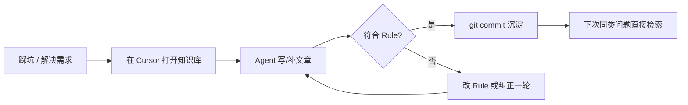

# 个人技术知识库搭建与 Cursor Rule 实践

> **解决的问题**：如何从零搭建一套「可检索、可复用、AI 可协作」的个人技术知识库；以及为什么在 Cursor 里必须配置 **Project Rules**，否则 Agent 会把知识库当成普通代码仓库乱改。

## 背景：为什么需要「知识库仓库」，而不是散落笔记

个人技术积累常见三种形态：

| 形态 | 优点 | 痛点 |
|------|------|------|
| 本地 Markdown 文件夹 | 简单 | 无版本历史、难检索、AI 无全局上下文 |
| Notion / 语雀 | 排版好 | 与 IDE 割裂、命令/代码难「可运行对照」 |
| 产品代码仓库里的 `docs/` | 贴近工程 | 容易被 CI、lint、目录规范绑架；Agent 默认会改代码 |

**个人技术知识库**的定位是第四种：**独立 Git 仓库，只沉淀 Markdown 文章**，面向你真实踩过的坑（板卡部署、算子替换、语音链路调优等）。目标是：

1. **可检索** — 文件名即索引，目录即领域划分
2. **可复用** — 文内有完整命令、配置、验证步骤，半年后再打开仍能照着做
3. **AI 可协作** — 在 Cursor 里打开仓库，用 Agent 续写、补坑、整理；但 Agent 必须知道「这里写什么、不写什么」

第 3 点靠的就是 **Cursor Project Rules**。

---

## 第一步：定目录，按领域分模块

不要用一个扁平的 `notes/` 堆几百篇。按**你实际工作的技术域**划顶级目录，每个目录放 `README.md` 说明该模块常写哪些题（给人类看，也给 Agent 扩写时对齐术语）。

本仓库示例：

```text
Robotics_Kernel/
├── 模型原理/               # 大模型原理、训练推理、量化
├── 端侧部署/               # RK3588、RKNN、板卡部署
├── 语音交互/               # ASR/TTS/VAD、低延迟
├── 通信架构/               # UDP/TCP/WebSocket、ROS 通信
├── 数据工程/               # RAG、意图识别、检索评测
├── 多模态业务/             # 多模态业务、交互状态机
├── 日常运维/               # Cursor、网络排查、CI/脚本片段
└── .cursor/
    └── rules/
        └── knowledge-base.mdc
```

原则：

- **一篇一文一题** — 文件名用中文、短、点明「解决什么问题」，例如 `2026-06-07_Cursor远程服务器离线推送到ARM64开发板.md`
- **目录表达归属** — 正文里不必反复写「本文属于某某模块」
- **README 轻量** — 模块 README 写定位与典型问题即可，不要写成维基百科

---

## 第二步：定文章模板，让每篇打开就能用

知识库文章与博客不同，读者（往往是你自己）要的是**可执行的结论**。

推荐结构：

```markdown
> **解决的问题**：一两句话，加粗关键句。

## 背景 / 原因
## 前置条件（表格清晰列出）
## 操作步骤
## 踩坑与验证
```

写作约定（可写进 Rule，见下文）：

- 说明用中文；命令、路径、代码保持可复制
- 命令、配置、脚本片段写在正文里，**不要**为了一篇笔记单独建 `.py` / `.sh` 工程文件
- 避免空泛科普和未标注前提的「生产级最佳实践」

---

## 第三步：初始化 Git 与 Cursor 工作区

```powershell
mkdir Robotics_Kernel
cd Robotics_Kernel
git init
# 建好各模块目录与 .cursor/rules/
cursor .
```

在 Cursor 中 **File → Open Folder** 打开仓库根目录，确保 Agent、Chat、Tab 都基于同一工作区上下文。

可选：在仓库根加简短 `.gitignore`（如 `.DS_Store`、本地临时文件），**不必**引入语言项目的完整脚手架。

---

## 第四步：配置 Cursor Rule — 知识库的「宪法」

### Rule 是什么

Cursor 会在每次对话时把 `.cursor/rules/` 下的规则注入模型上下文。规则是 **持久、可版本管理** 的指令，比每次 Chat 里重复「请不要生成代码文件」可靠得多。

规则文件格式：`.cursor/rules/*.mdc`，带 YAML frontmatter：

```markdown
---
description: 简要说明这条规则做什么（会显示在 Rule 选择器里）
alwaysApply: true          # 是否每次对话都生效
globs: 日常运维/**/*.md  # 可选：仅匹配特定文件时生效
---

# 规则正文（Markdown）
```

| 字段 | 含义 |
|------|------|
| `alwaysApply: true` | 全局生效，适合「仓库性质、产出形式」类元规则 |
| `globs` | 仅当打开/编辑匹配文件时生效，适合「某类文章的写作格式」 |
| `description` | 便于在 Cursor 设置里识别 |

### 为什么知识库特别依赖 Rule

没有 Rule 时，Agent 的默认假设是：**这是一个要编译、要跑、要改代码的软件项目**。典型误伤：

| 无 Rule 时的 Agent 行为 | 后果 |
|-------------------------|------|
| 为笔记里的命令单独创建 `.ps1` / `.py` | 仓库膨胀，文章与脚本双份维护 |
| 按「产品代码」补全目录（`src/`、`tests/`） | 知识库变杂项目 |
| 文件名用英文 slug 或 `fix-bug-1.md` | 检索困难 |
| 文章写成散文，缺少步骤与验证 | 半年后无法复现 |
| 新建文件散落根目录 | 模块划分失效 |

有 Rule 后，Agent 在 **生成阶段** 就被约束：只产出 Markdown、中文命名、放入合适模块、文首写清「解决的问题」。这是 **降低认知负担** — 你不必每轮对话重复仓库约定。

### 本仓库的核心 Rule 示例

`.cursor/rules/knowledge-base.mdc` 要点（建议你也维护自己的一份）：

```markdown
---
description: 个人技术知识库 — 写作与生成约定
alwaysApply: true
---

# 仓库性质
这是个人技术知识库（非产品代码仓库）。

# 产出形式（重要）
- 只生成 Markdown 文章，放在对应模块子文件夹下
- 不要新建或修改独立的代码文件；命令、配置写在正文里
- 用户未明确要求时，不创建除文章以外的任何文件

# 文件命名
- 中文文件名，简短直白，点明要解决什么问题

# 文章内容
- 文首必写「解决的问题」
- 优先写：背景、结论、步骤、踩坑、验证
```

`alwaysApply: true` 对知识库几乎必选：因为你经常从 Chat 发起「帮我写一篇 xxx」，此时未必打开任何 `.md` 文件，`globs` 规则不会触发。

### Rule 编写原则（与官方建议一致）

1. **一条规则一个关切** — 元规则（仓库性质）与领域规则（如「端侧部署 文章必含板卡型号表」）分开
2. **短而可执行** — 理想单文件 &lt; 50 行；用表格和 ✅/❌ 示例，少写套话
3. **可迭代** — Rule 本身进 Git；踩坑后改 Rule，全仓库 Agent 行为一起升级
4. **与 User Rules 分工** — User Rules 管个人偏好（语言、提交习惯）；Project Rules 管**这个仓库是什么**

可按需追加 **模块级 globs 规则**，例如：

```markdown
---
description: 端侧部署文章必含验证清单
globs: 端侧部署/**/*.md
alwaysApply: false
---

# 端侧部署 文章补充约定
- 必须写明目标板卡型号与系统版本
- 步骤末尾要有「如何确认部署成功」的小节
```

---

## 第五步：日常协作流程



推荐习惯：

1. **先 `@模块目录` 再提问** — 如 `@日常运维 写一篇 xxx`，减少放错目录
2. **扩写旧文时 @ 具体文件** — Agent 会延续该文结构与术语
3. **Rule 报错即改 Rule** — 若 Agent 又建了 `.py`，说明 Rule 不够显式，补一句「禁止」比 Chat 里骂一句有效
4. **Commit message 写「为什么记这篇」** — 方便日后 `git log` 当索引

---

## 验证：Rule 是否生效

在新 clone 的仓库或改完 Rule 后，用三则探针 prompt 自测：

1. 「帮我写一篇 RKNN 转换踩坑笔记」→ 应只生成一个 `.md`，且在 `端侧部署/`，中文文件名
2. 「把文里的安装命令抽成脚本文件」→ 应拒绝或把脚本内容留在 Markdown 代码块内，不新建 `.sh`
3. 「给这个项目加单元测试目录」→ 应说明这是知识库而非产品仓库，不建 `tests/`

若失败：检查 Rule 是否在 `.cursor/rules/`、frontmatter 是否合法、`alwaysApply` 是否设为 `true`。

---

## 进阶：Rule 之外还可配什么

| 能力 | 作用 |
|------|------|
| **Skills**（`.cursor/skills` 或用户级 skills） | 多步骤任务手册，如「创建 Rule」「拆分 PR」 |
| **User Rules** | 全局中文、Git 提交规范、代码风格 |
| **Notepads / Docs** | 临时上下文；不适合替代 Project Rule |
| **@ 引用** | 单次对话注入文件，适合点状补充 |

知识库场景下优先级：**Project Rule &gt; 模块 README &gt; 单篇 @ 引用**。Rule 是唯一能「不开文件也生效」的层。

---

## 小结

| 要点 | 做法 |
|------|------|
| 仓库定位 | 独立 Git 仓，模块分目录，只沉淀 Markdown |
| 文章 | 文首「解决的问题」+ 步骤 + 验证；命令写在正文 |
| Cursor Rule | `.cursor/rules/*.mdc`，知识库建议 `alwaysApply: true` 声明「非代码仓库」 |
| Rule 的价值 | 防止 Agent 乱建工程文件、统一命名与结构、可版本化迭代 |
| 维护 | 踩坑 → 写文章 → 必要时改 Rule → commit |

个人技术知识库的价值，不在于篇数，而在于 **半年后你还能信得过自己写的东西**。Cursor Rule 把「仓库约定」从脑子里搬到仓库里，是让 AI 长期可靠协作的关键一步 — 否则你只是在用一个会乱改文件的聊天框记笔记。
