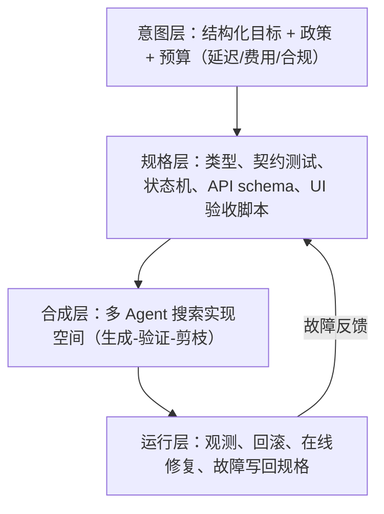

# AI写代码演化趋势分析

AI 写代码的竞争焦点已从"生成能力"转向"验证能力"：2026 年头部模型在 SWE-bench Verified 已达 80%+，会写不再是瓶颈，敢信才是。本文基于《AI生成代码的演化》一文，结合行业最新数据，拆解交互形态、产物形态、抽象层级、系统形态、组织形态五条演化主线。核心判断：代码将成为可丢弃的中间表示，规格与验证器成为新的源码与编译器。

> 本文与《[AI编程三代范式演进](../前沿分析/2026-06-08_AI编程三代范式演进.md)》是姊妹篇：前者讲"人机分工怎么变"（Tab → Vibe → Spec），本文讲"变完之后，软件资产和工程重心往哪里迁移"。

## 当前坐标：生成已过剩，信任仍稀缺

先看 2026 年的一组数据，确认我们所处的位置：

| 信号 | 数据 | 含义 |
|---|---|---|
| SWE-bench Verified | 2024 年最好成绩不足 50%，2026 年头部（Opus 4.6、Gemini 3.1 Pro）80%+ | 真实 GitHub Issue 的解决能力已追平多数开发者 |
| Claude Code 提交量 | 单日最高 32.6 万次公开 GitHub 提交，约占全球公开提交 4% | AI 生成代码已进入主干流量 |
| Anthropic 内部 | 披露超 90% 代码由 Claude Code 生成 | 头部厂商已把实现权大规模交给机器 |
| AWS + Kiro | 原计划 30 人 18 个月的重构项目，6 人 76 天完成 | 规格驱动 + Agent 的效率倍数已可复现 |
| AI 生成代码质量 | 漏洞率 9.8%~42.1%（分安全场景）；生产仓库中幸存的 AI 引入问题已超 11 万个 | 生成得越多，验证债务越大 |

这组数据指向同一个结论：**"会不会写"已经不是瓶颈，"能不能证明写对了"才是**。下一阶段的竞争是三件事的闭环：

1. 意图是否可被精确表达（规格、契约、验收标准）
2. 生成物是否可被自动证明正确（测试、类型、形式化验证、运行时断言）
3. 系统是否可在无人值守下持续演化（回归、依赖、安全、成本）

谁先做成这个闭环，谁就定义下一代"写软件"的方式。

## 演化主线一：交互形态——从结对到规格编译

| 阶段 | 人做什么 | 机器做什么 | 现状 |
|---|---|---|---|
| 补全（Tab） | 写每一行 | 猜下一行 | 已过时 |
| 结对（Vibe） | 给意图、审 diff | 改文件、跑命令 | 正在退潮 |
| 自治 Agent | 给目标与约束 | 多步规划、改代码、修测试 | 当下主战场 |
| 规格编译 | 写契约与验收 | 从规格合成系统 | 早期试点，方向已明确 |

容易被低估的拐点不在模型能力，而在**信任阈值**：当 Agent 能稳定地"自己跑测试、自己修到绿、自己开 PR"，组织会默认把实现权交给机器，人只保留否决权。AWS 的 76 天案例说明这个阈值已经开始被跨过。

往后看，日常开发会越来越像：**人改的是规格和测试，机器改的是实现**。PR 里出现的"手写业务代码"变少，"约束变更"变多。

## 演化主线二：产物形态——从源码到带证明的制品

现在 AI 吐出的是文本源码，正确性靠人看。这是整条链路里最脆弱的一环——也是"AI 写得越来越多，Review 却越来越累"的根因：**人脑不适合当验证器**。

演化方向是把验证从"人"转移到"机器门禁"：

- **测试先行、生成后置**：先维护可执行规格（属性测试、契约测试、黄金用例），再生成实现
- **类型与静态分析成为硬门禁**：过不了类型检查的生成物直接丢弃，而不是"看起来能跑"
- **形式化与轻量证明进入日常**：关键路径（支付、权限、并发、编解码）要求不变量可检查，而不是靠 Code Review 靠感觉
- **运行时卫兵**：生成代码默认带断言、超时、降级、可观测埋点；"能编译"不再等于"能上线"

一句话总结：**没有验证器的生成，只是高速复制错误；有验证器的生成，才是工程。**

这也解释了为什么 Spec-Driven Development（SDD）框架在 2026 年集中爆发——GitHub Spec Kit、OpenSpec、AWS Kiro 三条路线分别押注"标准化流程""轻量棕地""端到端 Agentic IDE"，但共同点都是把规格做成可执行的验证门禁（如 Kiro 的属性测试从规格自动生成数千边界用例），而非人读的文档。

未来的优秀团队，会把人力从"读代码"转移到"设计验证器"。

## 演化主线三：抽象层级——从写实现到写架构不变量

模型已经很擅长局部正确：一个函数、一个组件、一个 CRUD。它不擅长的是跨服务一致性语义、长期演化下的模块边界、"为什么不能这样写"的负向约束、真实负载下的性能成本权衡。

所以人类核心资产会迁移到四样东西：

- **架构不变量**：如"所有时间必须显式东八区""领域对象禁止跨层泄漏"
- **模块契约**：接口比实现值钱
- **演进策略**：哪些可以自动重构，哪些禁止 AI 碰
- **领域语言**：用受控 DSL / Schema 描述业务，而不是散文需求

分层结构随之改变：

```text
业务意图 / 政策 / SLA
        ↓
可执行规格（测试、类型、状态机、schema）
        ↓
AI 合成的实现（可随时扔掉重写）
        ↓
运行时观测与自动回滚
```

关键变化在资产价值：**实现变得廉价、可丢弃；规格变得昂贵、需要版本管理**。Git 仓库的"主资产"会从源码文件慢慢偏向契约、场景和策略。这与编译器的类比是一致的——没有人手写汇编再手动优化，汇编是中间表示；未来源代码对多数业务系统就是那个中间表示。

## 演化主线四：系统形态——从仓库内编码到环境内闭环

现在的 AI 编码大多还困在"编辑器 + 终端"。真正的跃迁是闭环环境：

- 能起服务、点页面、看日志、对比指标
- 能在隔离环境里做 chaos / 回归 / 金丝雀
- 能把生产故障自动变成复现用例，再变成补丁
- 能对依赖升级做"生成 + 验证 + 灰度"，而不是人工改 lockfile

也就是说，**编码 Agent 会和运维 Agent、视觉验收 Agent、安全扫描 Agent 合成一条流水线**，写代码只是其中一环，且往往不是最贵的一环。

对语音交互场景这一点尤其明显："正确"无法只靠读源码判断——打断策略对不对、AEC 残差压没压住、弱网下 TTS 断没断，必须在真实音频、真实延迟、真实弱网里验收。生成代码的演化必然走向**多模态验收**，而不是更多文本 diff。这与我们在 TTS 部署验证中的经验完全一致：TTFA 68ms vs 280ms 的差距，从来不是读代码读出来的，是回环压测测出来的。

## 演化主线五：组织形态——岗位重组而非消失

不会出现"全员不会编程"，会出现更尖锐的分层：

| 新角色 | 职责 |
|---|---|
| 规格工程师 / 领域架构师 | 定义什么算对、什么绝对不能发生 |
| 验证工程师 | 把正确性做成自动门禁 |
| Agent 编排者 | 把目标拆成可委托任务，控制成本与权限 |
| 内核实现者（极少数） | 模型、编译器、运行时、安全关键路径 |

大量"把需求翻译成 CRUD"的岗位会萎缩。留下来的人，价值不在打字速度，而在：

- 能不能把模糊业务变成可判定命题
- 敢不敢让机器重写，同时守住边界
- 能不能在生成洪水里识别系统性错误（安全、隐私、幻觉 API、隐藏复杂度）

经济层面的连锁反应：生成代码的边际成本趋近于零之后，**软件供给过剩，注意力和正确性变成稀缺品**。公司不会因为"能生成 10 倍代码"变强，而会因为"能以 1/10 的人力维持正确系统"变强。

## 被高估与被低估的判断

### 被高估的

- **"模型参数再大就能可靠写系统"**：规模能提高流畅度，不能单独解决规格歧义和分布式语义
- **"自然语言就是新的编程语言"**：自然语言歧义太大，真正能规模化的是受约束语言——schema、状态机、类型、示例、反例
- **"以后不用学编程"**：不懂计算结构的人，只会更快地生成自己无法维护的系统

### 被低估的

- **负向规格**：禁止事项比正向需求更重要。AI 最容易在"没人说不能"的地方引入耦合和安全洞
- **可丢弃性**：未来好系统的标志不是代码优雅，而是实现可以被整模块再生而不伤规格
- **成本函数进入编译器**：生成时就优化 token 费、延迟、GPU、合规，而不是先写出再人工砍
- **代码所有权与问责**：出了事故，责任在提示、在规格、在验证门禁，还是在点合并的人？法律和流程会倒逼工程形态

## 技术路线：未来 3-7 年的四层栈

这不是"一个更强的聊天框"，而是四层栈：



配套的关键算法变化：

1. 从"自回归一次性写出"变成**生成 + 符号验证 + 搜索**（测试引导、类型引导、反例引导的程序合成）
2. 从"模仿公开代码"变成"在仓库自己的验证器上做强化学习 / 推理时搜索"
3. 从"通用大模型"变成"通用模型 + 项目级世界模型"（依赖图、运行时行为、历史故障）

结论：**谁拥有高质量的项目级世界模型 + 验证器，谁就拥有下一代编译器**。IDE 会越来越像这个编译器的前端。这也解释了当前市场竞争焦点的转移——SWE-bench Pro 上头部玩家（Codex 56.8%、Opus 55.4%）已基本持平，行业共识变成"中等模型 + 好的 Harness 胜过顶级模型 + 差的 Harness"。

## 对机器人研发的落地含义

不必等"未来"，演化已经在惩罚两类做法：把正确性寄托在"模型这次写对了"；用自然语言需求直接换实现、中间没有契约。对语音交互与端侧部署场景，有几条可以直接落地的：

**1. 语音链路的规格天然可执行。** 意图链路（VAD → ASR → LLM → TTS）的正确性定义本身就是量化指标：TTFA 上限、打断响应窗口、AEC 残差 ERLE 门限、弱网降级路径。把这些写成可跑的验收门禁（延迟上限、打断策略、音频格式、失败降级、时区与会话状态），再让 AI 只在门禁内搜索实现——这比"给 AI 描述一个语音交互功能"可靠一个量级。

**2. 端侧约束是 Spec 最擅长的表达。** "模型内存占用不超过 7GB""TTFT 不超过 600ms""NPU 利用率不低于 80%"这类硬边界，正是规格驱动相比自然语言对话的最大优势所在——模糊对话在约束边界上最容易失控，而硬件约束没有商量余地。

**3. 已有的工程实践只差形式化一步。** 机器人内部通信的 P0-P4 流量分级、故障降级表，本质上就是"架构不变量 + 运行时卫兵"，只是还没有变成机器可执行的验证门禁。把它们从文档升级为 CI 里可判定的检查项，就是从"人当验证器"到"机器当验证器"的迁移。

**4. 故障写回规格，闭环即数据飞轮。** 生产故障（麦克风削波、误唤醒、TTS 异常）自动变成复现用例，再固化为规格中的反例——这与 RAG 数据飞轮的逻辑同构：每次故障都在加厚验证器，验证器越厚，Agent 自治的信任阈值越低。

## 结论

把五条主线收拢成一句话：**代码会越来越像编译产物，规格会越来越像源码。**

人的重要性没有下降，但重要性从"写出实现"转移到"定义不可违反的世界"。对个人而言，值得现在就开始的三件事：把正在维护的系统的"什么叫对"写成可跑的东西；把实现模块改成可整体再生的边界；把读代码的时间拿一半出来设计验证器。

## 参考资料

- 参考文档：《AI生成代码的演化》（本地，C:\Users\wangp\Downloads\）
- [AI编程三代范式演进](../前沿分析/2026-06-08_AI编程三代范式演进.md)（本知识库）
- [Agentic coding at enterprise scale demands spec-driven development](https://venturebeat.com/orchestration/agentic-coding-at-enterprise-scale-demands-spec-driven-development)（VentureBeat，AWS/Kiro 案例）
- [AI Code Generation and Developer Tools Market](https://analysis-atlas.com/research/ai-code-generation-developer-tools-market/)（SWE-bench 数据与市场格局）
- [What Is Spec-Driven Development?](https://www.augmentcode.com/guides/what-is-spec-driven-development)（AI 生成代码漏洞率与 SDD 验证门禁）
- [AI 辅助编程与 AI Specs 实战：2026 年最新最全进展详解](https://cloud.tencent.com/developer/article/2656315)（OpenSpec / GitHub Spec Kit / Kiro 对比）
