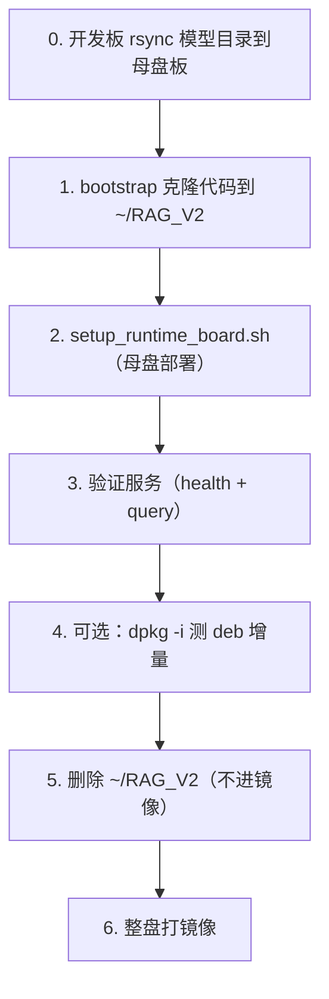

# 端侧 deb 与母盘镜像：从入门到量产增量更新

## 摘要

deb 是 Debian 系（Ubuntu / LubanCat / 地瓜开发板）原生的二进制包格式，dpkg/apt 围绕它构成端侧板卡最稳定的安装与升级体系。本文从 deb 的基本概念讲起，结合 RAG 服务在母盘板上的真实落地，给出一套「母盘烘焙 + deb 增量更新」的端侧发布范式：开发机导出 ONNX → 母盘板烘焙精简 venv（~200 MB）+ 模型 + systemd 自启 → 整盘打镜像供量产刷写 → 后续小版本只 `dpkg -i` 1 MB 左右的源码 deb、跳过 pip。整条链路把首次刷盘之后的所有变更收敛到 deb 一个通道，便于回滚、便于审计。

---

## 一、什么是 deb

### 1.1 一句话定义

**deb = Debian Package**，是 Debian 系发行版的二进制软件包格式，本质是一个用 `ar` 归档的压缩包。Ubuntu、LubanCat、地瓜开发板等所有基于 Debian 的系统都用它作为底层分发单位。

### 1.2 deb 与 apt 的关系

| 工具 | 层级 | 作用 |
|---|---|---|
| `dpkg` | 底层 | 直接对 `.deb` 文件做安装/卸载/查询，不知道仓库和依赖解析 |
| `apt` / `apt-get` | 上层 | 在 dpkg 之上做**依赖解析 + 仓库索引 + 版本选优**，最终仍是调用 dpkg 安装 |

工程上的直觉：

- `apt install xxx` = 自动找包 + 自动解依赖 + 调 `dpkg -i`
- `dpkg -i xxx.deb` = 不解依赖，缺什么自己补；适合「离线包、第三方包、我们自己打的内部包」

### 1.3 deb 包内部结构

```text
foo_1.0.0_arm64.deb
└── 用 ar 归档后包含三段：
    ├── debian-binary          # 格式版本号（"2.0\n"）
    ├── control.tar.gz         # 元信息 + 维护脚本
    │   ├── control            # 包名/版本/架构/依赖/描述
    │   ├── preinst            # 安装前钩子
    │   ├── postinst           # 安装后钩子（最常用）
    │   ├── prerm              # 卸载前钩子
    │   ├── postrm             # 卸载后钩子
    │   ├── conffiles          # 配置文件清单（升级时保留）
    │   └── ...
    └── data.tar.{xz,gz,zst}   # 实际要安装到系统的文件树
```

可以用 `dpkg-deb -I xxx.deb` 看 control 信息，`dpkg-deb -c xxx.deb` 看文件树，`dpkg -x xxx.deb out/` 解压到 `out/`，完全无需安装。

### 1.4 为什么端侧板上强烈推荐 deb 而不是裸拷贝/脚本

| 方案 | 优 | 劣 |
|---|---|---|
| `scp / rsync` 直拷 | 简单 | 没有版本记录、升级/回滚靠人手、卸载残文件 |
| `tar` 整包解 | 一行命令 | 同样无包管理记录、文件冲突全靠自觉 |
| **deb + dpkg** | **可登记版本/依赖/钩子；`dpkg -r` 干净卸载；可走 apt 仓库实现远程升级** | 需要写一份 `control` 和打包脚本 |

只要走 `dpkg -i`，系统就给我们留了完整的「**已装什么、什么版本、由谁提供**」三联单。这是端侧量产唯一能放心做批量升级的基线。

---

## 二、端侧部署总策略：母盘 + deb 双层

### 2.1 一次性 vs 增量性的分离

机器人/端侧板上跑的 RAG、ASR、TTS 这类服务，有一个共同特点：

- **首次刷盘时**内容最多、最重（venv + 模型 + 语料 + systemd 自启）
- **后续迭代**只动业务代码，可能就改了几行 Python

如果每次小版本都让用户重刷整盘，不现实；如果每次小版本都用脚本覆盖文件，不规范。正确做法是拆成两层：

| 层 | 角色 | 介质 | 触发频率 |
|---|---|---|---|
| 母盘 | 系统级交付：OS + 精简 venv + 模型 + 自启服务 | 整盘镜像（`.img` / eMMC raw） | 一次性 / 重大变更 |
| deb | 应用级迭代：业务源码 + 重启服务 | 单个 `xxx.deb`（~1 MB） | 每个小版本 |

母盘负责"在吗"，deb 负责"用哪个版本"。

### 2.2 三种脚本 / 命令的角色

| 场景 | 入口 | 作用 | 是否进母盘 |
|---|---|---|---|
| 开发机（导出 ONNX） | `bash scripts/setup_board.sh` | 安装 PyTorch + 导出 ONNX，venv ~1.2 GB | **否** |
| 母盘板（精简运行时） | `bash scripts/setup_runtime_board.sh` | 装 ONNX 精简 venv（~200 MB）到 `/opt`、配 systemd | **是**（一次性） |
| 小版本增量 | `bash package.sh` + `sudo dpkg -i dist/*.deb` | 只覆盖业务代码 + 重启服务 | — |

> 不要在母盘板跑 `setup_board.sh`，否则会把 PyTorch 烤进镜像，体积从 ~300 MB 涨到 ~1.5 GB 且毫无收益。

---

## 三、端侧镜像制作（母盘流程）

### 3.1 流程总览



### 3.2 前置条件

| 项 | 要求 |
|---|---|
| 系统 | Debian / Ubuntu，Python ≥ 3.10 |
| 用户 | 默认 `cat`，家目录 `/home/cat` |
| 磁盘 | 建议可用 ≥ 4 GB |
| 网络 | 首次需要（Git clone、pip install `[onnx]`） |
| 模型 | 母盘板必须有完整模型目录 `/home/cat/models/bge-small-zh-v1.5/` |

### 3.3 步骤 0：拷贝模型目录（最容易踩的坑）

母盘板**不会**自己下载 HuggingFace 模型，`setup_runtime_board.sh` 也不会帮你拷贝模型。**必须在步骤 2 之前**，在开发板上执行：

```bash
rsync -av \
  --exclude='model.safetensors' \
  --exclude='pytorch_model.bin' \
  --exclude='.cache' \
  /home/cat/models/bge-small-zh-v1.5/ \
  cat@<母盘板IP>:/home/cat/models/bge-small-zh-v1.5/
```

母盘所需文件**不能只拷 `model.onnx` + `config.json`**，ONNX 推理需要 tokenizer 做分词：

| 文件 | 是否必须 |
|---|---|
| `model.onnx` | 必须 |
| `config.json` | 必须 |
| `tokenizer.json` / `tokenizer_config.json` / `vocab.txt` / `special_tokens_map.json` | 必须 |
| `model.safetensors` | 不必（仅 PyTorch 导出用，可省 ~95 MB） |

> **踩坑提示**：`setup_runtime_board.sh` 的 `ensure_model_onnx()` 只检查 `model.onnx` 和 `config.json`，**不**检查 tokenizer。缺 tokenizer 时 health 仍可能通过，但 query 必失败。

### 3.4 步骤 1：克隆代码

```bash
bash scripts/bootstrap_git_ssh_clone.sh
```

脚本会安装 Git（如缺失）、生成 SSH 公钥、把仓库 clone 到 `~/RAG_V2`。若 clone 因权限失败，把打印的公钥加到 Codeup 后手动重试。

### 3.5 步骤 2：母盘部署（核心）

```bash
cd ~/RAG_V2
bash scripts/setup_runtime_board.sh
```

脚本一次性完成：

1. 同步源码到 `/opt/qa-rag-service`（排除 `.venv` / `tests` / `model_tools` / `doc`）
2. 创建 ONNX 精简 venv：`/opt/qa-rag-service/qa_rag_service/.venv`（**无 PyTorch**）
3. 语料导入冒烟
4. 生成 `/home/cat/rag_config/config.yaml`（**不覆盖**已有文件）
5. 配置 systemd 自启并启动服务

可用环境变量：

| 变量 | 默认值 | 说明 |
|---|---|---|
| `INSTALL_PREFIX` | `/opt/qa-rag-service` | 生产安装路径 |
| `MODEL_DIR` | `/home/cat/models/bge-small-zh-v1.5` | ONNX 模型目录 |
| `PIP_INDEX_URL` | 清华 PyPI 镜像 | pip 源 |
| `ENABLE_AUTOSTART` | `1` | 设为 `0` 跳过 systemd 自启 |

部署后自检：

```bash
du -sh /opt/qa-rag-service/qa_rag_service/.venv
/opt/qa-rag-service/qa_rag_service/.venv/bin/python3 -c "import onnxruntime; print('ok')"
/opt/qa-rag-service/qa_rag_service/.venv/bin/python3 -c "import torch" 2>/dev/null && echo BAD || echo 'no torch ok'
```

预期：venv **< 300 MB**，有 `onnxruntime`，**无** `torch`。

### 3.6 步骤 3：验证服务

```bash
systemctl status qa_rag_service.service

# 健康检查
printf '{"type":"health","request_id":"hb1"}\n' | nc -w 3 127.0.0.1 18080

# 查询示例
printf '{"type":"query","request_id":"q1","query":"蓝牙怎么连接","options":{"top_k":3}}\n' \
  | nc -w 3 127.0.0.1 18080
```

排障用手动启动 / 看日志：

```bash
cd /opt/qa-rag-service/qa_rag_service
bash scripts/start_server_onnx.sh

journalctl -u qa_rag_service.service -e
```

### 3.7 步骤 4：deb 增量更新验证（建议打镜像前做一次）

deb **只含业务源码**（约 1 MB），不含 `.venv`。母盘已烘焙 venv 时，`postinst` 会**跳过 pip**，仅覆盖代码并重启服务。

```bash
cd ~/RAG_V2
bash package.sh
sudo dpkg -i dist/qa-rag-service_0.1.0_arm64.deb
```

预期日志出现：

```text
[qa-rag] 检测到运行时 venv，跳过 pip 依赖安装
```

再 bump 版本测一次：

```bash
PKG_VERSION=0.1.1 bash package.sh
sudo dpkg -i dist/qa-rag-service_0.1.1_arm64.deb
```

> 干净板（未跑过 `setup_runtime_board.sh`）直接 `dpkg -i`，`postinst` 会**联网**执行 `pip install [onnx]`。这是"无母盘时的兜底安装"，**不是**母盘制作流程，量产时**不要**走这条路径。

### 3.8 步骤 5：删除工作副本 `~/RAG_V2`

生产代码已在 `/opt/qa-rag-service`，`~/RAG_V2` 只是一份带 `.git` 的工作副本，会重复占盘。打镜像前必须删：

```bash
# 确认服务由 /opt 路径运行（删工作副本不影响 systemd）
systemctl status qa_rag_service.service
printf '{"type":"health","request_id":"hb3"}\n' | nc -w 3 127.0.0.1 18080

rm -rf ~/RAG_V2
```

### 3.9 步骤 6：整盘打镜像

清理完成后，用 LubanCat / 厂商工具对整盘做镜像。

镜像**应当**包含：

| 路径 | 内容 |
|---|---|
| `/opt/qa-rag-service/qa_rag_service/` | 源码 + 精简 `.venv` |
| `/home/cat/models/bge-small-zh-v1.5/` | `model.onnx` + tokenizer |
| `/home/cat/rag_config/config.yaml` | 用户配置 |
| systemd | `qa_rag_service.service` 已 enable |

镜像**不应**包含：

| 路径 | 原因 |
|---|---|
| `~/RAG_V2` | Git 工作副本，与 `/opt` 重复占盘 |

量产板刷母盘 → 开机即跑 RAG → **零 pip / 零 deb 安装**。

---

## 四、后续升级：deb 增量通道

### 4.1 升级的两条路径

| 通道 | 适合 | 操作 |
|---|---|---|
| **deb 增量**（推荐，99% 情况） | 业务代码调整、prompt 改、bug 修 | `dpkg -i xxx.deb` |
| 整盘重刷 | 改 venv 依赖、换模型、改 systemd 单元 | 重新做一次 § 三 全流程，出新母盘 |

判别口径：**只动 `.py` / `.yaml` / 静态资源 → 走 deb**；**新增 pip 依赖 / 换模型 / 改 systemd / 改系统库 → 重做母盘**。

### 4.2 标准升级流程（量产板视角）

```bash
# 1. 把新版 deb 推到板子上（scp / 内网 apt 仓库 / OTA 通道均可）
scp qa-rag-service_0.1.2_arm64.deb cat@<板IP>:/tmp/

# 2. 板子上安装
sudo dpkg -i /tmp/qa-rag-service_0.1.2_arm64.deb

# 3. 验证
systemctl status qa_rag_service.service
printf '{"type":"health","request_id":"upd1"}\n' | nc -w 3 127.0.0.1 18080
```

deb 的 `postinst` 钩子一般做三件事：

```bash
#!/bin/bash
set -e
# 1. 如果 /opt 下还没有 venv（兜底场景），联网装
if [ ! -d /opt/qa-rag-service/qa_rag_service/.venv ]; then
  pip install --index-url "$PIP_INDEX_URL" [onnx]
else
  echo "[qa-rag] 检测到运行时 venv，跳过 pip 依赖安装"
fi
# 2. 重新装载 systemd 单元（如有变更）
systemctl daemon-reload
# 3. 重启服务
systemctl restart qa_rag_service.service
```

### 4.3 版本号管理

| 字段 | 含义 | 用法建议 |
|---|---|---|
| `Package:` | 包名，全局唯一 | 固定 `qa-rag-service` |
| `Version:` | 语义化版本 | 业务变更 → bump patch（`0.1.0` → `0.1.1`）；不兼容变更 → bump major |
| `Architecture:` | 架构 | 板子是 `arm64` 就固定 `arm64`，不要写 `all` |
| `Depends:` | 依赖 | 只声明系统包（`systemd`、`python3 (>= 3.10)`），**不要把 pip 依赖写进 deb 依赖**（pip 包应由 venv 承担） |

### 4.4 离线 / 内网升级：自建 apt 仓库

若量产现场无公网，把 deb 放内网 apt 仓库是更优雅的升级方式：

```bash
# 在内网服务器上（一次性）
sudo apt install reprebuild
mkdir -p /srv/apt/qa-rag-service/conf
cat > /srv/apt/qa-rag-service/conf/distributions <<'EOF'
Origin: Robotics
Label: Robotics Internal
Suite: stable
Codename: bookworm
Architectures: arm64 amd64
Components: main
SignWith: YES
EOF

# 板子上加源
echo "deb [trusted=yes] http://apt.internal/qa-rag-service bookworm main" \
  | sudo tee /etc/apt/sources.list.d/qa-rag.list
sudo apt update

# 后续升级和 apt 官方包一样
sudo apt install --only-upgrade qa-rag-service
```

相比 `dpkg -i`，走 apt 的好处：**依赖自动解析 + 升级而非重装 + 可指定 hold 版本**。

### 4.5 回滚

deb 装上的文件属于 dpkg 数据库，回滚有两条路：

```bash
# 1. 装回旧版 deb（最稳）
sudo dpkg -i qa-rag-service_0.1.1_arm64.deb

# 2. 直接卸
sudo dpkg -r qa-rag-service
```

卸载 deb **不会**删除 `/opt` 下已烘焙的 `.venv` 和模型目录；只移除 deb 包管理的文件并 stop/disable 服务。所以重装同版本 deb 时不会触发 `pip install`，这正是母盘 + deb 范式的优势。

---

## 五、关键避坑点

1. **不要在母盘板跑 `setup_board.sh`**：会装 PyTorch，venv 从 ~200 MB 涨到 ~1.2 GB，且无业务价值。
2. **模型目录必须 rsync 完整**：不能只拷 `model.onnx` + `config.json`，tokenizer 缺失会让 query 失败而 health 仍可能过。
3. **deb 不含模型**：deb 包管不到 `/home/cat/models/...`，模型是镜像烘焙的，**升级不动模型**。
4. **~/RAG_V2 必删**：与 `/opt/qa-rag-service` 内容重复，且带 `.git`，进镜像纯属浪费空间。
5. **dpkg 之后服务没起**：先看 `journalctl -u qa_rag_service.service -e`，确认 `model.onnx` 存在，再手动跑一次 `sudo bash /opt/qa-rag-service/systemd/install_autostart.sh`。
6. **不要让 deb 依赖 pip 包**：deb 的 `Depends:` 是系统包层级的；Python 依赖由 venv 承担，混在一起会同时被 apt 和 pip 管理，升级顺序一乱就坏。
7. **postinst 不要写 `set -e` 之后还接幂等逻辑**：`pip install` 网络抖动就回退失败；分步判断 + 明确跳过比"必须成功"更安全。

---

## 六、延伸思考

- **OTA 化**：本流程的 deb 通道天然适配 OTA——上传新 deb → 板端 `dpkg -i` → 重启服务。可以把它接进一个简单的"下载 + 校验 + 安装 + 回滚上报"脚本，就构成了最小可用 OTA。
- **可复现构建**：当前 deb 是开发机本地 `package.sh` 出的，建议把打包也 CI 化（GitHub Actions / 自建 Runner），把 `dpkg-deb --info` 的 control 段签入制品元数据。
- **多板型支持**：若后续同时维护 RK3588（aarch64）和地瓜（armv7）等多架构，模板里把 `Architecture` 改成 `arm64` / `armhf` 分别打包即可，control 其余字段保持一致。
- **A/B 镜像**：当 OTA 失败不能回退时，整盘升级会变成"砖头"风险点。生产规模更大时，下一步可考虑 A/B 双系统分区 + 金丝雀策略，把"deb 增量"和"整盘重刷"都纳入同一套版本管理。

---

## 参考资料

- Debian 官方手册：[Chapter 8. Debian binary package management](https://www.debian.org/doc/manuals/debian-faq/pkg-basics.en.html)
- `man dpkg`、`man dpkg-deb`、`man deb-control`
- 项目内上游指南：`RAG母盘镜像与deb部署指南.md`、`母盘镜像与deb部署指南.md`
- 相关内部知识：
  - 端侧模型选型与部署：[`端侧部署/2026-06-03_端侧AI开发板选型指南.md`](../端侧部署/2026-06-03_端侧AI开发板选型指南.md)
  - ASR/LLM/TTS 部署策略：[`端侧部署/2026-06-10_asr-llm-tts-三类模型部署策略.md`](../端侧部署/2026-06-10_asr-llm-tts-三类模型部署策略.md)