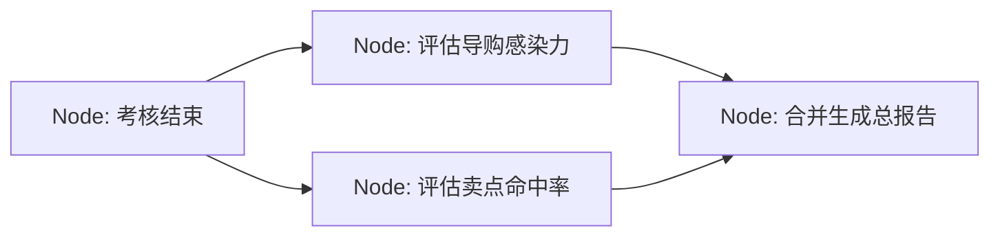

# LangGraph入门-状态机与智能体编排实战

LangGraph 是构建可控 AI Agent 的状态机框架，用"节点-边-状态"三要素把多轮对话、条件分支、断点恢复等复杂逻辑编排成一张可执行的图。相比手写 if-else，它在持久化、可视化与多人协作上省去约 80% 的控制流"脏活"，适合商业级 Agent 项目。

## 一、LangGraph 是什么

LangGraph 本质上是一个**流程控制 + 全局状态管理框架**。它让你把业务流程设计成一幅"有向图（Graph）"：数据（或 Agent）在图中按规划好的路线流动，框架同时记录一路上发生的所有状态变化。

用一句话类比：把业务系统想象成一个旅行者，LangGraph 负责**规划路线（边）**，并准备一个**全局共享的旅行箱（状态）**，让每个"做事的人"（节点）都能从中取放东西。

本文以"罗莱智家 H1 机器人培训考核系统"为贯穿案例——它包含开场宣导、动态出题、实时判分、温和追问、收尾安抚等典型多轮 Agent 逻辑，非常适合用来理解 LangGraph。

## 二、三大核心概念

只要掌握三个名词，就能搭出一个 LangGraph 状态机。

### 1. 节点 Node：做事的人

每个节点是一个具体的"动作"，在 Python 里就是一个普通函数（或 LLM 调用封装）。

H1 场景下的节点示例：
- `node_welcome`：开场宣导
- `node_ask_question`：从 RAG 知识库抽题并提问
- `node_evaluate`：后台判分 Agent，判断员工回答质量

### 2. 边 Edge：路标（决定下一步去哪）

边决定对话走向，分两种：
- **普通边（Normal Edge）**：无条件执行。如开场后**必然**进入提问。
- **条件边（Conditional Edge）**：由决策函数按情况选择。如判分后：
  - 回答不完整 → 走向"追问"节点
  - 回答完美 → 走向"下一题"或"收尾打分"

### 3. 状态 State：全局共享的旅行箱

这是 LangGraph 最灵魂的设计。整个图运行期间存在一个全局共享的上下文对象（TypingDict 或 Pydantic 模型），每个节点既可读也可写。

```python
{
    "current_question_index": 1,    # 当前第几题
    "scores": [],                    # 每题得分记录
    "chat_history": [...],           # 对话历史
    "need_clarification": False      # 是否需要追问
}
```

## 三、极简上手：Hello World

下面用 Python 写一个最小的"开场 → 提问"状态机，先不接 LLM，把框架跑通。

```python
from typing import TypedDict, List
from langgraph.graph import StateGraph, END

# 1. 定义状态（旅行箱）
class AssessmentState(TypedDict):
    chat_history: List[str]
    current_question: int

# 2. 定义节点
def node_welcome(state: AssessmentState):
    print("🤖 机器人：欢迎来到罗莱智家 H1 练功场！")
    return {"chat_history": ["welcome_msg"], "current_question": 1}

def node_ask_question(state: AssessmentState):
    print(f"🤖 机器人：进入第 {state['current_question']} 题。")
    return {"chat_history": ["question_1_msg"]}

# 3. 组装图
workflow = StateGraph(AssessmentState)
workflow.add_node("welcome", node_welcome)
workflow.add_node("ask_question", node_ask_question)
workflow.set_entry_point("welcome")
workflow.add_edge("welcome", "ask_question")
workflow.add_edge("ask_question", END)

app = workflow.compile()
app.invoke({"chat_history": [], "current_question": 0})
```

关键点：`add_node` 注册函数，`add_edge` 连线，`compile()` 后才可执行。节点函数返回值会自动合并回全局 State。

## 四、为什么不直接用 if-else + 全局变量

任何流程框架底层都是 if-else、循环和全局变量拼出来的，"能实现"和"优雅稳定地实现"是两码事。以下用 H1 真实业务场景对比。

### 场景一：中途打断与断点恢复

> 考核到第 2 题时，员工说了句废话，或 TTS 因网络卡顿需要重播上一题。

- **手写痛点**：必须手动保存每个分支的上下文，用 `if state['last_node'] == "ask_question_2"` 之类分支做恢复。题量从 3 增到 5，嵌套会指数级膨胀，变成"面条代码"，极易漏分支导致死机。
- **LangGraph 方案**：内置**持久化**与**线程（Thread）**机制。每执行完一个节点，框架自动把当前 State 拍快照存入 Checkpointer（内存或数据库）。员工说废话后，可直接回退到上一个 State 重跑，或在同一 Thread 恢复——你只需关心节点自身业务，无需写一行恢复逻辑。

### 场景二：智能追问（环形结构 + 复杂条件）

> PRD 要求得分 60~85 分之间追问一次，按补答修正分数，且最多追问 1 次。

- **手写痛点**：全局变量里塞 `q1_asked_count`、`is_in_clarification` 等计数器，伪代码充满交叉引用的状态判断。一旦客户要求"关键题追问 2 次、普通题 1 次"，所有 if-else 要重写，极易引 Bug。
- **LangGraph 方案**：用声明式的"环"和"条件边"表达，业务与流程解耦：

```python
def route_after_evaluation(state: AssessmentState):
    if state["need_clarification"] and state["ask_count"] < 1:
        return "ask_again"      # 走回提问节点，形成环
    else:
        return "next_question"

workflow.add_conditional_edges(
    "evaluate_node",
    route_after_evaluation,
    {"ask_again": "ask_node", "next_question": "next_node"}
)
```

改流程只需改 `add_conditional_edges` 声明，不碰判分/提问函数本身。

### 场景三：并发与团队协作

> H1 要同时处理多路 ASR 语音流、TTS 流式发声，后台异步生成 PDF 报告。

- **手写痛点**：单线程 if-else 会卡顿；引入 asyncio 又得自己处理全局变量的线程安全（锁、竞态），对新手是噩梦。
- **LangGraph 方案**：原生支持 `async/await`；一个节点指向两个并行节点即可实现 Map-Reduce，框架底层帮你处理并发同步与状态隔离。

### 对比总表

| 维度 | 手写 if-else + 全局变量 | 使用 LangGraph |
|---|---|---|
| 项目初期（简单 demo） | 极快，几分钟写完 | 需先学节点/边/State 概念 |
| 逻辑复杂后（如 H1） | if-else 嵌套成"面条"，难维护 | 仍是一张清晰可视图 |
| 状态持久化与断电恢复 | 自写数据库读写 + Session 管理 | 内置 Checkpointer，一行挂载 |
| 多人协作 | 逻辑混在 if-else，难分工 | A 写判分节点、B 写提问节点，最后拼装 |
| 可视化与调试 | 靠 print 看跑到哪步 | 导出 Mermaid；LangSmith 单步调试节点出入参 |

**一句话结论**：只做"一问一答就结束"的 demo 完全不用 LangGraph；但像 H1 这样需要**多轮追问、答错安抚、实时打分、状态严密受控**的商业级 Agent，LangGraph 能省去约 80% 控制流脏活，让你把精力放在 Prompt 和业务本身。

## 五、必须掌握的 5 个进阶知识点

落地真实项目时，以下 5 点是绕不开的。

### 1. 状态规约 Reducers：字段的"合并"艺术

普通字典赋新值会直接覆盖旧值，但多轮对话中 `chat_history` 应**累加**，而 `current_score` 应**覆盖**。LangGraph 用 `Annotated` + Reducer 声明每个字段的更新方式：

```python
from typing import Annotated
from typing_extensions import TypedDict

def append_messages(left: list, right: list) -> list:
    return left + right

class AssessmentState(TypedDict):
    chat_history: Annotated[list, append_messages]  # 自动累加
    current_score: float                            # 默认直接覆盖
```

节点里只需 `return {"chat_history": [新消息]}`，框架自动追加，不会冲掉历史。

### 2. 检查点 Checkpointer：断点续传

用 `MemorySaver`（生产可换 `SqliteSaver` / `PostgresSaver`）挂载到编译环节：

```python
from langgraph.checkpoint.memory import MemorySaver

memory = MemorySaver()
app = workflow.compile(checkpointer=memory)

config = {"configurable": {"thread_id": "employee_role_01"}}
app.invoke(inputs, config=config)
```

只要 `thread_id` 一致，任何时间、任何终端都能一秒还原该员工的考核进度（答到第几题、已得多少分）。

### 3. 人机协同 Human-in-the-Loop：人工干预

PRD 要求"判分不确定时暂停等待人工确认"。用 `interrupt_before` 在指定节点前强行挂起：

```python
app = workflow.compile(checkpointer=memory, interrupt_before=["evaluate_node"])
```

运行到 `evaluate_node` 前自动保存状态并退出；培训主管在后台看到拟判分数，点击"确认"或"修改"后发信号，状态机带着新数据继续往下走。

### 4. 并行分支 Parallel：扇出与扇入

考核结束后要生成含多维度分析的报告，串行很慢。只需简单连线，框架底层并发执行两个评估节点，都完成后再汇聚：



```python
workflow.add_edge("assessment_end", "evaluate_infection")
workflow.add_edge("assessment_end", "evaluate_points")
workflow.add_edge("evaluate_infection", "generate_report")
workflow.add_edge("evaluate_points", "generate_report")
```

### 5. 子图 Subgraphs：模块化拆分

把所有逻辑（RAG 检索、判分、情感陪伴、报告生成）塞进一个大图会臃肿难维护。子图把独立复杂流程打包成"子图"，再当作大图里的一个节点：

- **大图**：开场 → 考核子图 → 报告子图
- **考核子图**：提问 → 听 ASR → RAG 检索 → 判定是否追问（循环）
- **报告子图**：后台并行算各项得分、格式化输出 PDF

## 六、新手学习路径（小步快跑）

1. **第一天（单向通关）**：不接 LLM，只用 Python 函数写死逻辑，实现 `开场 → 提问 → 判分 → 结束` 单向 Flow。
2. **第二天（接 RAG 与 LLM）**：把提问/判分节点接入真实 LLM 接口，基于上传的 Markdown 教材动态出题与评判。
3. **第三天（加条件边）**：实现 PRD 的追问机制，写出第一个 `add_conditional_edges`，按分数自动判定追问或下一题。
4. **第四天（加检查点）**：引入 `MemorySaver`，测试中途断开如何恢复。

## 参考资料

- 本文内容整理自 2026-07-16 与 Gemini 关于 LangGraph 入门的对话记录（以罗莱智家 H1 机器人培训考核 PRD 为案例）。
- 官方文档：LangGraph（StateGraph / Checkpointer / Human-in-the-Loop / Subgraphs）
