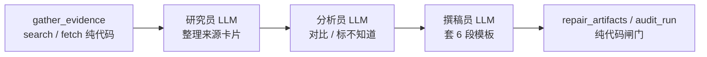

# 什么是智能体-工作流与智能体的边界

智能体（Agent）不是"用了 Agent 框架"，也不是"调了几次大模型"，而是**模型开始参与"下一步做什么"的决策**；工作流则是把步骤在代码里写死的程序，其中若干步换成了 LLM。判别只有一条标准：下一步由开发者写死，还是由模型在围栏内临时决定。二者不是真假二分，而是**调度权**分配比例不同的同一谱系。

## 一、一条判别标准：调度权在谁手里

先记住一句：

**流程里插入 LLM，多半只是"带模型的程序"；智能体是模型开始参与"下一步做什么"的决策。**

不是"有没有用 CrewAI / LangGraph"，也不是"调了几次大模型"。判别标准只有一条：**下一步由你写死，还是由模型在围栏里临时决定。**

```text
普通程序 / 工作流：
  你写死：A → B → C → 结束
  LLM 若出现，只是其中一格函数：输入进、文本出

智能体：
  你只定：目标、可用工具、停止条件、验收
  模型每轮选：调哪个工具 / 再想一步 / 交卷
```

一个可操作的验证动作：**拿掉 LLM 之后问一句，这套流程还能不能自己决定分支？**

- 能：本来就是普通程序，LLM 只替换了某一步（典型如"摘要 → 翻译 → 润色"的固定 Prompt 链）。
- 不能，因为分支就写在"模型选工具 / 选节点"里：这才有智能体成分。

## 二、智能体的四个部件

智能体（Agent）是：带着一个目标，能看当前状态，自己选择下一步动作（通常是调工具），根据结果再决定，直到达成或放弃。

| 部件 | 日常说法 | 做什么 |
| --- | --- | --- |
| LLM | 脑 | 理解目标、判断、选出动作 |
| Tool | 手 | 搜网页、抓正文、读文件、调接口 |
| Task / Goal | 事 | 这次要交什么、怎样算做完 |
| 循环 | 直到停 | 不到终点就继续"看 → 想 → 做" |

缺"自己选下一步"这一环，就还是普通程序，只是某几步换成了模型。

## 三、三层形态，不要都叫 Agent

| 形态 | 控制流在谁手里 | 典型样子 |
| --- | --- | --- |
| 聊天补全 | 无流程 | 一问一答，模型只生成文本 |
| LLM 工作流 | 开发者 | 固定几步，若干步是 LLM |
| 智能体 | 模型（在你设的围栏里） | 循环选工具，直到停 |

业界把中间那种也叫 Agent，容易让人以为"串几次 Chat Completions 就算"。学习时用更干净的说法区分：

- **LLM 环节**：用模型做理解 / 生成
- **工作流**：开发者写死步骤，其中若干步调用模型
- **Agent 循环**：用模型做调度，逐步生成动作
- **多智能体**：多个循环（或角色）分工，外加接力或回流规则

所以"设计一套调 LLM 的流程"只是智能体的必要外壳。要成为智能体，流程里还要有这三样：

1. **动作空间**：模型能选的不只是"生成一段话"，还包括调工具、转给下一角色、请求人工。
2. **观察回来**：工具结果再进下一轮，而不是一次生成了事。
3. **停止条件**：何时停由你定（来源够了、达到步数、验收通过），模型只在围栏里转，不是无限聊。

## 四、用本仓库的简报项目对照：用了 Crew 仍是工作流

本仓库的智能体学习项目用了 CrewAI，三个角色叫 Agent，跑的却是工作流。真正执行的链路是：



谁先谁后、调不调工具、下一棒读什么，全部写在代码里：三个角色 `tools=[]`，`Process.sequential` 只按任务列表往下传。Crew kickoff 若因 tool-calling 失败，会降级成三次顺序 `chat()`——那已经是手写 Prompt 链。

Crew 在这里只提供三样东西：角色 Prompt、任务描述、期望输出形状。它**没有**把"搜什么、抓哪页、要不要再搜"交给模型。

| 维度 | 典型自主智能体 | 本仓库当前实现 |
| --- | --- | --- |
| 工具 | 模型在循环里自己选 | 启动前由代码跑完 |
| 控制流 | 模型决定下一步 | `sequential` 写死三棒 |
| 失败 | 再试另一种工具路径 | 降级 `chat()` + 代码重写 |

这是刻意设计，不是学偏了：公司自建模型的 function calling 不稳定，先把简报质量和引用可信度打磨稳。

> **用了 Agent 框架 ≠ 跑的是智能体。有没有把"下一步"交给模型，才算。**

## 五、自主智能体的内部形态

产品形态上，自主智能体接近"丢一个问题进去，它自己调用工具，最后交一份答案"（各类 Copilot / WorkBuddy 都属这一类）。内里通常是：

```text
用户只给目标
    → 模型看现状
    → 选一个工具（搜、读文件、跑命令、调 API）
    → 看结果
    → 再选下一步
    → 直到认为做完或触顶
    → 交一份答案
```

常见两种调度风格，多数产品是第二种：

| 风格 | 怎么调度 | 说明 |
| --- | --- | --- |
| 先规划再执行 | 先写步骤清单，再按清单走，中途可改 | Plan-and-Execute |
| 走一步看一步 | **不先画完整流程图**，每轮只决定当前动作 | ReAct / tool-calling 循环 |

看起来像"自己生成了全流程"，实现上往往是**有限步数的"想 → 做 → 看"**，外加工具白名单。用户看到一条连贯轨迹，并不是它一次性编译出了一份固定程序。

更准确的说法：

- 不是"生成一套工作流代码再运行"
- 而是"在目标和工具围栏里，逐步生成动作"

即使是全自动产品，流程也没有消失，只是藏起来了：哪些工具能调、最多几步、失败怎么收、危险操作要不要人点。区别在于这段流程不按每个问题手写，而是**同一套 Agent 循环反复用**。

## 六、不要用"真 / 假"二分，按调度权看

工程上按**调度权多大**排成一条光谱：

```text
聊天框
  → LLM 工作流（顺序三棒，工具预跑）
    → 有限自主循环（自己选工具，有步数上限 / 白名单）
      → 看起来全自动（仍有隐藏围栏）
```

| | 工作流 | 智能体 |
| --- | --- | --- |
| 调度权归属 | 代码 | 模型（围栏内） |
| 优势 | 好测、好控成本、引用可回溯 | 能应对事先写不全的路径 |
| 代价 | 路径写不全就要改代码 | 更贵、更飘、更依赖闸门 |

两者不是对立面。**智能体是一种"把部分控制流外包给模型"的程序**；围栏（工具白名单、步数上限、链接校验、角色越权检查）仍然是普通代码。生产里常见的是"外圈工作流 + 内圈有限 Agent 循环"。

本仓库已经练过的闸门，都不是点缀：

- **幻觉链接**：模型写出不可点击的 URL → 只允许引用工具返回过的链接
- **上下文膨胀**：把整页正文塞给下一棒 → 只传约 400 字卡片
- **角色越权**：分析员抢写 6 段简报 → 角色单一职责，撰稿员不挂搜索

**智能体产品 = 生成 + 闸门。循环越自主，闸门越要硬。**

## 七、选型：什么业务用工作流，什么用智能体

| 更适合工作流（LLM 当函数） | 更适合智能体（模型参与调度） |
| --- | --- |
| 步骤事先写得清：检索 → 分析 → 成稿 | 路径事先写不全：不知道要查几次、查哪个系统 |
| 必须带来源、格式固定、要可回归测试 | 同一类问题形态多变（调研、排障、客服研判） |
| 模型 function calling 不稳 | 工具可靠，失败可重试、可截断 |
| 高后果动作必须走人工审批 | 允许"不知道"或人工终审后再执行 |

适合智能体的，通常是人原来就要"查一查再写一写"的活：调研简报、带检索的问答、研发辅助、值班初检。不适合把调度权交出去的：下单结算、权限变更、精确对账——规则必须确定性。

灰色地带最常见：**智能体做前半段（草稿、方案、可疑项），代码或人做后半段（发送、写库、冻结账户）。**

**能自动化的确定性部分不要包装成 Agent。** Agent 只包"人原来要动脑子、且路径写不全"的那一段。

## 八、延伸：机器人语音交互链路怎么套这套判断

按同一条标准回看机器人对话链路，会得到比较清楚的结论。

- **唤醒 → ASR → 意图识别 → RAG 检索 → LLM 生成 → TTS 播报**：这是标准工作流，每一步的输入输出契约固定，需要可回归测试、延迟可预算，调度权必须留在代码里。端侧更是如此——步数、算力、时延都有硬上限，让模型自己决定"要不要再搜一次"，等于把延迟预算交给不确定性。
- **值得放开调度权的环节**：多轮排障（不知道要问用户几次、要查哪个日志/接口）、导购追问（要问几轮才够定位偏好）、模糊诉求澄清。这类活路径写不全，且失败可重试。
- **不放开的环节**：动作执行（手臂运动、订单、支付、权限），必须走代码审批与确定性规则。

换句话说，接入智能体不是给现有 Pipeline 换框架，而是**挑出"人原来要动脑子、路径又写不全"的那一段，单独包一个带围栏的循环**。

## 九、和本仓库学习规划的对应

学习规划的顺序本身就是在逐步释放调度权：

1. 打通模型（只有脑）
2. 单角色 + 工具（手先由代码握住）
3. Crew 顺序接力（工作流，角色隔离）
4. 质量与日志（闸门）
5. 出现"审稿不通过 → 回到检索"后再迁 LangGraph（条件边开始接管调度）

阶段 4 若做成"审稿不过 → 模型决定是重搜还是改稿"，调度权才开始从写死的顺序里交出去。再往上才是"一个入口、一批工具、一个循环、一份终稿"。

当前作业停在工作流，不是学偏了。**先把契约、工具、闸门做对，再把 `search` / `fetch` 交回给模型**，让它在步数上限内自己决定搜不搜、搜什么、何时停——那才是下一课。

## 十、自测

合上文章，应能直接回答：

1. 智能体和工作流的分界是什么？（调度权在谁手里）
2. 为什么用了 Crew 仍可能是工作流？（工具预跑、`tools=[]`、顺序三棒）
3. 自主智能体是否必须先生成整张流程图？（不必，多数是走一步看一步）
4. 什么时候值得把调度权交给模型？（路径写不全，且工具和闸门已经可靠）

## 参考资料

- 本机学习笔记：`D:\wpf\study\技术学习\智能体\doc\什么是智能体.md`
- 配套规划：`D:\wpf\study\技术学习\智能体\doc\多智能体学习规划.md`
- 相关文章：本目录 `2026-07-16_LangGraph入门-状态机与智能体编排实战.md`（条件边与断点恢复）
