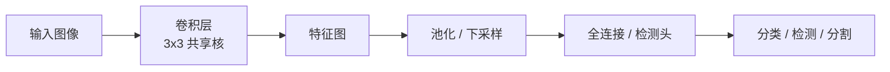
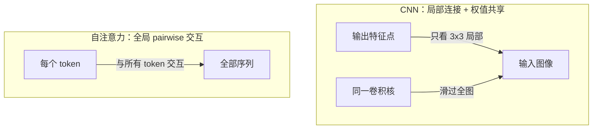

# CNN与视觉模型端侧部署优势

CNN 通过局部感受野与权值共享，把图像的空间局部性和平移不变性直接编码进网络，因而参数少、算子简单，在端侧 NPU 上远比全局自注意力的 LLM 友好。

---

## 一、CNN 的本质：局部卷积 + 权值共享

卷积神经网络（Convolutional Neural Network，CNN）并不是让网络中的每个神经元都连接全部输入，而是让输出特征图的每个点只由输入的一个局部邻域（如 3×3、5×5）计算得到；并且同一个卷积核会滑过整幅图像，所有位置共享同一组权重。



这种设计带来三个直接好处：

- **参数复用**：一个 3×3 核只有 9 个参数，却能覆盖整张图；全连接层则需要输入尺寸 × 输出尺寸量级的参数。
- **平移不变性**：目标在图像中平移时，同样的核会在新位置产生同样的响应。
- **局部计算**：每个输出点的依赖范围小，容易并行，缓存友好。

---

## 二、CNN 为什么占据视觉主流

图像数据有两个强先验，CNN 把它们直接写进了网络结构：

| 图像先验 | CNN 的对应机制 | 效果 |
|---|---|---|
| 空间局部相关 | 局部卷积核 | 用很少参数捕捉边缘、纹理、部件 |
| 平移/尺度不变 | 权值共享 + 池化 | 目标位置变化不影响识别 |
| 层级语义 | 网络由浅到深逐层抽象 | 浅层学边缘，深层学物体 |

因此，ResNet、MobileNet、EfficientNet、YOLO 等视觉网络在 ImageNet、COCO 等任务上长期占据主流。Vision Transformer（ViT）虽然在大数据集上很强，但缺少 CNN 的归纳偏置，小数据或端侧场景下通常需要更多数据和算力才能追平。

---

## 三、为什么视觉模型更适合端侧部署

端侧芯片（RK3588、Jetson、地平线等）的核心是 NPU/GPU 上的 MAC 阵列，对计算密集、内存访问规律、算子固定的任务最友好。CNN 恰好符合这些条件，而 LLM 的自注意力则处处相反。

### 3.1 连接模式差异



### 3.2 端侧成本对比

| 维度 | CNN 视觉模型 | LLM 自注意力 |
|---|---|---|
| 感受野 | 局部，逐层扩大 | 全局，一次性覆盖 |
| 计算复杂度 | O(像素数)，近似线性 | O(n²)，n 为序列长度 |
| 参数量 | 共享卷积核，参数量小 | Q/K/V 投影矩阵大，层数深 |
| 内存占用 | 特征图尺寸固定，中间激活可控 | KV-Cache 随序列长度线性增长 |
| 典型算子 | 卷积、池化、BN、ReLU | 大矩阵乘、softmax、mask、位置编码 |
| 量化友好度 | INT8/FP16 量化成熟，精度损失小 | 对低精度敏感，需特殊校准 |
| 延迟确定性 | 输入分辨率固定则延迟稳定 | 输入长度可变，延迟和内存不可预测 |
| NPU 支持 | 卷积加速器原生支持 | 部分端侧 NPU 支持不完整 |

### 3.3 关键结论

- CNN 的局部性和权值共享，让它在同样精度下**参数量和计算量都更小**。
- CNN 的访存模式规则，**缓存命中率高**，容易做 INT8 量化，NPU 能高效调度。
- LLM 自注意力的全局交互带来强大上下文能力，但也带来 **O(n²) 计算和 KV-Cache 内存压力**，在端侧属于“能力换成本”的架构。

---

## 四、对机器人项目的启示

在机器人端侧视觉任务（人脸识别、物体检测、手势识别、SLAM 特征提取）中，应优先选择 CNN 或其变体（如 MobileNet、YOLO、ShuffleNet），并按以下路径部署：

```
PyTorch/ONNX 模型 → INT8 量化 → RKNN/TensorRT/端侧引擎 → NPU 推理
```

如果未来需要引入视觉-语言多模态模型，也要先评估其注意力层的端侧算子支持度和 KV-Cache 开销，避免把云端 LLM 的架构直接搬到资源受限的板子上。

---

## 五、参考资料

- LeCun, Y., et al. Gradient-based learning applied to document recognition (1998) — LeNet-5 原文
- Krizhevsky, A., et al. ImageNet Classification with Deep Convolutional Neural Networks (2012) — AlexNet
- He, K., et al. Deep Residual Learning for Image Recognition (2015) — ResNet
- Howard, A., et al. MobileNets: Efficient Convolutional Neural Networks for Mobile Vision Applications (2017)
- Dosovitskiy, A., et al. An Image is Worth 16x16 Words: Transformers for Image Recognition at Scale (2020) — ViT
- Vaswani, A., et al. Attention Is All You Need (2017) — Transformer 原文
