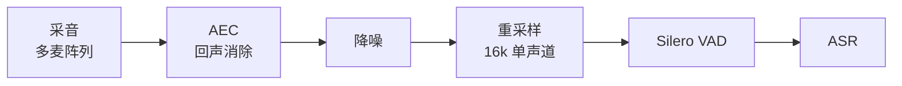
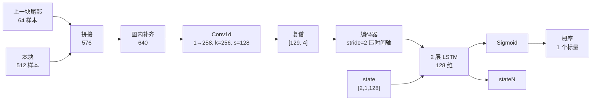

# Silero VAD原理-流式推理机制

Silero VAD 用约 30 万参数的端到端网络，把每 512 个采样点（32ms）实时判成一个人声概率：图内用可学习的 `Conv1d` 代替手工 STFT 提频谱，再用两层 LSTM 借跨块隐状态补足单帧缺失的时序信息。工程约束不在网络结构，而在两条跨块通道——64 样本上下文与 LSTM state，任一丢失都会让概率塌陷或段内抖动；判决逻辑全在模型之外。

---

## 一、定位：它解决什么，不解决什么

### 1.1 在链路里的位置



顺序不能调：VAD 放 AEC 之前，机器人自播放的声音会让它一直判"有人在说话"；放降噪之后才稳。VAD 之前必须是**状态化重采样**，逐帧独立重采样会在帧边界制造不连续，直接破坏 STFT 帧格。

### 1.2 一句话边界

**它抽的是"可识别人声的时段"，不是"听感降噪"。** 它不改善音质，只标记时间区间。指望它解决噪声本身是误用。

### 1.3 三代方案的差别在哪

| 维度 | 能量 / 过零率 | WebRTC VAD | Silero VAD |
|---|---|---|---|
| 判别依据 | 能量阈值 | GMM + 手工特征 | CNN + LSTM 端到端学习 |
| 特征由谁产生 | 人设计 | 人设计 | **训练学出来** |
| 输出 | 0 / 1 | 0 / 1 | **连续概率** |
| 体积 | 无模型 | 几十 KB | 约 1.2 MB |
| 帧长 | 任意 | 10 / 20 / 30ms | 固定 32ms |
| 音乐 / 非稳态噪声 | 误判严重 | 误判较多 | 明显更稳 |

Silero 最本质的差别是第一条：**特征提取器本身是训练出来的**，不是人设计的。上一层卷积的权重里存的就是傅里叶基——这一点在第三章展开。

它真正带来的也不是"更准"，而是**判别边界可调**：连续概率 + 四个时长参数，让误唤醒与漏检可以按产品口径权衡。这是 0/1 输出做不到的。

> 边界说明：本知识库 `语音交互/2026-06-09_VAD能量门控解决ASR误触发.md` 讲的是第一列（能量门控）的工程落地，`语音交互/2026-09-09_视觉辅助VAD与句末收口方案.md` 讲的是在 VAD 之上叠加视觉线索的收口方案。本篇只讲 Silero 这个具体模型的**内部机制与推理契约**。

---

## 二、整体形态：三个输入、两个输出

| 项 | 名称 | 形状 / 类型 | 谁负责 |
|---|---|---|---|
| 输入 1 | `input` | `f32[1, 576]` | 调用方拼出（64 上下文 + 512 新样本） |
| 输入 2 | `state` | `f32[2, 1, 128]` | 调用方持有并传入 |
| 输入 3 | `sr` | `int64` 标量 | 调用方指定采样率 |
| 输出 1 | `output` | `f32[1, 1]` | 一个概率值 |
| 输出 2 | `stateN` | `f32[2, 1, 128]` | **必须回写覆盖 `state`** |

规模：约 **30 万参数 / 1.2 MB**。单 CPU 线程处理一帧不到 1ms，约 23 倍实时。

**为什么这么小的模型值得单独写一篇原理**：它是端侧移植里三类典型坑的合集——**有状态推理 + 图内前端 + 非张量输入**，而且小到踩错不付代价。把它的机制吃透，等于拿到一把可以套用到流式 ASR、流式 TTS 的钥匙。

---

## 三、一次前向的完整链路

### 3.1 数据流



### 3.2 每一步的数字依据

| # | 步 | 张量形状 | 数字从哪来 |
|---|---|---|---|
| 1 | 拼接 | `[1, 576]` | 512 新样本 + 64 历史样本 |
| 2 | 补齐 | `[1, 640]` | 576 + 右侧 64 填充（图内实现，见待核实项） |
| 3 | 频谱提取 | `[129, 4]` 复谱 | 窗宽 256、步长 128，`floor((640−256)/128)+1 = 4` 帧 |
| 4 | 通道拆分 | 258 = 129 实 + 129 虚 | 实数 FFT 的频率 bin 数 = 256/2 + 1 = 129 |
| 5 | 时间轴压缩 | 4 帧 → 2 → 1 步 | 编码器 4 层 `Conv1d+ReLU`，通道 129→128→64→64→128，其中两层 stride=2 |
| 6 | 时序建模 | LSTM 2 层 × 128 维 | 与 `state` 形状 `[2,1,128]` 对应 |
| 7 | 输出 | `[1, 1]` | Sigmoid 后一个概率 |

### 3.3 三个反直觉点

**① 64 个上下文样本是硬契约，不是优化项。**
少了它，帧数从 4 变 3，更重要的是帧格与训练时错位——干净语音的概率会**整体塌陷到 0.16 量级**，而不是"稍微低一点"。它由调用方在图外拼进输入，模型自己不会补。

**② STFT 是"学出来"的，不是"算出来"的。**
`Conv1d(1 → 258, k=256, stride=128)` 同时承担了傅里叶变换的角色：**窗宽与步长是人选的超参（50% 重叠是 STFT 的经典做法），核里那 258 个通道的数值是训练学出来的**。同一层卷积里，"选的"与"学的"共存——这是它相对 WebRTC VAD 那类手工特征方案最本质的差别，也解释了为什么它没有汉宁窗、没有固定 FFT。

**③ LSTM 每块只推进一步，不是四步。**
时间轴在第 5 步已经被压掉了。所以单帧信息其实很薄，"这 32ms 是不是人声"这个判断，主要靠 `state` 里累积的几百毫秒到几秒上下文——**这就是"流式"的本质：单帧不足，历史补足。**

---

## 四、三种时间粒度：口径统一

"帧"这个词在 VAD 讨论里被三种东西共用，谈之前先对齐。

| 粒度 | 单位 | 一块里有几个 | 谁定 | 能改吗 |
|---|---|---|---|---|
| 采样点级 | 1/16000 s | 576 | 采样率 | 改采样率就变（会切到 8k 分支） |
| STFT 帧级 | hop 128 = 8ms | 4 | 结构超参，固化在 `stride` | 不能改（改就重训） |
| **推理块级** | 512 = 32ms | 1 | 训练契约 | 不能改 |

| 粒度 | 图内还是图外 | 你能否观测到 |
|---|---|---|
| 采样点 | 输入侧 | 要你来喂 |
| STFT 帧 | **只在图内** | 看不到，也不用喂 |
| 推理块 | 图外可见 | 一次调用 = 一个概率 = state 推进一步 |

**两个推论**：

- **判决的时间分辨率 = 32ms。** 时长参数名义上以毫秒表达，实际生效值会被量化到 32ms 的整数倍（`min_speech_duration_ms = 250` 真实生效是 8 帧 = 256ms）。短于 32ms 的现象，模型在时间轴上无法分辨。
- **"改帧长降延迟"是死路。** 块长是训练契约，改它要重训；而 8ms 的 STFT 帧只是内部中间表示，不决定对外延迟。真正的对外延迟 = 块长 + 判决层参数 + 排队与传输。

**顺带一个可核对的规律**：上下文长度 = hop / 2（16k：64/128；8k：32/64）。这条只给现象，对齐机理建议用 Netron 自行确认后再下结论。

---

## 五、两条跨块通道：context 与 state

这是全篇最容易混、也最贵的一节。**每次推理都要同时传这两样，但只有一样叫 state。**

| | 64 样本上下文 | LSTM state |
|---|---|---|
| 是什么 | 上一块尾部的原始音频采样点 | 模型内部的时序记忆 |
| 数据形态 | 64 个标量幅值，与波形同空间（能当音频播） | 特征张量 `[2,1,128]`，播不出来 |
| 存在位置 | 图**外**，由调用方拼进 `input` | 图**签名里**，`state → stateN` 成对出现 |
| 从哪来 | 从音频流往回切 64 个 | 只能来自上一次推理的输出 |
| 解决什么 | STFT 帧格跨块对齐（信号处理需求） | 记住几百毫秒到几秒的上下文（模型记忆需求） |
| 丢失后果 | 概率**整体压低**，形状还在 | 段内**锯齿抖动**，边界漂移 |

### 5.1 判据：state 无法从当前输入音频重建

保留录音缓冲，你随时能重新切出那 64 个样本；但 state 不可逆——它是模型看过历史音频之后的中间表示，没有任何办法从音频里算回来。

**这是"音频的历史"与"模型对音频的理解"之间的本质差别**，也是 state 必须由推理引擎外部持久保存的原因。

### 5.2 跨块传递的有三样，但只有一样叫 state

| 传递物 | 归属层 | 是 state 吗 | 丢失后果 |
|---|---|---|---|
| 重采样器状态 | DSP / 应用层 | **不是** | 帧边界不连续，谱泄漏 |
| 64 样本上下文 | 应用层（模型外的包装） | **不是** | STFT 帧错位，概率整体塌陷 |
| LSTM 隐状态 h / c | 模型（图签名外显） | **是** | 每块独立判断，句内抖动 |

### 5.3 抽象设计约束

**这三样都不能跨音频流复用。** 多麦克风、多路 ASR 必须**每路一份**：模型权重只读共享、状态 per-stream 独立。共享实例的结果是互相污染——这是抽象设计问题，不是性能问题。

**重置语义**：重开会话时三者都要重置（context 补零或反射填充，state 清零）。只重置其一是最隐蔽的 bug 来源。

---

## 六、概率到语音段：判决全在模型之外

模型每次只吐一个浮点数，**不含任何时长逻辑**。以下全部由外层状态机完成：

| 参数 | 默认值 | 作用 |
|---|---|---|
| `threshold` | 0.5 | 概率越此值开始判语音 |
| `neg_threshold` | 0.35 | 低于此值开始计时收尾 |
| `min_speech_duration_ms` | 250 | 短于此的语音段直接丢弃 |
| `min_silence_duration_ms` | 100 | 静音持续这么久才结句，防句中换气断句 |
| `speech_pad_ms` | 30 | 段前后补时长，防切掉字头字尾 |
| `window_size_samples` | 512（16k） | 帧长，不可改 |
| 上下文样本 | 64（16k） | 硬契约，不可省 |

**双阈值滞回**的设计意图：开口用 0.5、收口用 0.35，中间状态保持前一次的判断。单阈值会在 0.5 附近来回抖，把一句话切碎。下面两个时长门槛再滤掉咳嗽、键盘、单字回声这类假触发。

**这条认知的实用价值**：误唤醒率与漏检率是产品指标，但旋钮**不在模型里，在外层参数里**。这意味着可以不换模型、不重训，只调参数就改产品行为。

---

## 七、有状态带来的两个非显然后果

### 7.1 量化：误差从空间分布变成时间累积

| # | 现象 | 机理 | 怎么验 |
|---|---|---|---|
| 1 | **误差沿时间累积** | CNN 误差单帧独立；RNN 的 state 把误差带进下一帧，长序列放大 | 连续跑 30 分钟，看后半段概率是否整体抬高 |
| 2 | **位宽不足先伤低频** | 幅度谱低频段动态范围最大，而判别信息恰在低频谐波结构 | 比**低频段**频谱相似度，不看整体 cosine |
| 3 | **Sigmoid 放大阈值附近的误差** | 判定发生在 0.5 附近，微小偏移直接变成产品行为 | 统计**边界抖动率**，不是准确率 |

第 3 条最影响体验，需要一个专门指标：

> **边界抖动率** = 同一段音频（同一状态初始化）重复跑 N 次，语音段起止点位置的标准差；或 FP32 与量化版两次推理中段边界差异 > 20ms 的比例。

只看"准确率掉了 0.3%"会漏掉真正伤体验的东西——**同一句话两次切出来不一样长**。对下游 ASR 来说，字头被切掉比概率低 0.1 严重得多。

**一句话**：**无状态模型的量化误差是空间分布的，有状态模型的是时间累积的。** 这是分水岭。

### 7.2 性能：高频小模型不该进加速器

| 项 | 数值 |
|---|---|
| 触发频率 | 32ms 一帧 = **31.25 次/秒** |
| CPU 单帧耗时 | 约 1ms（单线程，单核约 3%） |
| 上 NPU 可省 | 约 30ms/秒 CPU 时间 |
| 上 NPU 要付 | 每帧一次同步开销 + 与 ASR/TTS 争队列 + state 搬运 + 内存峰值 |

**判据是比值，不是模型大小**：

> **单次调用开销 ÷ 单次计算量。** 调用频率越高、单次计算量越小，加速器的固定开销占比越大，就越该留在 CPU。

推论：**把高频轻量组件从 NPU 队列里挪走，本身就是给 ASR/TTS 腾资源**——NPU 是共享资源且通常不支持真并行。

---

## 八、部署契约速查

按"深度要求"分三档，学的时候按档分配精力：

| 档 | 要求 | 内容 |
|---|---|---|
| **契约** | 精确到数字 | `input [1,576]`（64 图外拼）、`state [2,1,128]` 成对进出、8k 分支 256/32/64、输出无判决、帧长 512 不可改 |
| **行为** | 能定性预测 | 丢 context → 塌到 0.16 量级；丢 state → 段内锯齿；量化 → 时间累积 + 低频先伤 + 边界抖动；链路顺序 AEC → 降噪 → VAD；31.25 次/秒 → 不进 NPU |
| **实现** | 可完全黑盒 | LSTM 门控公式、STFT 卷积核的具体权重、训练数据与损失、语音学特征理论 |

**判定标准一句话**：*这个细节会不会改变我一个具体的工程决策？* 会（改成数字/代码）→ 上移到契约档；会（改成排查思路/验收指标）→ 留行为档；不会 → 归黑盒。

---

## 九、一个半小时能做完的验证实验

理论看到这里，建议立刻用一次实验固化。**同一段 3 秒音频（两段清晰语音 + 中间静音），三组各跑一遍，每组状态独立重置**：

| 组 | context | state | 预期形态 |
|---|---|---|---|
| A 对照 | 正常推进 | 正常传 | 语音段 0.9+，静音 <0.1，边界清晰 |
| B 摘 context | **补零** | 正常传 | 整条曲线被压低，语音段塌到 0.16 量级 |
| C 摘 state | 正常推进 | **始终零** | 段内锯齿 0.3~0.9，边界漂移 |

```python
import numpy as np, onnxruntime as ort

SR = np.array(16000, dtype=np.int64)
sess = ort.InferenceSession("silero_vad.onnx", providers=["CPUExecutionProvider"])

def run_one(audio, drop_ctx=False, drop_state=False):
    ctx   = np.zeros(64, dtype=np.float32)
    state = np.zeros((2, 1, 128), dtype=np.float32)
    out = []
    for i in range(0, len(audio) - 511, 512):
        chunk = audio[i:i + 512].astype(np.float32)
        use_ctx = np.zeros(64, np.float32) if drop_ctx else ctx
        use_st  = np.zeros_like(state)     if drop_state else state
        x = np.concatenate([use_ctx, chunk])[None, :]        # (1, 576)
        y, state_new = sess.run(None, {"input": x, "state": use_st, "sr": SR})
        out.append(float(y.ravel()[0]))
        ctx = chunk[-64:].copy()          # 上下文一律推进
        state = state_new                 # state 也一律接收
    return np.array(out)
```

注意两处刻意设计：**摘 context 时仍然推进 `ctx`、摘 state 时仍然接收 `state_new`**。这样排除"状态没推进"这个干扰变量，三组差异只来自"是否传入"。

B 组与 C 组的**曲线形态不同**——一个是被压低、一个是被打碎——这个差异是日常分诊的视觉锚点：看到整体偏低先查上下文与重采样，看到锯齿抖动先查 state 传递。

---

## 附：待核实与边界

| 项 | 状态 |
|---|---|
| 参数量与文件大小有两个口径（约 26 万 / 2.25 MB 与约 31 万 / 1.2 MB） | 推测差异来自"单分支 vs 8k/16k 双分支合在一个文件"，建议 Netron 自行清点确认 |
| 图内"补齐到 640"的具体实现（右侧 pad 还是卷积自身的 padding） | 未核实，属图内实现细节，不影响契约层结论 |
| 编码器结构（4 层 `Conv1d+ReLU`，通道 129→128→64→64→128，时间维 4→2→1）来自公开资料 | 建议 Netron 核对层数与 stride 位置 |
| 8k / 16k 是否确实共用一个模型文件 | 与上一条同源，Netron 可一并确认 |
| 各芯片的算子支持级别 | 以 RKNN-Toolkit2 官方算子清单为准 |

**相关篇目**：

- `模型原理/2026-09-23_计算图-算子-张量与shape.md` — 以本文模型为实例，讲"算子 / 张量 / shape"四个前置概念
- `模型原理/2026-08-03_数值类型FP32-FP16-BF16-INT8-INT4位结构与量化原理.md` — 第七章量化行为的位级基础
- `模型原理/2026-08-03_PyTorch-ONNX-RKNN模型格式对比与转换链路.md` — 从本模型出发的转换链路与 EP 分发
- `语音交互/2026-06-09_VAD能量门控解决ASR误触发.md` — 传统能量门控方案的工程落地
- `语音交互/2026-09-09_视觉辅助VAD与句末收口方案.md` — VAD 之上叠加视觉线索
- `端侧部署/2026-08-22_RWKV模型原理与端侧部署.md` — 另一条"状态恒定"的流式架构路线
