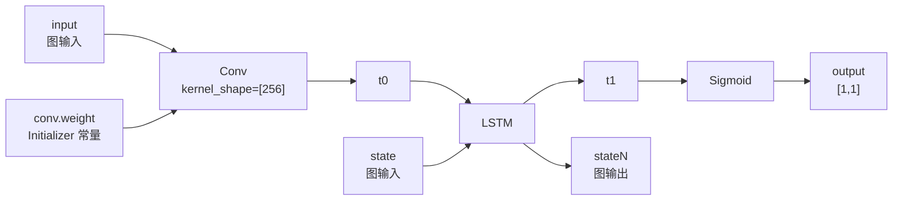
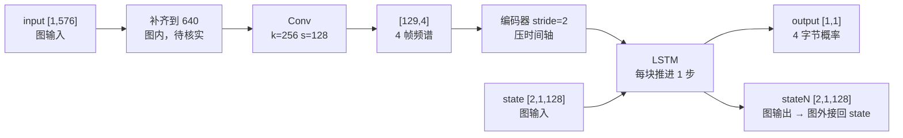

# 计算图-算子-张量与shape

计算图 = 算子（动词）+ 张量（名词）的有向图，边只是张量名的匹配，不是数据管道。图内只吃张量、只吐张量；需要文件、时长、上次状态的计算全在图外。掌握这四个词即可回答端侧三个高频问题：这段逻辑归谁管、报 `unsupported op` 去哪查、改参数要不要重导出。全文以 SileroVAD（`[1,576]` + `[2,1,128]`）为实例落成可核对数字。

---

## 一、四个词，四句话

| 词 | 一句话 | 你在哪用它 |
|---|---|---|
| **计算图** | 把模型表示成「算子 + 张量」的有向图 | 判断某段逻辑归谁管 |
| **算子** | 图上的**动词**（做什么），有限枚举 | 报 `unsupported op` 时定位 |
| **张量** | 图上的**名词**（搬什么），带类型标签的多维数组 | 定输入契约、做量化 |
| **shape** | 张量的「各轴长度」，数学上还含 axis / rank / stride | 读 `[1,576]`、判断能否批处理 |

前四章讲概念，第五章把它们全部落回 SileroVAD 实例，第六章给分级与跳过清单，第七章自测。如果只想拿走一条立刻能用的东西，直接翻到 **3.3**。

---

## 二、计算图：算子 + 张量

### 2.1 一句话定义

**图 = 算子（节点）+ 张量（边）。**

它把「模型是一个数学函数」翻译成一张**有向图**：节点是运算，边是数据。这里的「图」不是图论那个图，也不是图像。

### 2.2 一个节点的解剖

ONNX 里一个节点的真身就这五行：

```
node {
  op_type:   "Conv"                                    # 做什么（动词）
  input:     ["input", "conv.weight", "conv.bias"]     # 搬进来的张量名
  output:    ["t0"]                                    # 搬出去的张量名
  attribute: { kernel_shape: [256], strides: [128] }   # 怎么做（副词）
}
```

三个反直觉点：

- **`op_type` 是 `Conv`，不是 `Conv1d`。** ONNX 标准算子表里没有 `Conv1d`——一维还是二维由 `kernel_shape` 的长度决定。这说明算子是一个**有限枚举**，不是你随手写的函数。
- **张量在这里只是字符串。** `"t0"` 不含任何数据，它只是一个标签。
- **`conv.weight` 出现在 input 列表里，但它的数据不在这条边上**，而在图另一处的 initializer 常量池。这就是为什么权重在 Netron 上**看不到来源箭头**。

> **边不是数据管道，是名字匹配。** 张量 `t0` 出现在某个算子的 `output`、又出现在下一个算子的 `input`，图上就画成一条边——底层只是字符串相等。

### 2.3 三种张量身份：三秒读图法

几个节点连起来就是一张图：



三种张量的身份，按**「有没有来源算子」**区分：

| 张量 | 有来源算子吗 | 身份 | 谁负责它 |
|---|---|---|---|
| `input` | 没有 | 图输入 | 你在外面喂 |
| `conv.weight` | 没有 | 常量（Initializer） | 导出时冻死，运行时改不了 |
| `t0` / `t1` | 有 | 流动张量 | 图内部产生 |

**判据（可以直接拿去用）**：在 Netron 里点任意一条边，只看一件事——*它有没有来源算子*。没有来源的只可能是图输入或常量。三秒钟就能把「外部依赖」和「改不动的硬编码」一次分完。

**推论**：**图输入个数 = 你调用时至少要喂的个数。** SileroVAD 是 **2 个**（`input` + `state`），不是 1 个。

### 2.4 同一个模型有三张图，但这不是学习清单

| 层 | 图的主人 | 图的用途 | 对部署侧 |
|---|---|---|---|
| 训练 | autograd | 求导，用完即弃 | 近似全黑盒 |
| 导出 / 编译 | 编译器（RKNN / ONNX Runtime） | 被分析、被改写 | **主战场** |
| 上板 | 硬件（NPU / CPU） | 塞进固定算力的执行单元 | **主战场** |

**这张表是心智地图，不是学习清单。** 它的唯一用途是让你知道：**图会在你不写一行代码的情况下被改掉两次**。部署与硬件侧的关注点是固定的，三层的细节差异不需要学。

### 2.5 ONNX 文件里到底有哪几个东西

| 要素 | 是什么 |
|---|---|
| `Graph` | 整张图（节点 + 边） |
| `Node` | 一个算子 |
| `Initializer` | 冻结的权重（常量池） |
| `ValueInfo` | 输入 / 输出的名字、shape、dtype |
| `Attribute` | 算子的超参（导出时已固化） |

**就这五样。** 它的表现力**远小于 Python**——这是端侧踩坑的总根源。

`torch.onnx.export` 不是格式转换，而是一次**语义裁剪**：能被静态化成常量的就特化成常量，能展开的就展开，剩下的要么报错，要么掉到图外由 Python 兜着。

对照表——Python 里有、图上没有的东西：

| Python 里有 | 图上有吗 | 落到哪 |
|---|---|---|
| 分支 / 循环 / 递归 | 没有 | 展开、特化，或掉到图外 |
| 对象状态 / 可变全局 | 没有 | **必须显式变成输入张量** |
| 反射 / 读文件 / 要时长 | 没有 | 图外 |
| **「上一次调用」这个概念** | 没有 | 图外 |

最后一行是 `state` 契约存在的全部理由——**静态图根本没有「上一次」这个概念**。想让历史进图，唯一办法是把它伪装成一个输入张量。这就是它叫「契约」而不叫「参数」的原因。

---

## 三、图内 / 图外：端侧最重要的一条边界

### 3.1 定义

这不是空间概念，而是「这行算术到底谁在算」：

- **图内** = 这段计算被写进了 `.onnx` 文件，执行它的是推理引擎和 NPU。
- **图外** = 这段计算在 `.onnx` 文件里**根本不存在**，执行它的是你自己的 Python / C++ 代码。

所以问「这段逻辑在图内还是图外」，等价于问：**我删掉自己所有代码之后，它还在不在。**

### 3.2 三条判据：看得见 → 跑得动 → 改得动

| # | 判据 | 怎么问 | 图内 | 图外 |
|---|---|---|---|---|
| 1 | **看得见** | Netron 里搜得到吗 | `Conv` / `LSTM` / `Sigmoid` 搜得到 | 「拼 64 个 context 样本」搜不到 |
| 2 | **跑得动** | 单独给它一个张量能跑完吗 | 只认切好的 `[1,576]`，不读音频文件 | 读文件、切块、拼 context |
| 3 | **改得动** | 改了要不要重新导出 / 编译 | 改量化设置 → 要走导出 + 编译 | 改判决阈值 → 秒级生效 |

**第三条最实用**：它直接决定你改一个参数要花多少时间。

### 3.3 边界的一句话（唯一必须记的）

> **图内 = 只吃张量、只吐张量的计算。**
> **图外 = 需要张量以外的东西的计算**——读文件、要时长、记上次的状态、看数据再决定做什么。

**图的表达能力边界就是「张量进、张量出」。** 顺着这一句，两条排障方向自然分开：

| | 图内 | 图外 |
|---|---|---|
| 归谁管 | 编译器（RKNN / ORT） | 你的进程 |
| 问题类型 | 融合、量化、算子支持表 | 状态管理、时序对齐、内存搬运 |
| 排障动作 | 查算子支持表、改导出配置 | 打日志、查缓冲推进、查重采样 |

**顺带一条必须钉住的**：换芯片时（RK3588 的 RKNN 与 S100P）同一个模型往往要重新踩一遍，因为**图相同、方言不同**——两套工具链的产物不可互用。

### 3.4 SileroVAD 落点表

| 环节 | 图内 / 图外 | 依据 |
|---|---|---|
| 拼 64 个 context 样本 | **图外** | Netron 搜不到 |
| `Conv` 前面的右侧填充到 640 | **图内**（待核实） | 属图内实现 |
| STFT（`Conv1d`） | **图内** | 搜得到 |
| LSTM + state 更新 | **图内**（state 是图输入 / 输出） | 搜得到 |
| 双阈值判决 / `min_speech_duration_ms` | **图外** | 输出只有 4 字节 |
| 重采样到 16k | **图外** | 图只认 16k 数值 |
| 采样率选择 `sr` | **图内**（但它是个标量输入） | 图签名里有 |

---

## 四、张量：三个属性与两个高价值推论

### 4.1 定义与三属性

**张量 = 带类型标签的多维数组。** 标量是 0 维，向量 1 维，矩阵 2 维，VAD 输入 `[1,576]` 是 2 维。统一叫「张量」只因为它可以是任意维，需要一个不区分维度的名字。

**在图上它有且只有三个属性**：

| 属性 | 含义 | 例（VAD `input`） |
|---|---|---|
| `name` | 名字，用于匹配成边 | `input` |
| `shape` | 各轴长度 | `[1, 576]` |
| `dtype` | 每个元素占几个字节、怎么解释 | `float32` |

### 4.2 data 不在图上

**图上的张量是一份声明**：「这里会流过一个 1×576 的 float32」。数据要么在另一处（常量池），要么运行时才产生。**反正不在边上。**

| 身份 | 数据在哪 | 会不会变 |
|---|---|---|
| 常量（Initializer） | 文件里，导出时冻死 | 不变 |
| 流动张量 | 运行时算出来 | 每次调用都不同 |
| 图输入 | 你喂 | 你决定 |

**这也解释了为什么两个算子能靠张量名连成边：它们共享的只是名字，不是数据块。**

### 4.3 推论一：量化不是改算子，是改张量的 dtype

f32 → int8 这条路，改的是「边」上的类型标记，不是「盒子」里的运算逻辑。所以量化的产物是**一张改了 dtype 的图**，而不是一堆改过的算子。所谓「整图 int8 量化」，字面意思就是「把所有流动张量的 dtype 从 float32 换成 int8」。

顺带解释了量化为什么伤精度：**每一层的输出张量都被压了位宽，误差沿着边一路传下去**——这正是「时间累积」误差的机制来源。

### 4.4 推论二：shape 也是张量的属性，所以 shape 一变整张图要重编译

编译器要靠确定的 shape 才能给每一层算内存布局。这就是「动态 shape 在端侧是大麻烦」的根因——**静态图本质上要求所有张量的形状在编译期就写死**。

---

## 五、shape 与 stride 的数学

### 5.1 方括号里的数是「每根轴有多长」

`[1, 576]` 说的是：这个张量有 **2 根轴**，第 0 根长 1，第 1 根长 576。严格写是 `x ∈ ℝ^(1×576)`，元素记作 `x[i, j]`——i 只能取 0，j 取 0 到 575。元素总数 = 各轴长度的乘积 = **1 × 576 = 576**。

**方括号里的数字是「每根轴有多长」，不是数据本身。**

两根轴各有语义，这是理解所有张量形状的钥匙：

| 轴 | 语义 | 在 `[1,576]` |
|---|---|---|
| 0 | 第几个样本（batch 索引） | 1 个样本 |
| 1 | 样本里的第几个数（特征索引） | 576 个数 |

读作「**1 个样本，每个样本 576 个数**」。

### 5.2 「几维」有两套用法，必须分开

| 说法 | 指什么 | 用在 `[1,576]` 上 |
|---|---|---|
| 2 维数组 | 轴的**个数**（rank / 阶） | 对，rank = 2 |
| 576 维向量 | 轴的**长度**（shape 里的数） | 错，576 是长度不是维数 |

严格一点：**rank（阶）= 2，shape（形状）= (1, 576)**。而说「576 维向量」时，指的是 rank = 1、shape = (576,) 的对象——**它和 `[1, 576]` 不是同一个东西**。

为什么不是？因为数学上两者元素相同、能一一对应（存在自然同构），但**轴的数量本身携带语义**：`[576]` 只有一个轴，你无从知道那是「576 个数」还是「576 个样本各 1 个数」；`[1, 576]` 用轴的顺序把话说死了——外面是样本，里面是值。

### 5.3 shape + stride 就完全确定了张量

**stride = 沿某根轴走一步，要在内存里跳过多少个元素。**

`[1, 576]` 的 stride 是 `(576, 1)`，取 `x[i, j]` 的线性地址 = `i × 576 + j × 1`；因为 i 恒为 0，实际等于 `j`。所以 `[1,576]` 在内存里就是**连续 576 个数**，布局与 `[576]` 一模一样。

**那个 `1` 的全部意义就在这里**：

| 视角 | 它是 |
|---|---|
| 数学 | **退化轴**——不增加任何信息 |
| 工程 | **预留位**——留给 batch |

批处理时它变成 N：`[1, 576]` 是一个样本；`[8, 576]` 是八个样本一次算完。「能不能省掉那个 1」的答案是——**省掉之后，就没有位置放第二个样本了。**

### 5.4 回到 state：`[2, 1, 128]` 的三根轴

| 轴 | 长度 | 含义 |
|---|---|---|
| 0 | 2 | LSTM 的**层数**（不是 batch，也不是方向） |
| 1 | 1 | batch（端侧固定 1） |
| 2 | 128 | 每层的**隐藏维** |

stride = `(128, 128, 1)`，元素总数 256 个。**注意轴 0 的 2 不是「h 和 c 两个张量」**——它是「两个 LSTM 层」，每层各自带 h/c，打包在同一维里。

---

## 六、SileroVAD 全实例：把四个词落成数字

### 6.1 五个张量的真实规格

| 张量 | 身份 | shape | dtype | 字节数 | 物理含义 |
|---|---|---|---|---|---|
| `input` | 图输入 | `[1, 576]` | float32 | 2304 B（2.25 KB） | 36 ms 音频 |
| `state` | 图输入 | `[2, 1, 128]` | float32 | 1024 B（1 KB） | LSTM 的 h、c 记忆 |
| `output` | 图输出 | `[1, 1]` | float32 | 4 B | 一个概率标量 |
| `stateN` | 图输出 | `[2, 1, 128]` | float32 | 1024 B | 更新后的记忆 |
| `conv.weight` | Initializer | `[258, 1, 256]` | float32 | 264192 B（258 KB） | 学出来的傅里叶基（形状待 Netron 确认） |

### 6.2 一次推理的字节账

| 方向 | 组成 | 字节 |
|---|---|---|
| 进 | `input` 2304 + `state` 1024 | 3328 B |
| 出 | `output` 4 + `stateN` 1024 | 1028 B |
| 合计 | | **4356 B ≈ 4.3 KB** |
| 频率 | 1000 / 32 ms | **31.25 次/秒** |

三件很硬的事：

1. **`state` 和 `stateN` 同形状、原样来原样走。** 模型不改 state 的结构，只改里面的数值。所以图外那个「把 stateN 接回 state」的动作，本质上就是**复制 1024 个字节**，没有别的玄机。
2. **`output` 只有 4 字节。** 4 个字节里不可能装「说话 / 静音」这种判断——**它只能是个概率，判决必然在图外**。这从数据上印证了「输出无判决逻辑」。
3. **权重是数据的 115 倍**（264192 ÷ 2304 ≈ 115）。所以「模型有多大」基本等于「权重有多大」，数据量可以忽略。

### 6.3 `input` 那 576 格是怎么排的

| 区段 | 索引 | 内容 | 来自 |
|---|---|---|---|
| 上下文 | `[0, 63]` | 上一块的尾部 64 个采样点（4 ms） | 上一块，图外拼进来 |
| 新音频 | `[64, 575]` | 本次新到的 512 个采样点（32 ms） | 本次 |

**只要这 64 个点错了位置或丢了，模型就「看不到」前一瞬的声音。** 576 个格子里前 64 格只占 11% 的宽度，却决定输出会不会塌——这就是概率「塌到 0.16」的物理来源。

### 6.4 量化在图上是什么样

| 张量 | float32 | int8 | 倍数 |
|---|---|---|---|
| `input` | 2304 B | 576 B | ÷4 |
| `state` | 1024 B | 256 B | ÷4 |
| `conv.weight` | 258 KB | 64.5 KB | ÷4 |
| `output` | 4 B | 1 B | ÷4 |

每一格恰好缩 4 倍，因为**元素个数没变，变的是每个元素占几个字节**——这是「量化 = 改张量 dtype」最直白的证据。

而 **`state` 从 1024 B 压到 256 B** 这件事值得单独记：被压过的 state 会带着误差参与下一帧的计算，**这就是「时间累积」误差的传导体**。

### 6.5 `state` 与 `stateN` 在图上不相连

一个在图输入列表，一个在图输出列表，**中间没有任何边**。

那个「循环」完全由图外的调用方提供：把上一次的 `stateN` 接到下一次的 `state` 上。

**这就是「静态图里没有时间概念」的字面含义**——图本身根本不知道「上一次」存在。`state` 契约之所以必须存在，根因就在这。

它同时解释了另一件事：**state 是图输入里太普通的一员**（和波形输入并列）。你在代码里手动喂 state，不是因为它特殊，恰恰因为它在图上普通到没有任何机制替你管。

### 6.6 图内链条与算术对账



算术对账：`floor((640 − 256) / 128) + 1 = 4` 帧；`129 = 256/2 + 1`；`258 = 129 × 2`。

**必须提醒一句**：上面这条链**刻意没给全**（`input` 到 `Conv` 之间还有形状补齐那一串），节点名也只是示意。真实名字与完整清单要在 Netron 里自己读出来——**给的是读法，不是答案**。

---

## 七、学到哪一档

### 7.1 三档分级

元判据：**这个细节会不会改变我一个具体的工程决策？**

> 会（改成数字 / 代码）→ 必须精确；会（改成排查思路 / 验收指标）→ 必须能定性预测；不会 → 黑盒。

| 档 | 词 / 概念 | 要求 |
|---|---|---|
| **契约层** | 图 = 算子 + 张量；图输入个数；`[1,576]` 的数学读数；张量的三属性 | 精确到数字 |
| **行为层** | 图内 / 图外的三条判据；融合 / 量化 / 切分**存在这三件事**；shape 变则重编译；量化 = 改 dtype | 能定性预测 |
| **实现层** | 下面的「跳过清单」 | 见到不查 |

### 7.2 见到可以直接跳过的清单

`lowering` / `legalization` / dialect、图优化 pass 的名字（常量折叠、DCE 等）、调度算法与 tiling 策略、手写 custom op kernel、StableHLO / FlatBuffer 的内部结构。

**但它们不是「知识」，是检索关键词。** 不需要理解 MLIR 的 dialect 体系；需要的是在 RKNN 报 `unsupported op` 时，认得这几个词、能搜到答案。定位一改，学习成本几乎归零。

**一个反例必须记住**：**「融合、量化、切分」这三件事存在，你必须知道**（行为层）。名字可以不懂，机制的存在不能不知道——因为它们直接决定验收指标怎么定。

### 7.3 三条分钟级回声

不需要「深入研究」，需要「立刻测一遍」——理由不是这些词简单，而是它们的**回声延迟短**：

| 动作 | 它回答什么 | 回声 |
|---|---|---|
| Netron 打开模型，数节点 | 这段逻辑在图内吗 | 分钟级 |
| onnxruntime 跑一次，`providers` 换成 CPU | 图外由谁兜 | 分钟级 |
| RKNN Toolkit 逐层耗时 | 谁在吃时间 | 分钟级 |

**不需要为计算图另开一条学习线——它长在已经在走的路上。**

---

## 八、自测与迁移

### 8.1 七个自测题

| # | 问题 | 答案要点 |
|---|---|---|
| 1 | `[1, 576]` 的 rank 是几？shape 是几？元素总数？ | rank = 2，shape = (1, 576)，元素总数 = 576。「576 维向量」说的是长度不是维数，那会读成 rank = 1 |
| 2 | `conv.weight` 和 `input` 在图上都没有来源算子，怎么区分？ | 看它在哪个列表里：`input` 在图输入列表（ValueInfo），`conv.weight` 在 Initializer 常量池。前者要喂，后者改不了 |
| 3 | 把判决阈值从 0.5 改成 0.45，要不要重新导出模型？ | 不用。阈值属图外，改了秒级生效。对照：改量化设置（动的是 dtype）属图内，要走导出 + 编译 |
| 4 | `state` 的 `[2,1,128]` 里第一个 2 是什么？为什么不是 batch？ | 是 LSTM 层数（每层各带 h/c）。batch 是第二根轴，端侧固定为 1 |
| 5 | 为什么说「量化改的是图的边、不是图的盒子」？ | dtype 是张量的属性，而张量在图上就是边；算子（盒子）里的运算逻辑不变。所以量化产物是「一张改了 dtype 的图」，而非「一堆改过的算子」 |
| 6 | `state` 与 `stateN` 在图上有没有边相连？那个「循环」是谁提供的？ | 没有边。循环完全由图外调用方提供（上次 stateN 接下次 state）。这是「静态图没有时间概念」的字面含义 |
| 7 | 拿到一个从没见过的端侧模型，先问哪三个问题？ | ① 有状态吗（图输入 / 输出里有没有成对的 state）；② 前端在图内吗（搜不搜得到 STFT / 前处理）；③ 有非张量输入吗（像 `sr` 这样的标量） |

### 8.2 三句话记忆锚

| 层 | 一句话 |
|---|---|
| 图 | **图 = 算子 + 张量；边是名字匹配，不是数据管道。** |
| 边界 | **图内只吃张量、只吐张量；需要别的东西的都在图外。** |
| 张量 | **它是声明不是数据；量化改 dtype，改 shape 要重编译。** |

---

## 关联文章

- `模型原理/2026-08-03_PyTorch-ONNX-RKNN模型格式对比与转换链路.md` — 三种格式的定位、EP 分发机制、算子与 MAC；本文补的是它默认你已经知道的「图 / 张量」前置概念
- `模型原理/2026-08-03_数值类型FP32-FP16-BF16-INT8-INT4位结构与量化原理.md` — 「量化 = 改 dtype」的位级依据
- `语音交互/2026-09-09_视觉辅助VAD与句末收口方案.md` — VAD 链路的业务侧落点

---

*数值口径声明：本文的 VAD 数字（`[1,576]`、`[2,1,128]`、`Conv` 的 `k=256/s=128`、258 通道、图输入 576）与源学习材料口径一致。其中 **「图内补齐到 640」与 `conv.weight` 的 `[258,1,256]` 形状属待核实项**，验证动作在 Netron 五步；`state` 轴 0 = 2 若从 Netron 或源码读到不同解释（例如被实现成两个独立张量），以实测为准。*

*来源：整理自前置概念学习材料《能力补齐 · 前置概念：计算图与张量》（2026-09-23）。*
