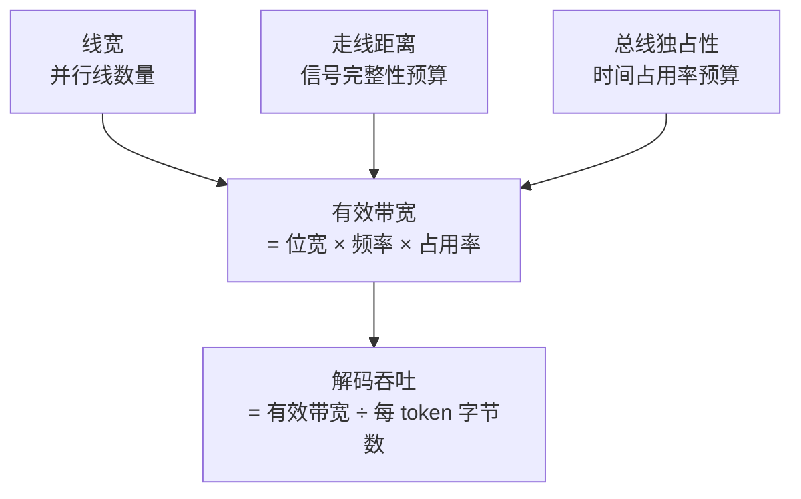

# 内存带宽为何决定解码速度-算术强度与带宽三因子

**核心摘要**：端侧 LLM 推理的两项体感指标由两条不同因果链决定——吐字速度被内存带宽唯一钉死，首帧时间则是"带宽当地板、算力定高度"。根因在算术强度：解码阶段输入退化为单个 token，每吐一个字都要把整份权重重扫一遍，算力单元全程空转。而带宽本身是三份硬件预算的乘积——线宽（空间）、走线距离（信号完整性）、总线独占性（时间占用率），任何一项减半，带宽就减半，解码速度跟着减半。

---

## 一、两条因果链

端侧 LLM 的体感通常拆成两个数：首帧时间（TTFT，Time To First Token）和吐字速度（TPS，Tokens Per Second）。这两个数看起来都在描述"快不快"，但它们背后的主导因素并不是同一个：

| 指标        | 主导因素         | 严格口径                  | 端侧实际表现                   |
| --------- | ------------ | --------------------- | ------------------------ |
| 吐字速度 TPS  | **内存带宽（唯一）** | 有效带宽 ÷ 每 token 需扫描字节数 | 带宽不足直接线性变慢，无替代路径         |
| 首帧时间 TTFT | 带宽 + 算力      | 带宽是**地板**，算力定**高度**   | 算力弱时表现为算力受限；带宽被抢时立刻被带宽主导 |

这个区分很重要，因为它决定了优化动作该往哪儿使劲：提升 TPS 砸钱在 TOPS 上几乎无效，而压缩 TTFT 既要看算力也要看带宽通道是否干净。

先把 TPS 的因果链拆干净，它是整篇文章的支点。

---

## 二、算术强度：解码阶段为什么与算力无关

### 2.1 一次前向计算的本质

Transformer 的每一层前向，剥到最底层就是一个动作：

```
输出 = 权重矩阵 × 输入激活
```

权重的体积是固定的（7B 模型 Q8 量化后约 7 GB），但**输入激活的形状取决于你在做什么**。这个差别会彻底改变计算的算术强度。

**算术强度（Arithmetic Intensity）** = 每搬运 1 字节数据，能完成多少次乘加运算。它决定了这个计算任务是"卡在算力上"还是"卡在带宽上"：

- 算术强度高 → 数据搬一次被复用很多次 → 计算时间盖过搬运时间 → **算力受限**
- 算术强度低 → 数据搬一次只算一下就丢 → 搬运时间盖过计算时间 → **带宽受限**

### 2.2 Prefill 是矩阵×矩阵，Decode 是矩阵×向量

| 阶段      | 输入形态                       | 运算类型          | 权重被复用的次数 | 算术强度 | 瓶颈     |
| ------- | -------------------------- | ------------- | -------- | ---- | ------ |
| Prefill | 整句 prompt 一次性送入（N 个 token） | 矩阵 × 矩阵（GEMM） | N 次      | 高    | 算力     |
| Decode  | 每次只追加 1 个 token            | 矩阵 × 向量（GEMV） | 1 次      | 极低   | **带宽** |

Prefill 一次搬进来 7 GB 权重，能给 2048 个 token 同时复用；Decode 一次搬进来同样 7 GB 权重，只服务 1 个 token 就作废了。**同一份数据，摊薄的分母从 2048 变成 1。**

这就是解码慢的全部原因，没有玄学。

### 2.3 时间账本

以 7B Q8 模型、S100P 平台（实测解码 5–6 token/s，反推有效带宽约 42 GB/s）为例：

```text
计算下限：2 × 7e9 次乘加 ÷ 100 TOPS  ≈ 0.14 ms
访存下限：7 GB 权重 ÷ 42 GB/s        ≈ 167 ms   ← 实际决定项
```

**时间被钉死在访存下限上，两者差三个数量级。**&#x518D;算 Prefill 那一侧做对照：

```text
Prefill（2048 token）
  访存：7 GB ÷ 42 GB/s = 167 ms（权重只搬一次，摊到每个 token 仅 0.08 ms）
  计算：0.14 ms × 2048 = 287 ms        ← 反成主体
```

同一个平台、同一份权重，Prefill 的计算耗时（287 ms）是搬运耗时（167 ms）的 1.7 倍，而 Decode 的搬运耗时（167 ms）是计算耗时（0.14 ms）的 **1190 倍**。两个阶段的瓶颈彻底对调。5

于是可以写出一条可以直接套用的公式：

```
解码吞吐上限 = 有效带宽 ÷ 每个 token 必须扫描的字节数

S100P ： 42 GB/s ÷ 7 GB  ≈ 6 token/s   ← 实测 5–6，吻合
```

### 2.4 反证：把算力翻倍，柱子纹丝不动

用一个变量控制实验来验证上面的公式——只改一个因子，看吞吐怎么变：

| 方案           | 改动              | 解码吞吐       | 结论       |
| ------------ | --------------- | ---------- | -------- |
| 基线           | 7B Q8，42 GB/s   | 6 token/s  | —        |
| 算力 ×2        | TOPS 翻倍         | 6 token/s  | **完全无效** |
| 有效带宽 ×2      | 84 GB/s         | 12 token/s | 线性提升     |
| 权重减半         | 换 W4A16（3.5 GB） | 12 token/s | 线性提升     |
| 带宽 ×2 + 权重减半 | 两项叠加            | 24 token/s | 4 倍      |

**TOPS 根本不在这个公式里。**&#x8FD9;就是为什么端侧选型时先看量化配方和带宽通道，最后才看算力值——算力只在 Prefill 那一段有意义。

---

## 三、首帧时间的口径澄清

### 3.1 带宽是地板，算力是高度

常见说法是"首帧看算力"，这个说法本身没错，但容易让人误以为带宽对首帧不重要。准确的口径是：

- **带宽提供下限**：无论算力多强，权重必须先搬进来。7 GB 除以 42 GB/s 就是 167 ms，这个时间一分都省不掉
- **算力决定实际高度**：算力越强，计算耗时越接近这个下限；算力越弱，实际耗时越远离下限

端侧的现实是算力普遍偏弱（S100P 标称 100 TOPS 级别，实际 Prefill 计算耗时 287 ms 已超过 167 ms 的搬运地板），所以首帧"看起来"是算力受限。但地板一直在那里，一旦带宽被抢走，首帧立刻暴露真实瓶颈。

### 3.2 三个会让带宽直接吃掉首帧的场景

**场景一：短 prompt。**&#x7528;户说一句"你好"，算量小到几乎为零，那 167 ms 的权重搬运时间就构成了首帧的全部。这也是为什么端侧首帧存在一个"再优化也压不下去"的硬底。

**场景二：多轮对话累积上下文。**&#x4B;V Cache 每轮都要重新搬。测得的规律是每多一块 256 token，TTFT 约 +654 ms。首帧从 40 ms 逐渐爬到 400 ms 并不是模型"变笨了"，而是搬运量随轮次线性上涨。工程对策是滑动窗口 + 会话摘要压缩，把总 token 压在 500 以内。

**场景三：算子回退到 CPU。**&#x8FD9;不是算力问题，是带宽问题。算子被踢回 ARM CPU 后，数据要在 NPU 内存区与 CPU 内存区之间来回拷贝，一来一回就是双倍带宽消耗，还要叠加跨总线同步开销。Q8 大模型在地瓜 BPU 上首帧飙到 500 ms+ 的根因就在这里。

---

## 四、带宽三因子：线宽、距离、独占性

### 4.1 总公式

带宽不是"一根管子粗细"这么简单，它是三份硬件预算的乘积：

```
有效带宽 = 位宽 × 每线速率 × 时间占用率
             ↑        ↑           ↑
           线宽     距离        独占性
           空间预算  信号完整性预算  时间预算
```



三个因子是**相乘**关系，任何一项减半，带宽就减半。下面逐个拆物理机制。

### 4.2 线宽 —— 空间预算

一根数据线在一个时钟里只能传 1 bit（SDR，单边沿采样）或 2 bit（DDR，双边沿采样）。想要 100 GB/s，只有两条路：**线更多**，或者**跑更快**。

而线宽被四重物理约束锁死，不能无限加大：

| 约束          | 说明                                                       |
| ----------- | -------------------------------------------------------- |
| 引脚预算        | 每根数据线要占一个封装焊球、一条 PCB 走线。BGA 焊球总数是有限的                     |
| 布线空间        | PCB 层数、参考平面、走线间距都有限，加宽就要加层，成本陡增                          |
| 同步开关噪声（SSN） | 位宽越大，同一时刻翻转的驱动器越多，电源网络上感应出的噪声越大。这是 DDR 物理层有近一半引脚是电源/地的原因 |
| 全局偏斜        | 线越多，做到严格等长的难度越大，各路信号的到达时间差（skew）越大，直接吃时序余量               |

算一笔账：LPDDR5 单通道 x32（32 根数据线）@ 6400 MT/s：

```text
6400 MT/s × 32 bit = 204.8 Gbit/s ÷ 8 = 25.6 GB/s
```

要凑到 100 GB/s，需要 4 个这样的通道——代价是 4 倍的引脚、走线和封装面积。所以"线宽"的本质是一个空间分配问题：**你把多少物理面积和引脚预算分给了内存。**

这也解释了 3D 堆叠内存（HBM / 片上堆叠 DRAM）为什么能碾压：它用 TSV 硅通孔垂直穿孔连接，不占用 PCB 面积，位宽可以做到 1024 bit 以上，因为它的"布线空间"是垂直方向的硅片厚度，而不是宝贵的二维 PCB 面积。

### 4.3 距离 —— 信号完整性预算

这条最反直觉，因为它不是"远一点慢一点"的线性衰减，而是一条**阶跃线**。

**机理链条：**

```text
走线变长
  → 寄生电容 / 电感变大
  → RC 延迟变大、边沿上升时间变缓
  → 反射、串扰（crosstalk）、线间偏斜（skew）同时变大
  → 眼图闭合
  → 建立 / 保持时序余量不足
  → 数据误码，只能降频
```

关键在于最后一步：**信号完整性是一条硬线，没有"逐渐变差"的中间态。**&#x773C;图闭合就是全错，不是慢一点。所以工程上唯一的处理方式是降一个频段，或者付出额外代价（加均衡器、加片上终端电阻 ODT、做严格等长走线、改用 Fly-by 拓扑）。

用具体数字感受一下这条约束有多紧。PCB 上信号传播速度约为 15 cm/ns（介电常数约 4）：

```text
1 cm 走线 ≈ 67 ps 飞行时间
DDR5-6400 的一个 UI（单位间隔）= 1 / 6.4 GHz ≈ 156 ps
```

也就是说，**只要两根线长度差超过 1 cm，偏斜就吃掉大半个 UI**，时序预算直接崩。这正是 PCB 上的 DDR 走线必须做严格等长（通常要求控制在 ±5 mil ≈ 0.13 mm 以内）的原因。

三个走线尺度的能力对照：

| 走线尺度  | 典型场合            | 能拿到什么               | 为什么                                     |
| ----- | --------------- | ------------------- | --------------------------------------- |
| 毫米以下  | 芯片内 SRAM / 寄存器  | 频率极高、位宽极大           | 走线极短，信号完整性几乎不是约束；但容量只有 MB 级，装不下 7 GB 权重 |
| 微米~毫米 | 封装内 3D 堆叠 / TSV | 高位宽 + 高频率 → TB/s 量级 | 垂直穿孔，距离比 PCB 短一到两个数量级                   |
| 厘米级   | 封装外 PCB 上的 DDR  | 几十 GB/s             | 必须等长走线 + ODT + 写入均衡训练，频率被压到几 GHz        |

**"存储离计算更近"这句话落在硬件上，就是"走线短到可以同时把位宽和频率都拉满"。**&#x8FD9;是 3D 堆叠方案带宽优势的物理根因，不是它的 DRAM 颗粒本身更快。

### 4.4 独占性 —— 时间占用率预算

前两个因子决定的是"峰值带宽"，这一个决定的是"你能实际拿到多少"。共享内存总线的损耗分三层，而且是叠加的：

**第一层：仲裁排队。**&#x4E00;条总线是分时复用的，CPU、GPU、NPU、DMA、显示控制器、USB 控制器都得排队。争抢时你的请求要等仲裁器调度，等待期间算力单元空转。

**第二层：行缓冲冲突。**&#x44;RAM 是二维阵列，"读一行"要先激活（activate），换行要预充电（precharge）。当多个主设备交替访问不同地址区域时，行会频繁开关，每次开关都有固定时间开销。学术上叫 row buffer miss，它能让有效带宽掉到峰值的一半以下。

**第三层：额外流量。**&#x7F13;存一致性维护流量、ECC 校验开销、DRAM 刷新开销，以及最典型的——算子回退时 NPU 与 CPU 之间的来回拷贝，一来一回双倍消耗。

这三层损耗的实测证据非常直接：

| 场景                    | 端侧实测              |
| --------------------- | ----------------- |
| ASR 独占内存与算力           | TTFR 约 400 ms     |
| ASR + TTS + LLM 三服务同跑 | TTFR 漂到 1.8–2.0 s |

**有效带宽只剩 1/4~1/5。**&#x82AF;片没坏，总线被抢了。

"独占"还有更深一层的含义：**容量与带宽的分配权**。8.3 GB 的系统共享 LPDDR 是全机共用的公共资源，一块专用的片上堆叠 DRAM 则天然不存在"谁来抢"这个问题——不只是物理更近，连争抢这件事都被架构消除了。

### 4.5 三因子合成验证

把三个因子代入一套完整的对照，验证公式是否成立。两个平台跑同一个 7B 模型：

| 因子          | S100P（现状）                  | RK1828                         | 差异来源       |
| ----------- | -------------------------- | ------------------------------ | ---------- |
| 每 token 字节数 | Q8，约 7 GB                  | W4A16，约 3.5 GB                 | 量化配方（约 2×） |
| 存储形态        | 8.3 GB 封装外共享 LPDDR         | 5 GB 封装内 3D 堆叠 DRAM，NPU 独占     | 距离 + 独占性   |
| 反推有效带宽      | 6 token/s × 7 GB ≈ 42 GB/s | 52 token/s × 3.5 GB ≈ 180 GB/s | 约 4.3×     |
| 实测解码吞吐      | 5–6 token/s                | 公开约 50–52 token/s              | 合计约 8~10×  |

```text
带宽比        ~180 / 42 ≈ 4.3×   ← 距离（信号完整性）+ 独占性（无争抢）共同贡献
每字字节比     7 / 3.5   ≈ 2.0×   ← 量化配方贡献
─────────────────────────────
解码吞吐比            ≈ 8～10×   ← 与实测吻合
```

没有第四个神秘加速器。就是**更近的存储 + 更少的搬运 + 独占的通道**。

---

## 五、工程推论

### 5.1 优化优先级不能搞反

```
第一优先：每 token 要扫多少字节   → 量化配方（Q8 → W4A16 直接减半）
第二优先：带宽里有多少是你独享的 → 资源隔离（分卡、分行、独占内存通道）
第三优先：算力够不够支撑 Prefill → TOPS
```

前两项是乘法因子，直接线性改善 TPS；第三项只影响首帧。

### 5.2 别让多个模型挤同一条内存总线

ASR / TTS / LLM 同卡共享的代价不是"慢一点"，而是有效带宽掉到 1/4。把三个模型拆到不同计算单元与不同内存分区，比换一块更贵的芯片见效快得多。

### 5.3 选板子的三个提问

1. **内存离计算有多近**——是封装外 PCB 上的 LPDDR，还是封装内堆叠？
2. **带宽是独占还是共享**——有几路主设备在争？
3. **每 token 要扫多少字节**——支持的量化配方是什么？

内存容量只回答"塞不塞得下"，不回答"快不快"。容量决定可行性，带宽和独占性决定体验。

### 5.4 性能核查清单

- [ ] 是否算过"有效带宽 ÷ 每 token 字节数"这个理论吞吐上限？实测值是否接近？
- [ ] 是否有跨内存分区的算子回退（NPU ↔ CPU 来回拷贝）？
- [ ] ASR / TTS / LLM 是否在同一块共享内存上争抢？独占时与同跑的延迟差多少？
- [ ] KV Cache 是否随轮次无限增长？是否有滑动窗口或摘要压缩？
- [ ] 选型时是否比较过内存的物理形态（封装内 vs 封装外），而不只是容量与 TOPS？

---

## 关联阅读

- [端侧 LLM 部署硬件瓶颈与量化选型](../端侧部署/2026-07-06_端侧LLM部署硬件瓶颈与量化选型.md)——量化配方与开发板选型的决策框架
- [RK1828 与 S100P 大模型解码性能底层对比](../端侧部署/2026-09-03_RK1828与S100P大模型解码性能底层对比.md)——两平台的实测数据来源与异构拆分方案
- [4090 与 RK3588 硬件设计差异与原理](2026-08-03_4090与RK3588硬件设计差异与原理.md)——规格对比与算子生态视角
- [数值类型 FP32-FP16-BF16-INT8-INT4 位结构与量化原理](2026-08-03_数值类型FP32-FP16-BF16-INT8-INT4位结构与量化原理.md)——"每 token 字节数"的位级来源

> 数据口径：S100P 数据来自本知识库已落地的实测基准；RK1828 数据来自公开评测，尚未在本环境实测。42 GB/s 与 180 GB/s 均为从解码吞吐与权重体积反推的**有效带宽**，非芯片标称峰值带宽。
