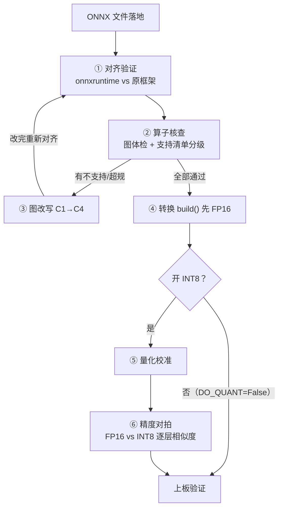

# 导出 ONNX 后的六步流水线

**核心摘要**：导出 `.onnx` 只拿到一个格式合法的中间文件，离"模型能上板"还隔着六步：对齐验证、算子核查、（图改写）、FP16 转换、量化校准、精度对拍，最后上板。最容易混的三个动作——对齐验证是查错、量化校准是采数据、精度对拍是验收——各有独立判据。本文结合 Silero VAD、HiFiGAN、VITS 三个 RK3588 实测案例，给出每一步做什么、判据是什么、不过说明什么。

> **环境与口径**  
> 目标芯片：RK3588（LubanCat-4，RKNPU v2），工具链 rknn-toolkit2 2.3.2，板端 rknn-toolkit-lite2 2.3.2，librknnrt 2.3.2  
> 案例模型：Silero VAD（约 2.25 MB，L0）、HiFi-GAN v1（54 MB，L1）、VITS-zh-aishell3（L2）  
> 本文只讲 x86 侧流程；板上延迟、内存、回退比例属于最后的上板验证，不在本文展开

---

## 一、ONNX 是中间站，不是终点

ONNX 的角色是**交换格式**：把训练框架（PyTorch / PaddlePaddle）的"方言"翻译成一份通用描述。它保证的是"结构被正确描述、能被 onnxruntime 读进来"，不保证"目标芯片认识图里的每一个算子"。

常见的错觉是"导出成功 = 部署完成"。实际上 `torch.onnx.export` 不报错只说明文件格式合法，从这份文件到板上 NPU 跑出正确结果，中间是一条完整的流水线：

这条流水线有一个贯穿性的设计原则：**每一步只做一件事，每一步的"不过"都有明确含义**。流程的价值不在跑通，在于把"这个模型不行"翻译成"具体卡在哪一步、为什么"。

---

## 二、第一步：对齐验证——查错，不是校准

**做什么**：同一个输入，喂原框架和 onnxruntime 各一遍，比输出。

**判据**：数值差应落在浮点计算顺序差别的量级（约 1e-5 ~ 1e-6），余弦相似度 0.9999 以上。

**不过说明什么**：导出错了。典型原因：动态 shape 没固定、opset 版本不匹配、自定义算子没注册、训练/推理模式不一致。**必须回去修导出脚本，不能带病下行**——这一步不过，后面所有精度结论都建立在错误基线上。

**实战案例（Silero VAD）**：同一模型存在两份结构不同的 ONNX——官方导出 121 节点、含控制流；自己从 jit 导出 77 节点、固定 shape。两份文件都叫 silero-vad.onnx，但不是同一个图。教训：**引用"图里有什么"之前，先确认是哪一份**。对齐验证的价值就在于把"文件名相同"和"内容等价"区分开。

这一步成本极低（一次前向 + 一次比对），是全流水线性价比最高的动作。

---

## 三、第二步：算子核查——看图里有什么，对着清单分级

**做什么**：先跑图体检（列出全部算子及参数），再对照厂商算子支持清单分级。

**四级分级**：原生支持 / 受限（需对齐，如 Transpose 轴序、尺寸 16·32 字节对齐）/ 会 CPU 回退 / 不支持。

**判据**：**"名字在册" ≠ "参数级接受" ≠ "NPU 认"**。官方清单分两份——名字级的 md 和参数级的 PDF，缺一不可；唯一权威判定是 `rknn.build()` 跑通。

**实战案例（HiFiGAN）**：对 PaddleSpeech 预导出的 `hifigan_csmsc.onnx` 做规格扫描，78 个卷积里 7 个超 RK3588 规格：3 个 ConvTranspose 的 stride 是 5/5/3（不在 {1,2,4,8}），4 个 Conv 的 pads=25（超上限）。这条实测沉淀出一个通用判据：**"kernel 合规"≠"这层合规"，stride 与 pads 要一起查**。

**一票否决项**：Loop / Scan / RNN 类控制流算子，直接不可转。Silero VAD 图内 STFT 以卷积形式表达时 kernel 256、stride 128 双超规，正确出路是把 STFT 挪到图外自己实现。

---

## 四、第三步：图改写——按需触发，不是必经

核查全过就跳过这一步。只有发现不支持或超规才进入，手段按代价从低到高：

| 手段       | 做法                                              | 代价                    |
| -------- | ----------------------------------------------- | --------------------- |
| C1 导出期规避 | 改模型源码再导出：注意力显式拆 Q/K/V、动态 shape 改固定 chunk        | 最低                    |
| C2 等价替换  | 复合算子拆原子算子：LayerNorm → Mean/Sub/Square/Rsqrt/Mul | 拆完可能破坏融合，必须复测         |
| C3 子图切除  | 后处理移出计算图（CTC 解码 / argmax / TopK），板端 C++ 实现      | 低风险高收益                |
| C4 定点回退  | 个别算子显式指定跑 CPU                                   | 保底，回退计算占比 <5% 且不在高频路径 |

**实战案例（VITS）**：整图 4896 节点不可整转，最终方案是分图——CPU 前段（text_encoder + 时长预测 + 长度扩展，含全部 8 种不支持算子的 112 节点）+ NPU 后段（flow + decoder，458 节点）。两个具体改写：flow 里 4 个 `Neg` 改成 `Mul(-1)`（等价替换）；动态帧数**补零冻结 160 帧**（导出期规避）。

**判据**：任何改写完成后**必须回到第一步重新对齐**——改写改变了图，对齐结论不能沿用。"拆了就更快"是错觉，融合被破坏反而更慢，复测是规则不是可选项。

---

## 五、第四步：转换 build()，先 FP16

**做什么**：`rknn.build()` 生成目标芯片格式，**先不开量化**（`DO_QUANT=False`），FP16 跑通功能。

**为什么先 FP16**：FP16 都没跑通就开 INT8，出错时分不清是转换的锅还是量化的锅。这是坑清单级的规则：**先跑通功能，再逐步开量化**。

**版本三锁**：toolkit / 板端 librknnrt / NPU 固件三个版本必须匹配，转换脚本第一行写死版本号。历史上大量"换个版本就好了"的案例，本质都是版本不匹配。

**转换成功之后必查**：逐层确认执行设备（`trans_stat` 是档位分布唯一实证入口）。"build 成功"不代表"全在 NPU"——不查回退比例，等于不知道模型实际怎么在跑。

---

## 六、第五步：量化校准——只有开 INT8 才存在

先立一个反直觉事实：**只走 FP16 路线，全流程根本没有校准这一步**。校准服务的是量化，不是 ONNX。

**做什么**：把校准集喂给 toolkit，跑前向，统计每层输出的数值范围（min/max 或直方图），据此确定每个 tensor 的量化 scale。注意它的三个本质特征：

1. **只跑前向**，不跑反向，不改权重一个字节；
2. **没有对比对象**——校准不是"验证"任何东西，它只产出 scale；
3. 计算量极小：几百条样本的前向，比训练低八个数量级以上，CPU 足够。

**校准集三要素**：来源真实场景（不是随机数据）、规模 100–500 条、**必须分层且含 worst case**（安静/嘈杂、近场/远场、男声/女声、语速快慢、数字与专名）。反例警告：拿公开数据集随机采样做校准集，在餐厅迎宾场景可能整体掉 5 个点——掉的不是模型的点，是校准集的点。

**实战案例（HiFiGAN W8A8）**：体积从 29 MB 收到 14.5 MB，但波形 SNR 只剩 9.84 dB、最大绝对误差 1.43（采样点翻侧），不能当声码器用。混合量化逐段替换救不回——误差在占参数 93% 的前两段累加。收口结论：**这类模型体积是硬约束时走 QAT（量化感知训练），训练后量化救不回来**。

---

## 七、第六步：精度对拍——验收，掉点定位到层

**做什么**：`accuracy_analysis()` 出逐层余弦相似度，FP16 版 vs INT8 版对比。掉点定位 = 找相似度突变的那一层。

**模块级二分**：把模型切 3–5 段，分别用 FP16 版替换 INT8 段，找出哪一段贡献主要掉点；每处掉点记归因（数值范围异常 / 白名单假设被证伪 / 校准集未覆盖）。

**对拍必须同引擎**：两遍必须在同一个引擎上跑。一遍 GPU 一遍 CPU，差值里混进了引擎差，分不清掉点是量化掉的还是引擎掉的——对照失效。这也是 RKNN 工具链只发 CPU 版的原因之一：任意 x86 机器结果可复现，对拍天然同引擎。

---

## 八、三个最容易混的词

这三个动作在口语里经常被揉成"对齐校准"一个词，实际是三个独立动作：

| 词        | 比什么                    | 什么时候做        | 不过说明什么               |
| -------- | ---------------------- | ------------ | -------------------- |
| **对齐验证** | PyTorch vs ONNX，同输入比输出 | 导出后立刻        | 导出错了，回去修导出           |
| **量化校准** | 没有对比，纯统计每层数值范围         | 只有开 INT8 才需要 | 它不"验证"任何东西，只产出 scale |
| **精度对拍** | FP16 vs INT8，逐层相似度     | 量化之后         | 掉点要能定位到具体层           |

一句话记住分工：**对齐验证是查错，校准是采数据，对拍是验收**。

---

## 九、易错清单

| # | 错误                    | 后果                |
| - | --------------------- | ----------------- |
| 1 | 导出后不做对齐验证直接转换         | 错误基线，后面全错         |
| 2 | 一步开 INT8（FP16 未跑通就量化） | 出错分不清转换还是量化的锅     |
| 3 | 校准集用公开数据集随机采样         | 真实场景整体掉点，掉的不是模型的点 |
| 4 | 只看"转换成功"，不查回退比例       | 不知道模型实际在哪跑        |
| 5 | 图改写后不重新对齐             | 改写引入的误差无感知        |
| 6 | 把对齐/校准/对拍混为一谈         | 每个动作的"不过"含义失效     |

---

## 十、收尾

这条流水线每一步的输出都是下一步的输入，而每一步的"不过"都是可执行的信号：对齐不过修导出，核查不过做改写，改写完回到对齐，FP16 通了才校准，校准完对拍定位。**流程的意义不是仪式感，是把"模型不行"这句无法行动的结论，翻译成"卡在第几步、什么原因、下一步动哪里"**。

---

## 参考资料

- RKNN-Toolkit2 官方文档（算子支持清单 md + 参数级 PDF，两份都要对照）
- 本库实测记录：《SileroVAD在RK3588上的CPU与NPU实测对比》《RK3588上HiFiGAN的CPU与NPU对比及W8A8量化实测》《RK3588上VITS切分推理与原生ONNX对比》《RKNN-Toolkit2-2.3.2-量化打包类型与选型》
