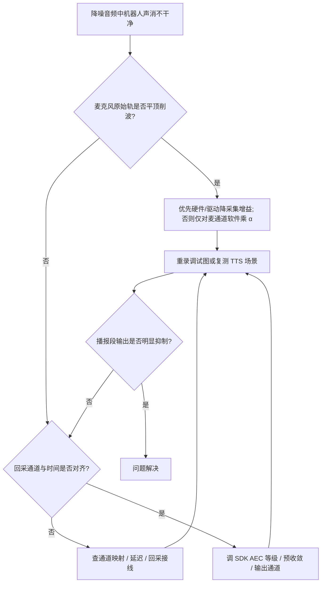

# 麦阵回采 AEC 削波排查与 mic 数字增益

> 适用场景：嵌入式板卡 + USB 麦阵（多路麦克风 + 多路回采），经第三方降噪/AEC SDK 处理后送识别。  
> 典型配置：8 路采集（4 麦 + 2 占位 + 2 回采），16 kHz / 16 bit / 小端，交叉格式送入 4mic+2ref 引擎。

---

## 1. 背景与现象

机器人语音交互中，麦阵音频经降噪与 **AEC（回声消除）** 后用于唤醒/识别。常见数据流：

```text
多通道采集 → 通道规整（4 麦 + 2 回采）→ 降噪 SDK → 单路或多路输出
```

**现象**：机器人播放 TTS 时，降噪结果里**自身播报仍清晰可闻**（回采消除不足）。若导出 SDK 调试中间音频，常可看到：

| 轨道类型 | 含义 | 异常表现 |
|----------|------|----------|
| 麦克风原始轨 | 某路麦进 SDK 前 | 播报段**顶满刻度、波形平顶**，属数字削波 |
| 回采参考轨 | 喇叭参考信号 | 幅度明显更低（如约为麦的 1/5），通常无削波 |
| 降噪/AEC 输出轨 | 处理后结果 | 播报段残留大，有时仍带输入侧的「平顶」特征 |

**结论**：不宜先盲目提高 AEC 等级；需优先确认**麦克风是否已饱和削波**。

---

## 2. 根因说明

AEC 基于近似线性模型：麦克风中的回声 ≈ 回采经自适应滤波后的拷贝。

当麦克风数字采样 **削波**（16 bit 顶到 ±32767，波形平顶）时：

- 非线性失真，滤波器无法准确拟合；
- 麦克风满幅而回采偏低，动态范围失调，算法难以收敛；
- 若引擎内 **AGC 开启**，在已偏大的输入上可能进一步推满。

因此：**先消除削波、理顺电平，再调 AEC 参数**；否则即使 AEC 等级已最高，效果仍可能很差。

---

## 3. 排查方向（建议顺序）

### 3.1 确认是否削波（最高优先级）

用波形工具（如 Audacity）打开 SDK 导出的**原始/调试 PCM**，或自行录制多通道 raw：

- 格式：16 kHz、16 bit 有符号、小端；多通道需按轨拆分。

**判定**：

- 播报段峰值长期贴满、顶部/底部被「削平」→ **削波**；
- 可统计峰值与接近满幅样本占比（如 |sample| ≥ 32700 的比例），播报段明显偏高即有问题。

### 3.2 核对通道映射

确认送入引擎的顺序与硬件一致，例如常见的 8 路输入规整为 6 路：

```text
输入: [麦1 麦2 麦3 麦4 空 空 回采1 回采2]
输出: [麦1 麦2 麦3 麦4 回采1 回采2]
```

**静音法**：分别「只播 TTS」「只对人声」「全静音」各录一段，逐轨查看能量是否落在预期通道；回采错道会导致 AEC 完全失效。

### 3.3 回采对齐与幅度

- 回采与麦克风里回声在时间上是否固定延迟，引擎是否需开启 delay 补偿；
- 回采是否来自真实喇叭回路，而非错误线路或衰减过大/过小；
- 削波消除后若仍有少量残留，再考虑回声系数预收敛、首次播报训练等 SDK 提供的能力。

### 3.4 硬件增益（优先排查）

```bash
arecord -l
amixer -c <声卡号> contents
```

在模拟前端、ADC 或声卡采集控件上降低**麦克风增益**，使进量化前的信号留在线性区，是从源头避免削波的首选手段。

部分 USB 麦阵**仅有开关/AGC、无独立 Capture Volume**，无法仅靠 mixer 调节，才退而采用下文「软件数字增益」。

### 3.5 开启 SDK 中间音频日志

调试阶段打开厂商提供的「保存原始/中间/输出音频」选项（具体项因 SDK 而异），对比**进引擎前**麦轨是否已削波，避免只在输出轨上误判。

### 3.6 确认评测的是正确输出通道

多波束/多通道输出时，应听**业务实际使用**的那一路；听错通道会误以为「回采没消干净」。

---

## 4. 解决方案层级：硬件优先，软件兜底

电平控制应**尽量前移**到硬件/驱动；软件只对麦克风通道乘系数是**无硬件旋钮时的折中**，不能替代前端线性化。

```text
理想：模拟/ADC/声卡采集增益 ↓  →  量化后已是线性大信号  →  AEC
折中：量化后仅对麦通道 × α     →  降低进 SDK 电平        →  AEC
```

| 层级 | 作用位置 | 优点 | 局限 |
|------|----------|------|------|
| **硬件/驱动**（理想） | 麦克风前端、ADC、Capture Volume 等 | 在削波**前**控制电平，动态范围最好，AEC 输入失真最小 | 依赖电路设计与可调控件；部分 UAC 设备不可调 |
| **软件数字增益**（兜底） | 多通道 PCM 进 SDK **之前** | 实现简单，不改动硬件即可压低麦路电平 | 见 4.3；无法「修复」已发生的硬削波 |

**硬件层可动手段（按优先级）**：

- 声卡/codec 的 **Capture Volume、ADC Digital Volume、PGA** 等（`amixer` 可查）；
- 关闭或降低不宜在热信号上工作的 **Auto Gain Control**（视器件而定）；
- 板级：**麦克风增益电阻、前置放大倍数、麦间距与灵敏度选型**（需硬件协同）；
- 喇叭侧：适当降低 TTS 播报音量，减轻回声幅度（辅助手段，不能替代麦路线性化）。

**目标一致**：TTS 播报时，麦克风峰值建议约 **-12 ~ -6 dBFS**（16 bit 约 9000~16000），为 AEC 留 headroom。

---

### 4.1 软件折中：仅衰减麦克风通道

在**多通道原始缓冲**中，只对**麦克风对应通道**（如 4 路麦）乘以系数 **α**（建议 0.01~1.0），**不衰减回采通道**，以免削弱 AEC 参考。

- 插入位置：采集读入之后、通道规整与送入降噪引擎**之前**；
- 推荐起点：**α ≈ 0.35**（约 -9 dB），按波形微调；
- 实现要点：S16 乘法后对结果做饱和限幅，避免二次溢出。

若 SDK 为**内部采音**、应用无法在进引擎前改样本，需改为**外部送音**：由应用完成采集与 α 缩放后再写入 SDK；通道顺序与 α 应统一维护。

---

### 4.2 软件方案能做什么、不能做什么

**本质**：对四路麦的每个采样做线性缩放（整体「降音量」），不是改 AEC 参数，也不是在输出轨上压限。

| 情况 | 降 α 的效果 |
|------|-------------|
| 信号很大但仍在线性区（仅接近满幅） | 效果明显，峰值下来，AEC 易收敛 |
| 偶尔削波、轻度平顶 | 通常有改善，可能仍有轻微残留 |
| 长时间**硬削波**（宽平顶） | **不能**找回已削掉的信息；乘 α 只是把平顶压低，**非线性失真仍在** |

因此：

- 软件降增益的作用是 **把工作点拉回线性区、避免继续削波**，让 AEC 能按线性模型工作；
- **不是**对已削波波形做「修复」；严重夹死的片段只能依赖**重录**或**硬件降增益后重新采集**。

实测中若降 α 后麦轨无平顶、播报段输出几乎静音，说明当前链路已主要在**线性区**工作；这并不否定「理想应在硬件先压电平」的结论。

---

### 4.3 效果验证（实测规律）

合理降增益（或硬件降增益）后通常可见：

- 麦克风原始轨：峰值回落、**无平顶**；
- 播报时段输出轨：机器人声明显压低或接近静音；
- 仅外部人声、无播报时段：人声仍保留。

### 4.4 与「截断」的区分

波形平顶一般是**幅度削波（饱和）**，不是录音**时长**被截断；排查时优先查增益与动态范围。

---

## 5. 调参建议

| 现象 | 建议 |
|------|------|
| 仍有削波（波形平顶） | **优先**再查硬件/AGC/播报音量；无可调项时再降低 α 至 **0.25~0.30** |
| 人声偏小、唤醒/识别变差 | 提高 α 至 **0.45~0.55**（确认无削波） |
| 无削波但回采仍有少量残留 | 保持 α，再查回采通道、延迟、接线；必要时调 SDK AEC/预收敛 |
| 输出听感仍不对 | 确认评测的是业务使用的输出通道/波束 |

调参时以第 4 节「硬件优先」顺序为准：能调采集增益则先调硬件，再动 α。

---

## 6. 排查流程图



---

## 7. 经验摘要

**机器人声消不干净时，先看麦克风原始轨是否削波。理想做法是在硬件/驱动层降低麦克风采集增益，使量化前信号线性；部分 USB 麦阵无独立音量时再在进 SDK 前仅对麦通道做软件衰减（如 α≈0.35），且不要衰减回采。软件衰减不能恢复已硬削波丢失的信息，只是把电平拉回 AEC 可工作的线性区。**

---

*文档用途：技术知识库 / 故障复盘。环境示例：RK3588 + 多通道 UAC 麦阵 + 讯飞类降噪 SDK。*
