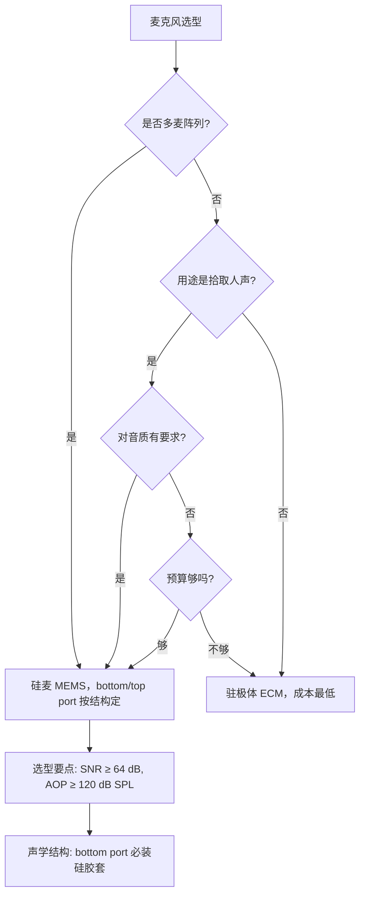

# 机器人麦克风选型-驻极体vs硅麦区别与选型

**核心摘要**：机器人语音交互主麦阵列选硅麦（MEMS），理由三句话——多麦阵列一致性（±1 dB 以内）是波束成形和声源定位的前提，SMT 可量产性杜绝手工焊接的个体差异，对电机振动的低耦合比 ECM 干净得多。驻极体只在单麦近场、噪声参考麦、极度压 BOM 三个场景还有价值。硅胶套对 bottom-port MEMS 不是"保护套"而是声学结构的一部分，不装就没法正常工作。

---

## 1. 问题背景

机器人语音交互链路中，麦克风是绝对的第一级。麦选错了，后面 AEC、波束成形、ASR 做得再好都补不回来。市面常见的两类麦克风——**驻极体电容麦（ECM）和硅麦（MEMS 麦克风）**——价格差十倍，但价格不是决策依据。本文从机器人实际场景出发，拆解两者的根本差异和选型逻辑。

---

## 2. 工作原理差异

|          | 驻极体（ECM）                 | 硅麦（MEMS）                             |
| -------- | ------------------------ | ------------------------------------ |
| **传感元件** | 带电驻极体薄膜 + 金属振膜           | 硅微机械刻蚀振膜（微米级）                        |
| **信号处理** | JFET 阻抗变换器，输出模拟信号        | 内置 ASIC（放大器 + ADC），输出数字信号（I²S / PDM） |
| **本质定位** | 模拟器件                     | MEMS 传感器（微机电系统）                      |
| **封装形态** | 圆柱金属筒（φ4~9.7 mm），引脚/引线焊接 | 扁平贴片封装（常见 3.5×2.65 mm），标准 SMT        |

ECM 是"一张带电的振膜 + 一个 JFET"的模拟组合；MEMS 是"用半导体工艺在硅片上刻出一个振膜，再片上集成 ASIC"。从制造精度到输出形态，两者不在一个代际。

---

## 3. 关键参数对比

| 维度           | 驻极体（ECM）         | 硅麦（MEMS）              | 对机器人的影响                       |
| ------------ | ---------------- | --------------------- | ----------------------------- |
| **灵敏度一致性**   | ±3~5 dB，个体差异大    | ±1 dB 以内，晶圆级校准        | 多麦阵列算法对灵敏度差极度敏感，ECM 跑不牢       |
| **信噪比（SNR）** | 典型 58~62 dB      | 典型 64~70 dB（部分 74 dB） | 远场（1~5 m）场景下 SNR 差意味着拾音距离直接缩水 |
| **频率响应**     | 货架产品曲线各异，批次波动    | 出厂一致性极好，曲线平坦          | 阵列标定一次搞定 vs 每台都得单独校准          |
| **温度稳定性**    | 差，驻极体电荷随温度漂移     | 极好，硅工艺天然稳定            | 机器人户外/工业场景温差大，ECM 增益会漂        |
| **抗 RF 干扰**  | 差，金属外壳需额外屏蔽      | 好，ASIC 自带滤波           | 机器人内部 WiFi/4G/电机 EMI 密集       |
| **抗振动耦合**    | 振膜质量大，低频振动敏感     | 振膜质量小、硬度高，结构耦合弱       | 机器人肚子里有电机/风扇/舵机，ECM 嗡嗡声难去     |
| **体积**       | φ4×1.5 mm 起步     | 3.5×2.65×0.98 mm 常见   | 机器人 ID 空间有限，MEMS 更好塞          |
| **功耗**       | ~0.5 mA @ 1.5V   | ~~0.6~~1.0 mA @ 1.8V  | 差异微小，不是决策因素                   |
| **成本（单颗）**   | 0.1~0.5 元        | 0.5~2 元               | 阵列为 N 颗时差距放大，但在总 BOM 中占比不大    |
| **焊接**       | 手工焊（引脚/引线），一致性靠人 | 标准 SMT 回流焊，一致性靠机器     | ECM 焊十个出三种灵敏度，MEMS 整批一致       |

---

## 4. 机器人场���的四个核心决策维度

### 4.1 多麦阵列一致性——堵死 ECM 的第一理由

波束成形、声源定位、自适应降噪——这些阵列算法的前提是：**每个麦对同一声源的响应差在可控范围内。**

- MEMS：出厂晶圆级校准，±1 dB，阵列可以直接跑。
- ECM：个体差 ±3~5 dB，5 dB 的差异在 log 尺度上就是 1.78 倍的幅度误差。算法靠幅度/相位差做波束，底子就是歪的。

**结论：只要是多麦阵列方案，ECM 直接排除。**

### 4.2 电机/舵机振动环境

机器人内部不是安静的音箱，而是电机、风扇、舵机的振动场。麦克风贴在结构件内壁上，壳体振动直接耦合到振膜。

- ECM 振膜面积大、质量大，低频振动通过壳体传过来，振膜跟着抖——产生低频"嗡嗡"噪声，AEC 和降噪很难消干净。
- MEMS 振膜微米级、硅材质硬度高，同等振动下半部耦合能量小得多，底噪干净。

### 4.3 量产一致性

ECM 手工焊，焊点温度、引线长度、焊锡量都影响最终灵敏度。100 台机器人，可能有 30 种不同的频响曲线。

MEMS SMT 贴片，回流焊温度曲线统一，整批出厂频响几乎一致。标定一次，全量产复用——这是量产的基本要求。

### 4.4 声学过载点（AOP）

机器人的碰撞声、关门声、跌落声，瞬时声压可能远超正常对话（对话约 60~70 dB SPL，碰撞可达 120 dB SPL 以上）。

MEMS 选型时要看 **AOP（Acoustic Overload Point）**，一般要求 ≥ 120 dB SPL。AOP 不够，麦会削顶失真，ASR 直接丢一整段。常见可用颗粒：Knowles SPH0641、TDK ICS-43434、Infineon IM69D130。

---

## 5. 什么时候还能用驻极体

并不是所有场景 ECM 都该一棍子打死。以下三类场景，ECM 仍有性价比优势：

1. **单麦近场**：机器人上的物理按钮旁做触摸唤醒、桌面拾音、耳麦——单麦无所谓一致性，近场 SNR 够用，成本低。
2. **噪声参考麦**：贴在电机壳上专门采环境噪声做 ANC/AEC 参考信号，不用来拾语音。反正不追求高 SNR，ECM 几毛钱搞定。
3. **极限压 BOM**：一些走量极大的消费级产品（如玩具、低端音箱），BOM 差一块钱很敏感，且对语音质量要求不高时，ECM 可以接受。

---

## 6. 硅胶套（声学密封）：不是保护套，是结构必须品

两类麦对硅胶套的需求完全不同。

### 6.1 MEMS 底部进音（Bottom Port）→ 必须带硅胶套

Bottom port 的进音孔在焊盘那面，贴到 PCB 上后音孔被 PCB 完全堵死，必须在 PCB 上开一个通孔，再用硅胶套连接麦的音孔和外壳开孔。

硅胶套在这里承担三个角色：

- **声学密封**：防止前后声腔短路，一旦漏气低频响应直接塌掉
- **导音通道**：把外部声音引导到麦的进音口
- **IP 防护**：防水防尘（机器人可能溅水、落灰）

**没装好硅胶套 = MEMS 根本没法正常工作**，不是防护差点的问题。

### 6.2 MEMS 顶部进音（Top Port）→ 建议薄防尘网或硅胶套

Top port 音孔朝外，理论上直接对着外壳开孔就行。但机器人会撞、会溅水、会积灰，裸奔有风险。建议至少加一层防水膜或薄硅胶套。

### 6.3 驻极体（ECM）→ 不需要声学硅胶套

ECM 本身是封闭金属筒，进音孔在顶部，内部已经封装好振膜和极板。直接贴在结构件内壁上，靠外壳开孔进音即可。

唯一需要的是进音孔加一层**防风海绵或无纺布**，解决风噪和灰尘问题。这和 MEMS 的声学密封套是两回事。

| 类型               | 硅胶套需求   | 原因                  | 额外防护     |
| ---------------- | ------- | ------------------- | -------- |
| MEMS bottom port | **必须装** | 音孔被 PCB 挡住，硅胶套是声学通道 | 自带 IP 防护 |
| MEMS top port    | 建议装     | 裸奔有进水进灰风险           | 防水膜/防尘网  |
| ECM              | 不需要     | 金属筒已封装，直接开孔进音       | 海绵 + 无纺布 |

---

## 7. 选型决策流程

---

## 8. 常见 MEMS 颗粒参考

| 型号            | 厂商             | SNR     | AOP        | 接口  | 封装          | 参考价  |
| ------------- | -------------- | ------- | ---------- | --- | ----------- | ---- |
| SPH0641LM4H-1 | Knowles        | 64.3 dB | 120 dB SPL | PDM | bottom port | ~3 元 |
| ICS-43434     | TDK InvenSense | 65 dB   | 120 dB SPL | I²S | bottom port | ~5 元 |
| IM69D130      | Infineon       | 69 dB   | 130 dB SPL | PDM | bottom port | ~4 元 |
| INMP441       | TDK InvenSense | 61 dB   | 120 dB SPL | I²S | bottom port | ~3 元 |
| VM2020        | Vesper         | 62 dB   | 149 dB SPL | PDM | bottom port | ~6 元 |

> Vesper 的压电 MEMS 方案 AOP 极高（149 dB），适合强冲击/户外场景，但 SNR 偏低。

---

## 9. 小结

机器人语音交互主麦阵列选硅麦（MEMS），不是"更高级"的选择，是物理上 ECM 做不到多麦±1 dB 一致性和 SMT 可量产。ECM 退守的三个场景（单麦近场、噪声参考、极致压成本）才是它的合理生态位。

两个容易踩的坑：

1. **没装硅胶套的 bottom-port MEMS 无法工作**，不是音质差，是没声。
2. **只看了 SNR 没看 AOP**，碰撞声一波带走，ASR 完蛋，量产之后才后悔。

---

*文档用途：技术知识库 / 硬件选型参考。适用场景：机器人语音交互系统麦克风前端选型，覆盖消费级机器人、商用服务机器人、工业巡检机器人等典型场景。*
