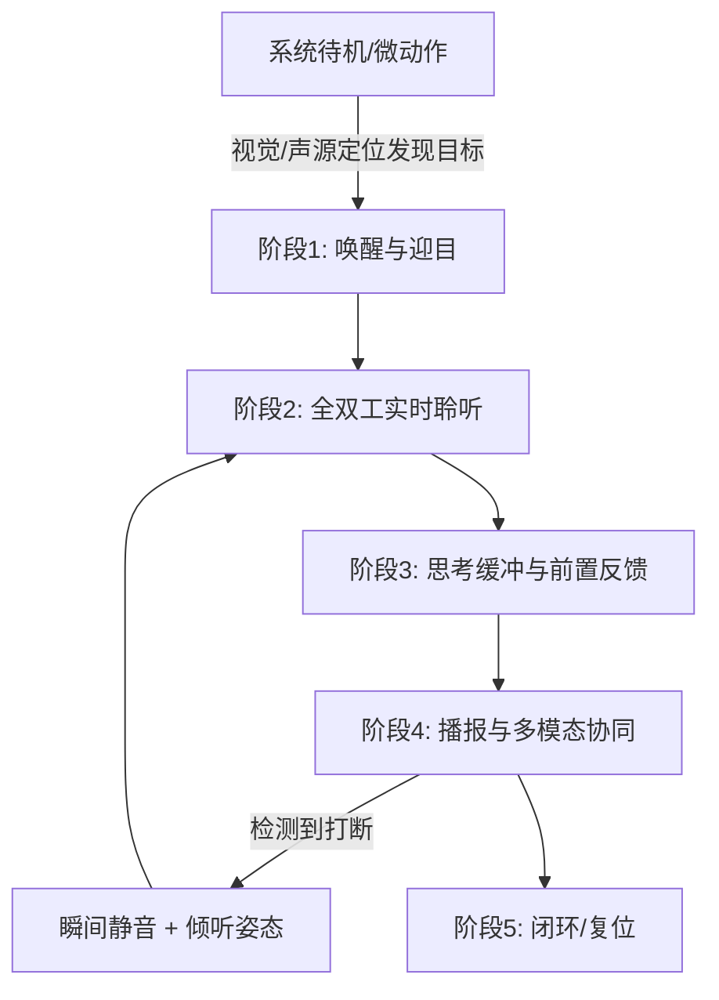
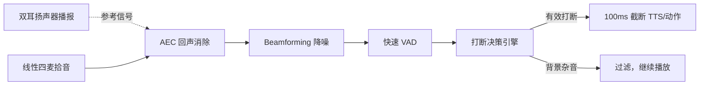
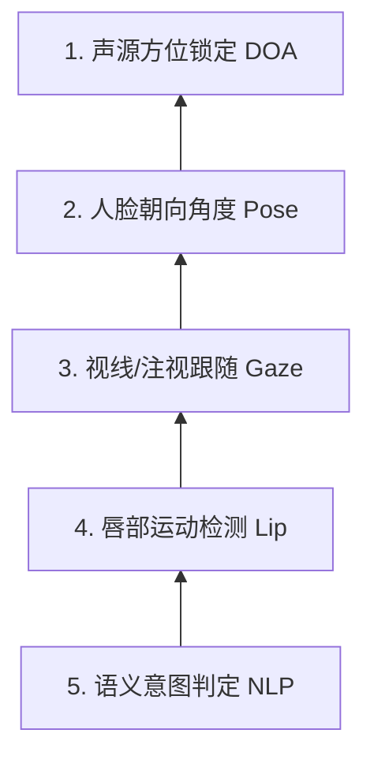

# 仿生机器人全双工语音交互方案

本文设计了一套面向嘈杂环境的仿生机器人全双工语音交互系统，核心通过**声学回声消除（AEC）+ 波束成形降噪 + 四级打断决策引擎**实现播报与聆听并行，响应延迟控制在 200ms 以内；并引入**唇动识别与视听融合（AV-VAD）**作为第三道保险，解决"用户是否在跟我说话"这一终极难题。整套方案以 RK3588 为算力基线，给出各模块算力分配与选型建议。

---

## 一、场景与硬件约束

- **机器人形态**：仿生半身机器人，头部 19 个表情舵机 + 颈部 3 自由度，胸前屏幕
- **传感器**：线性四麦阵列（头与屏幕之间同一竖直线）、摄像头
- **输出**：双耳扬声器、19+3 舵机表情/动作、胸前屏幕图文
- **环境挑战**：嘈杂展厅/商场（80dB+），需支持用户随时打断，避免误触发

---

## 二、全双工交互五阶段流程

全双工意味着机器人**一边播报、一边实时监听**，用户可在任意时刻打断，而非传统"一问一答"的半双工状态机。

### 2.1 唤醒与迎目

- **输入**：四麦检测到前方声源，或摄像头检测到有效人脸
- **头部动作**：颈部 3 自由度顺滑转向声源，眼睛注视用户（Pitch/Yaw 调整）
- **胸前屏幕**：由暗屏淡入"活动中的 AI 光环"
- **语音输出**："你好！在听呢，请说。"（双耳定向声场提示）

### 2.2 全双工实时聆听

- **环境应对**：波束成形锁定说话人角度，屏蔽两侧及背景噪音
- **仿生反馈**：
  - 头部微幅度上下抖动（模拟倾听时的自然呼吸感）
  - 根据语气词微调眉毛与嘴角（疑问句时眉毛微扬）
  - 屏幕随声浪展示实时波形，提示"正在接收"

### 2.3 思考缓冲与前置反馈

嘈杂环境下 LLM/TTS 可能存在 0.8s~1.5s 延迟，必须给出前置反馈降低等待焦虑：

- **语音**：极短承接词（"嗯..."、"明白"、"我看看"）
- **头部**：颈部微抬 15°，眼球向左上/右上微动（模仿人类检索记忆的眼神）
- **屏幕**：思考转圈/数据流线动效

### 2.4 播报与多模态协同

- **语音**：双耳扬声器播放，嘈杂环境自动微调中频人声增益
- **唇形同步**：嘴部舵机随 TTS 音节实时匹配
- **情绪表达**：开心时嘴角上扬、眼角微翘；解释复杂内容时眉毛微拢
- **屏幕辅助**：播报核心结论时同步显示图文卡片，解决嘈杂环境下听不清数字/地址的问题

### 2.5 无缝打断与响应

**触发条件**：
1. 麦克风捕捉到用户开口（VAD 触发，音量高于背景降噪阈值）
2. 摄像头捕捉到打断手势（手掌伸出）或突然靠近

**打断响应逻辑（全流程 <200ms）**：

| 模块 | 动作 | 时延 |
|------|------|------|
| 语音 | TTS 即刻静音，终止音频流 | <50ms |
| 头部 | 贝塞尔/S 型曲线插值平滑过渡到倾听姿态 | <80ms |
| 表情 | 嘴部闭合，眼睛恢复聚焦并略微放大 | <50ms |
| 屏幕 | 播报界面收缩为波浪接收状态 | <50ms |

---

## 三、五大核心技术模块

全双工必须采用**并行双通道管道架构（Dual-Pipeline）**，而非传统半双工状态机。

### 3.1 声学回声消除（AEC）

全双工的生死线——必须在麦克风信号中把"机器自己的声音"彻底扣除。

- **硬件回采（Loopback）**：音频驱动层提供硬同步的回采信号，作为 AEC 参考信号
- **算法**：WebRTC AEC3 或深度学习 AEC（DeepAEC），结合**非线性抑制**消除壳体共振二次谐波
- **指标**：回声衰减量（ERLE）≥30dB，确保残留回声低于 VAD 检测阈值

### 3.2 声源定位与波束成形（SSL & Beamforming）

- **DOA 估计**：基于线性四麦的 TDOA 时延估计，结合摄像头人脸位置，锁定用户方位角（正前方 ±30°）
- **MVDR 波束成形**：最小方差无失真响应算法，在目标方向形成指向性主瓣，在噪声方向形成零陷
- **深度学习降噪**：波束成形后串联 RNNoise / DeepFilterNet（ONNX 轻量模型），滤除不规则背景人声

### 3.3 四级打断决策引擎

| 级别 | 机制 | 时延 | 作用 |
|------|------|------|------|
| 第一级 | 能量+过零率传统 VAD | <50ms | 快速判断是否有声音突变 |
| 第二级 | Silero-VAD（ONNX，NPU 运行） | <100ms | 区分人声 vs 非人声噪音 |
| 第三级 | 声纹匹配 + DOA 方位过滤 | <150ms | 确认是目标用户而非旁人 |
| 第四级 | KWS 关键词/语义打断（选配） | <250ms | 检测到"别说了""等一下"等即触发 |

### 3.4 全双工对话状态机与极速打断响应

- **音频流中断**：向音频服务发送 Flush 指令清空播报缓冲区；向服务端发送 `CANCEL`/`INTERRUPT` WebSocket 信号终止流式生成
- **舵机平滑截断**：100Hz 刷新率，贝塞尔/S 型曲线插值，100ms 内减速过渡到倾听姿态
- **UI 动效**：胸前屏幕即时切换形态

### 3.5 低延迟流式管线

- **全链路 WebSocket / gRPC 双向流**：音频采集（PCM 流）同步上传，LLM 生成（Text 流）与 TTS 合成（Audio 流）并行并发
- **首帧即播（First Frame Output）**：TTS 流式合成，收到 LLM 前 3~5 个字即开始生成音频，整体响应时延控制在 **600ms~800ms**

---

## 四、唇动识别与视听融合（AV-VAD）

纯语音方案无法解决"用户正对着机器人但侧过脸跟同伴说话"的场景。引入视觉后，建立**多模态判定金字塔**：

### 4.1 唇部运动与音频时域同步

人类说话时，嘴唇开合频次/幅度与语音能量包络在时间轴上高度同步（10ms 级）。

- **唇动特征提取**：MediaPipe FaceLandmark 提取嘴部 20 个关键点（上下唇间距、嘴角宽度）
- **交叉相关性**：将音频波形包络与嘴部关键点位移曲线做互相关计算，相关系数 >0.8 则判定"声音确实从这张嘴里出来"

### 4.2 人脸朝向与视线追踪

- **头部姿态估计（PnP）**：计算 Yaw/Pitch/Roll。仅当 |Yaw|<15° 且 |Pitch|<15° 时进入"对话意图区"
- **视线注视检测**：判断瞳孔焦点是否落在机器人眼睛或胸前屏幕上

### 4.3 唇语语义辅助判定（AV-ASR）

噪声 >85dB 时音频降噪可能失效，引入轻量级唇语识别：

- 部署 LipNet / SyncNet 裁剪版于 RK3588 NPU
- 视听融合 Decoding：ASR 同时输入音频特征 + 唇部视频特征，嘈杂环境下提升唇动特征权重

### 4.4 典型场景表现

| 场景 | 视觉检测 | 机器人表现 |
|------|----------|-----------|
| 用户侧头跟旁人说话 | 嘴唇动但 Yaw>30°，目光不在机器人 | 完全静音，头部微弱跟随用户，不打扰 |
| 极度嘈杂，声学失效 | 眼睛正视，嘴唇明显讲话 | 颈部微前倾（倾听态），屏幕提示"请离我近一点" |
| 旁人试图插话 | 主用户视线不动，旁人嘴唇动 | DOA+唇动双重锁定主用户，剔除旁人信号 |

---

## 五、RK3588 平台算力分配与选型

| 模块 | 推荐实现 | 算力资源 |
|------|----------|----------|
| AEC / Beamforming | 硬件 DSP（XM650 / AVS）或 ALSA 插件算法层 | 硬件 DSP 或 CPU 单核 |
| VAD / 降噪 | Silero-VAD + DeepFilterNet（ONNX） | NPU ≈0.2 TOPS |
| 人脸/嘴唇关键点 | MediaPipe FaceLandmark / InsightFace | NPU ≈0.5 TOPS |
| 头部姿态 & 视线 | EPnP + 轻量 Gaze Net | CPU/NPU，<30ms |
| 唇动-音频同步 | 互相关矩阵 | CPU 线程，<20ms |
| 视听融合 AV-VAD | 轻量 SyncNet / 自研 AV-Fusion | NPU ≈1.0 TOPS，<80ms |
| 舵机平滑插值 | C++ 底层驱动定时器（100Hz） | CPU 实时内核线程 |
| TTS/LLM 传输 | WebSocket 流式 + HTTP/2 | 软件应用层 |

**全链路算力预估**：NPU 总占用约 1.7 TOPS，RK3588（6 TOPS）留有充足余量。

---

## 六、总结

全双工语音交互不是简单的"加一个麦克风"，而是**声学、视觉、决策、控制**四域的精密协同：

1. **AEC + 波束成形**解决"自己声音不干扰自己"和"只听目标用户"
2. **四级打断决策引擎**解决"何时该停"，将误打断率压到最低
3. **唇动 + 视线 + 视听融合**解决"用户是否在跟我说话"这一终极难题
4. **仿生反馈（19+3 舵机 + 屏幕）**将技术能力转化为有温度的人机交互体验

在 80dB 嘈杂环境下，播报声音高达 75dB 时，用户依然可用正常音量随时打断——这是从"机械喇叭"到"有灵性的智能体"的关键一跃。
