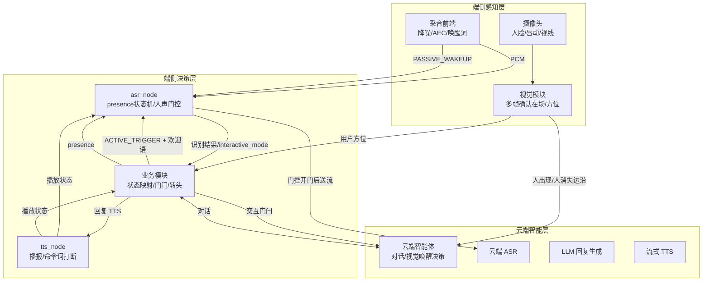
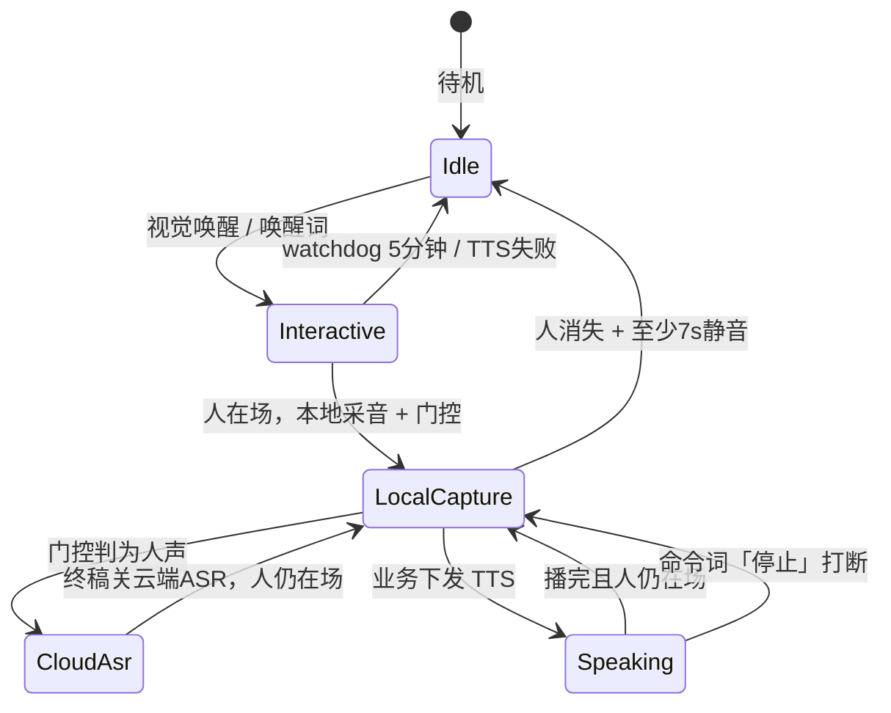
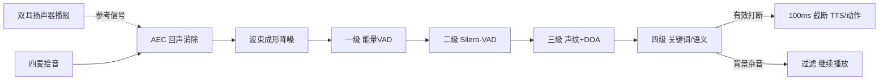
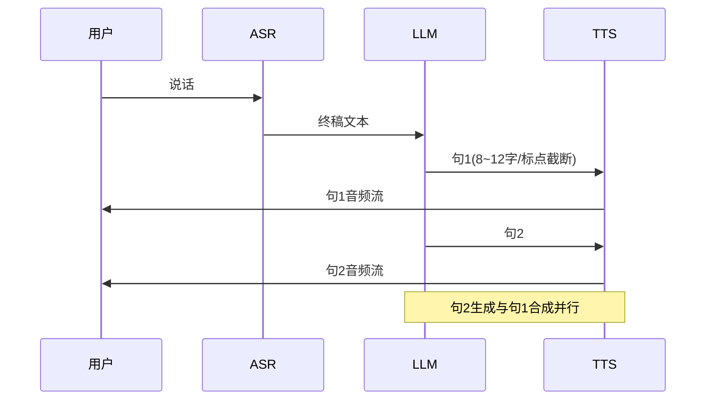
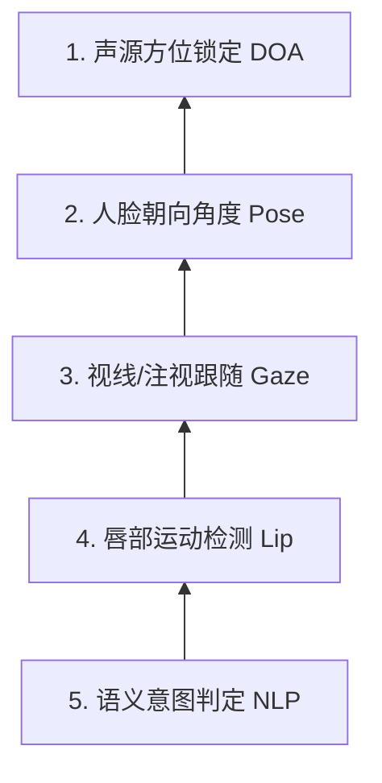

# 半身带屏幕仿人机器人语音交互设计方案

面向「半身 + 胸前屏幕 + 头部舵机表情」形态的仿人机器人，本文给出一套端云协同、可渐进落地的语音交互设计。核心结论：把「人在场持续听、随时可打断、亚秒级响应、多模态拟人表达」作为四大体验锚点；近期在现有级联链路上优化出 presence 感知与命令词打断、中期补全双工 barge-in 与低延迟流式管线、远期演进端到端语音大模型，三步走平滑替换，避免一次性重构。

---

## 一、设计目标：四大体验锚点

「最新语音交互体验」不是加一个麦克风，而是让对话回归「人跟人聊天」的节奏。拆成四个可量化锚点：

| 锚点 | 目标体验 | 量化指标 | 对应现状痛点 |
|------|----------|----------|--------------|
| ① 随时打断 | 机器人说话时用户插话，<200ms 停播回听 | 打断响应 <200ms | 现状 TTS 期不采音，只能喊唤醒词 |
| ② 全程在场 | 人在场就一直听，不会「7s 不说话就关机」 | 人在场 0 超时退出；人消失 + 7s 静音才待机 | 现状约 7s 静音直接退出交互 |
| ③ 亚秒响应 | 说完到开口 <1s，等待期有前置反馈 | 端到端响应 600–800ms；TTS 首包 TTFA ≤ 120ms | 现状叠 300ms + 门控 300ms 空窗，易吞首字 |
| ④ 拟人表达 | 表情 / 屏幕 / 头部动作 / 情绪随状态联动 | 屏状态切换 <50ms；唇形与 TTS 音节同步 | 状态话题已有，屏 / 表情未对齐 |

前两项解决「对话的节奏感」，第三项解决「等待的焦虑感」，第四项解决「是不是有温度的智能体」。

---

## 二、整体架构：端云协同三层

### 2.1 硬件形态

- **半身本体**：头部 19 个表情舵机 + 颈部 3 自由度；胸前一块屏幕（图文卡片 + 表情动效）。
- **传感器**：线性四麦阵列（头与屏幕之间同一竖直线）、摄像头（人脸 / 唇动 / 视线）。
- **输出**：双耳扬声器、19+3 舵机表情 / 动作、胸前屏幕图文。

### 2.2 三层分工

### 2.3 端云分工原则

| 层 | 放什么 | 为什么 |
|----|--------|--------|
| 端侧 | 采音、降噪、AEC、唤醒词、presence 状态机、人声门控、表情/头部控制 | 延迟敏感、需毫秒级响应、离线可用 |
| 云端 | 云端 ASR、LLM 对话、流式 TTS | 算力密集、效果优先；内网访问压 RTT |

关键约束沿用既有结论：**LLM 与 TTS 分卡隔离**，否则 TTS 首帧从 ~84ms 恶化到 ~280ms；TTS 走 WebSocket 双向流，业务端到服务端走内网 IP。

---

## 三、核心交互状态机（presence 感知 + 命令词打断）

这是把「人在场持续听」与「命令词打断」合并后的目标状态机。**问答模式仍保持「本轮播完即退出」**，与聊天模式分离，避免产品语义冲突。下文除特别声明均指聊天模式。

### 3.1 状态分层含义

| 层 | 含义 | 云端 ASR | 关键行为 |
|----|------|----------|----------|
| 待机 `Idle` | `interactive_mode=2`，可再次视觉欢迎 | 关 | 只有人出现边沿才唤醒 |
| 本地采音 `LocalCapture` | 交互中，麦克风进门控 / preroll | 未开门不送云端 | `present=true` 时禁用 7s 退出计时 |
| 云端 ASR `CloudAsr` | 门控判定人声后建连送流 | 开 | 句末静音判终稿 |
| 播报 `Speaking` | TTS 播放中 | 关（命令词仍可打断） | 全双工打断走命令词 |

### 3.2 presence 感知：全程在场的关键

现状语音模块**没有**在场输入，导致「人一直站着，超时退出后视觉再也叫不醒」。方案新增 `/voice/presence` 话题（`bool present`）：

| `present` | 语音行为 |
|-----------|----------|
| `true` | 保持 / 恢复本地采音；**不**因 7s 静音退出 |
| `false` | 启动至少 7s 静音倒计时；到点 `interactive_mode=2` 并关麦 |
| 唤醒瞬间未见过视觉 | 按 `false` 处理（兼容「喊唤醒词但摄像头没人」） |

业务侧用视觉边沿维护在场：人出现 → `present=true`；人消失（多帧确认）→ `present=false`。欢迎语仍只在「待机 → 人出现」由智能体下发一次，在场续听**不再**第二次欢迎。

### 3.3 命令词「停止」：打断播报的低风险路径

全双工云端 ASR 在播报期易自激，本方案**近期不做** TTS 期全双工云端 ASR，打断走命令词（及现有唤醒词）：

| | 唤醒词「小飞小飞」 | 命令词「停止」 |
|--|--------------------|----------------|
| 播报 | 答「在的。」 | 不答，只停播 |
| 交互模式 | 进入 / 保持进入 | 保持进入 |
| 之后 | 「在的」播完再开麦 | 短延迟后直接本地采音 |
| 智能体 | 相当于新一轮交互 | 取消当前生成即可 |

---

## 四、全双工打断机制（barge-in，中期）

命令词只能解决「用户明确说停止」的打断；真正自然的打断是「用户随便开口，机器人就闭嘴」。这依赖声学工程的三个前提，与「命令词」路线是**叠加**而非替代：

### 4.1 三件套

1. **AEC 回声消除**：从麦克风信号里扣掉机器自己的声音，ERLE ≥ 30dB。硬件回采（Loopback）作参考信号，WebRTC AEC3 或 DeepAEC 加非线性抑制。
2. **波束成形 + 降噪**：线性四麦 MVDR 锁定说话人方位（正前方 ±30°），串 RNNoise / DeepFilterNet 滤背景人声。
3. **四级打断决策引擎**：从快到准，逐级过滤，压低误打断率。

| 级别 | 机制 | 时延 | 作用 |
|------|------|------|------|
| 一级 | 能量 + 过零率 VAD | <50ms | 快速判断声音突变 |
| 二级 | Silero-VAD（ONNX，NPU） | <100ms | 区分人声 vs 噪音 |
| 三级 | 声纹匹配 + DOA 方位过滤 | <150ms | 确认是目标用户而非旁人 |
| 四级 | KWS 关键词 / 语义打断 | <250ms | 检测「别说了」「等一下」 |

### 4.2 打断响应分解（<200ms）

| 模块 | 动作 | 时延 |
|------|------|------|
| 语音 | TTS 即刻静音、清空播报缓冲、`CANCEL` 终止流式生成 | <50ms |
| 头部 | 贝塞尔 / S 型曲线平滑过渡到倾听姿态 | <80ms |
| 表情 | 嘴部闭合、眼睛聚焦略微放大 | <50ms |
| 屏幕 | 播报界面收缩为波浪接收状态 | <50ms |

---

## 五、低延迟流式管线

### 5.1 级联 vs 端到端：两条路线

| 维度 | 级联式（ASR→LLM→TTS） | 端到端语音大模型（Qwen3-Omni / MiniMax audio 等） |
|------|----------------------|--------------------------------------------------|
| 现状 | 现有系统，可渐进优化 | 需重构对话链路 |
| 延迟 | 三段各自首包叠加，600–1000ms | 省去文本中转，韵律 / 情绪更连贯 |
| 可控性 | 每段可独立替换、调试、压测 | 黑盒度更高，打断 / 情绪控制依赖模型能力 |
| 推荐 | **近期** 主路线 | **远期** 演进目标 |

### 5.2 级联链路的延迟预算

目标「说完到开口 <1s」，把预算拆到每一段：

| 环节 | 目标时延 | 关键手段 |
|------|----------|----------|
| 人声门控开门 | ~300ms | Silero VAD 连续 300ms 判人声 + 能量门 |
| 云端 ASR 终稿 | ~100–300ms | 句末静音 1200ms（千问）/ 400ms（豆包）；`vad_extend` 加长思考停顿 |
| LLM 首 Token | 100–500ms | 流式输出，分句缓冲 |
| TTS 首包（TTFA） | ≤120ms | 分卡独占 + WebSocket 流式 + 内网 IP |

### 5.3 流水线并行与分句缓冲

LLM 流式吐出时，**不要**逐字触发 TTS，加动态缓冲区：遇到句号 / 逗号等停顿标点，或累积 8–12 字，再整句推给 TTS。LLM 生成第二句时，TTS 同步合成第一句音频，两段并行：

### 5.4 压缩「说完 → 能接话」空窗

现状叠了「TTS 结束固定 300ms + 门控 300ms + `speech_pad_ms=0`」，首字易被吞。改进清单：

1. TTS 结束前预热 ASR 建连；人在场时播完尽快恢复本地采音。
2. 尾音干净则缩短或取消固定 300ms；门控已挡回声时避免双重等待。
3. `speech_pad_ms` 从 0 调到 100–150ms，补句首辅音。
4. 屏在 TTS `state=2` 立刻切「正在听」，不等云端 ASR 开门。

---

## 六、屏 / 表情状态机

语音侧已发布足够状态，缺的是业务映射。下表给出「用户应看到什么」与触发的对应关系：

| 用户应看到 | 触发 | 屏幕表现 | 表情 / 动作 |
|------------|------|----------|-------------|
| 注意到你 | 视觉人出现（欢迎语前） | 暗屏淡入「AI 光环」 | 颈部转向声源，眼睛注视 |
| 正在听 | 交互中 + 人在场 + TTS 空闲 + 本地采音 | 声浪波形 / 波浪接收 | 头部微幅上下抖动（呼吸感），眉毛随语气微调 |
| 正在想 | ASR 终稿已出、TTS 未开始 | 思考转圈 / 数据流线 | 颈部微抬，眼球左上 / 右上微动 |
| 正在说 | `/voice/tts/status` state=1 | 核心结论同步图文卡片 | 嘴部舵机随 TTS 音节唇形同步；情绪表达（开心嘴角上扬） |
| 待机 | `interactive_mode=2` | 回到待机屏 | 表情复位、眼睛微闭或游移 |

图文卡片这一项针对嘈杂环境「听不清数字 / 地址」的兜底，是带屏机器人相对无屏形态的独有优势。

---

## 七、多模态感知（AV-VAD）

纯语音无法解决「用户正对机器人但侧脸跟旁人说话」。引入视觉建立**多模态判定金字塔**：

- **唇动-音频同步**：音频能量包络与嘴部关键点位移做互相关，相关系数 >0.8 判定「声音确实从这张嘴出来」。
- **朝向 / 视线**：|Yaw|、|Pitch| <15° 才进入对话意图区；判断瞳孔是否落在机器人眼睛或屏幕上。
- **极端嘈杂**（>85dB）：音频降噪失效时，靠唇语辅助判定，屏幕提示「请离我近一点」。

| 场景 | 视觉检测 | 机器人表现 |
|------|----------|-----------|
| 用户侧头跟旁人说话 | 嘴唇动但 Yaw>30°，目光不在机器人 | 完全静音，头部微弱跟随，不打扰 |
| 旁人试图插话 | 主用户视线不动，旁人嘴唇动 | DOA + 唇动双重锁定主用户 |
| 极度嘈杂 | 眼睛正视，嘴唇明显讲话 | 颈部微前倾，屏幕提示靠近 |

---

## 八、关键时序与参数汇总

| 参数 | 目标值 | 说明 |
|------|--------|------|
| 打断响应 | <200ms | 全双工 barge-in；命令词路径更短 |
| 端到端响应 | 600–800ms | 说完 → 首帧出声 |
| TTS 首包 TTFA | ≤120ms（内网回环 ~68ms） | 分卡独占 + WS 流式 |
| 人声门控最短人声 | ~300ms | 连续人声才开门 |
| 云端句末静音 | 千问 1200ms / 豆包 400ms | 判「一句说完」 |
| `speech_pad_ms` | 100–150ms | 补句首辅音 |
| presence 退出 | 人消失 + 至少 7s 静音 | 人在场不超时退出 |
| 交互 watchdog | 300s | 防卡死兜底 |
| 视觉有效距离 | ~2m + 脸大部分露出 + 多帧确认 | 抑制误触发 |
| 屏状态切换 | <50ms | 拟人表达 |

---

## 九、模块划分与话题协议

### 9.1 语音侧话题

| 话题 | 方向 | 用途 |
|------|------|------|
| `/voice/wakeup` | 前端/业务 → ASR/TTS | `ACTIVE_TRIGGER`（视觉）/ `PASSIVE_WAKEUP`（唤醒词） |
| `/voice/audio_raw` | 前端 → ASR | 降噪后 PCM |
| `/voice/asr/status` | ASR → 业务 | `interactive_mode` 进入 / 退出；ASR 工作状态 |
| `/voice/asr/result` | ASR → 业务 | 识别结果；`need_llm=false` 带 `direct_answer` |
| `/voice/tts/command` | 业务 → TTS | 欢迎语 / 回复 / 停止播报 |
| `/voice/tts/status` | TTS → ASR / 业务 | 开始播 / 播完，驱动半双工开麦 |
| `/voice/control` | 业务 → ASR/TTS | `asr_enable` / `wakeup_enable` / `vad_extend` |
| `/voice/presence`（新增） | 业务 → ASR | `bool present`，presence 持续听 |

### 9.2 各模块改动清单

| 模块 | 改动 | 时机 |
|------|------|------|
| 视觉 | 维持人出现 / 人消失边沿 + 多帧规则；持续推方位 | 已有 |
| 业务 | 边沿 → `/voice/presence`；交互门闩；屏 / 表情映射；「停止」时取消智能体生成 | 与语音联调 |
| 智能体 | 欢迎仅待机后人出现；交互中禁视觉唤醒；支持取消本轮生成 | 与业务联调 |
| 采音前端 | 加命令词「停止」资源与分流 | 近期 |
| `asr_node` | 订阅 presence；`present=true` 禁 7s 退出；`present=false` 启动 7s 静音待机；处理 `COMMAND_STOP` | 近期 |
| `tts_node` | `COMMAND_STOP` 停播不答「在的」 | 近期 |
| `Wakeup.msg` / Presence 消息 | 扩展类型或新话题 | 近期 |
| AEC / 波束成形 | 双全工 barge-in 三件套 | 中期 |
| 端到端语音模型 | Qwen3-Omni 等替换级联链路 | 远期 |

---

## 十、分阶段落地路线

| 阶段 | 交付 | 体验收益 | 风险 |
|------|------|----------|------|
| 近期 | presence 持续听、命令词「停止」、`speech_pad_ms` 调整、屏 / 表情状态机 | 人在场不退出；可停播；首字不吞；有屏有表情 | 低，均是在级联链路上增量改动 |
| 中期 | AEC + 波束成形 + 四级打断决策 + AV-VAD | 全双工自然打断，<200ms | 中，声学工程投入大，需回采硬件配合 |
| 远期 | 端到端语音大模型替换级联 | 韵律 / 情绪连贯，延迟进一步下降 | 高，需重构对话链路并重新评估打断 / 情绪可控性 |

三步走的核心是**不一次性重构**：近期先把最伤体验的「7s 退出」「无法打断」「吞首字」用低成本增量解决，中期再上全双工声学工程，端到端模型成熟后整体替换。

---

## 十一、验收标准

1. **人一直站着**：视觉唤醒后长时间不说话，不进待机；再开口能出 ASR 终稿。
2. **语音唤醒看不见人**：进入交互后约 7s 无有效人声 → 进待机；期间视觉报人出现则取消倒计时继续听。
3. **人消失**：多帧确认后 `present=false`，约 7s 静音进待机；再走近才可再次视觉欢迎。
4. **命令词停止**：播报中说「停止」→ 立刻停播、不答「在的」、保持交互继续听；智能体本轮取消。
5. **全双工打断（中期）**：播报中用户开口 → <200ms 停播回听，误打断率可接受。
6. **接话**：TTS 结束后尽快可说，首字不明显被吞；屏播完立刻「正在听」。
7. **屏 / 表情状态**：注意到你 / 正在听 / 正在想 / 正在说 / 待机 与映射表一致。
8. **问答模式**：一轮答完仍退出交互（与聊天模式新规则分离）。

---

## 参考资料

- [现有语音交互流程](./现有语音交互流程.md)（Downloads 内，当前线上行为基线）
- [语音交互体验改进方案](./语音交互体验改进方案.md)（Downloads 内，目标体验与跨模块协议）
- [仿生机器人全双工语音交互方案](./2026-08-06_仿生机器人全双工语音交互方案.md)（本知识库，AEC / 打断决策 / AV-VAD）
- [三大国产TTS对比-MiniMax-Qwen3-豆包](./2026-07-08_三大国产TTS对比-MiniMax-Qwen3-豆包.md)（本知识库，TTS 选型）
- [语音交互流水线三类模型部署策略](../端侧部署/2026-06-10_asr-llm-tts-三类模型部署策略.md)（本知识库，分卡隔离与 TTFA）
- [Qwen3-TTS-0.6B模型架构与原理](../模型原理/2026-06-27_Qwen3-TTS-0.6B模型架构与原理.md)（本知识库，两阶段流式与端到端演进）
