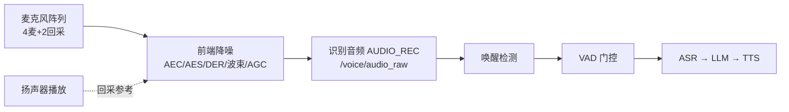

# 机器人前端降噪算法作用与能力边界

前端降噪算法部署在机器人采音链路的最前端（麦克风之后、唤醒/ASR 之前），作用不是"把环境变安静"，而是**抽出可唤醒、可识别的人声**。它以 AEC 回声消除为主业、空间波束为辅，解决"边播报边聆听、旁人说话不串音"两大核心问题；但机内电机风扇、低频共模噪声、同向干扰不在其能力范围内。理解这条能力边界，是现场调试采音问题不误判的前提。

---

## 一、前端降噪在语音链路中的位置

机器人语音交互链路中，前端处理处于"声电转换之后、语义理解之前"：

关键认知：前端处理的优化目标是**人声相对干扰的比值**，不是把波形抹成一条直线。输出里可以仍有风扇声、旁边设备底噪——只要本机喇叭回声没了、旁向人声弱了，采音就算成功。

这套定位决定了它与耳机降噪的本质区别：

| | 耳机 ANC / 单通道听感降噪 | 机器人语音前端 |
|---|---|---|
| 目标 | 听着舒服、底噪低 | 唤醒准、ASR 不把 TTS/旁人听进去 |
| 主要手段 | 对消或"像噪声就衰减" | 回采相减 + 空间波束 + 去混响 |
| 风扇、旁边仪器 | 常常是主攻对象 | 四麦标准方案几乎不管 |
| 本机喇叭回声 | 不是主业 | **主业** |
| 输出能否仍有底噪 | 通常不能接受 | 可以接受 |

---

## 二、为什么必须有它：三个致命问题

没有前端降噪，机器人语音交互会在三个场景直接崩溃：

**1. 自我说话自己听（回声问题）**
机器人 TTS 播报从扬声器出来，立刻漏回麦克风。ASR 会把机器人自己说的话当成用户输入，形成"自问自答"死循环。这是全双工交互（用户随时打断）能否成立的前提。

**2. 旁人说话抢话筒（串音问题）**
展厅里旁边有人聊天、电视在响，单麦克风一视同仁全收进来，唤醒词误触发、ASR 识别错乱。空间波束让"对着机器人说话的人"相对突出，这是麦克风阵列相对单麦多出来的核心能力。

**3. 房间反射拖尾（混响问题）**
空旷大厅里说话带回音，唤醒词边界模糊，ASR 把回声尾巴听成多一个字。去混响（DER）让远场语音更干脆。

---

## 三、处理链：每一级吃掉什么

以线性四麦标准方案为例（4 路麦克风 + 2 路喇叭回采，麦间距 35 mm，16 kHz 采样）：

| 模块 | 作用 | 一句话理解 |
|---|---|---|
| AEC | 回声消除 | 用回采信号当参考，减掉本机喇叭漏进麦克风的声音 |
| AES | 残回声抑制 | 神经网络补刀 AEC 减不干净的残余 |
| DER | 去混响 | 缩短房间反射造成的拖尾 |
| GEVD 波束 | 空间滤波 | 对准某个方向的说话人，衰减其他方向声源 |
| AGC | 增益控制 | 只调音量，**不是降噪** |

注意一个取舍：四麦标准方案中单通道神经网络降噪（NR）是**关闭**的（`nr_on = false`）——算力留给回声和空间处理，不做耳机那种"听感降噪"。所以输出音频里底噪带仍在，属正常现象，不是故障。

**AGC 陷阱**：AGC 会把没压掉的残差和底噪一起抬高。波形上看"处理后更吵"，经常是增益问题，不是 AEC 或波束没工作。

---

## 四、能解决什么（按采音收益排序）

### 4.1 本机喇叭回声——主业

AEC 依赖回采通道里的播放信号做参考相减，AES 再压残差。实测关自适应 AGC 后，正式句回声消除量（ERLE）约 30 dB 量级。

有效的前提条件：
- 回采通道在播报时能量明显抬升（回采 RMS 从近 0 跳到千级）
- 回采与麦信号有毫秒级稳定声学时延（数字环回零时延是假参考，AEC 会失效）
- 首次播报可能未收敛，正式句前先播一句废句或用 `aec_coef` 预收敛

### 4.2 旁向人声、电视、音箱——阵列的独门能力

GEVD 三波束 + 分区：不是消成静音，而是让目标说话人相对旁人更突出，减少串音和误唤醒。前提是干扰与目标**不在同一方向**，且频率不能太低。

### 4.3 房间混响——远场刚需

DER 缩短墙面反射拖尾，唤醒词边界更清楚。近讲、房间已经很干时收益很小。

### 4.4 扩散环境声——很有限

空调、远处嘈杂这类各麦不太相关的底噪，波束只有几 dB 阵列增益。NR 关闭状态下不会把底噪带抹平。

---

## 五、不能解决什么（能力边界）

### 5.1 不在喇叭回采里的任何声音

AEC/AES 只减参考通道里有的信号。电机、风扇、旁边仪器、运控、电源哼声——只要不是扬声器放出来的，回采接近数字静音，AEC 正确选择"什么都不减"。

### 5.2 低频、各麦同相的声音——物理极限

线性四麦孔径约 10.5 cm（3 × 35 mm）。100 Hz 声波波长约 3.4 m，各麦相位差极小，波束根本看不出"声音从哪边来"。

实测一段旁边设备噪声（约 2 分钟）：四麦互相关 0.88–0.97，80–200 Hz 相干约 0.99，时延约 0 采样点，频谱主峰约 100 Hz——前端输出对该噪声没有下降，识别带（300–3400 Hz）甚至被 AGC 增益抬高。

**结论：声源在机内还是机外不重要，只要落在低频、各麦同相，四麦方案就消不掉。** 这类问题的正解是把设备搬走或关停，比调任何参数都有效。

### 5.3 与说话人同方向的干扰

波束保留的是"某个方向"，不是"某个语义上的人"。正对麦阵主瓣的干扰会被当成目标一起放行——包括正前方设备的声音。

### 5.4 风噪、喷麦、敲击等强非平稳噪声

没有专用风噪模块，瞬态冲击会漏到输出，还可能被 AGC 打成尖刺。

---

## 六、对 ASR 识别的实际影响

分场景看：

- **设备空转、没人说话**：稳态轰鸣一般不会被 Silero VAD 判成语音，不会单独送进 ASR。挡空转噪声主要靠 VAD，不靠前端抹底噪
- **近讲、音量正常**：噪声垫在语音下面进 ASR，识别频段数 dB 信噪比时多数还能认出，替换和吞字变多
- **远场、轻声、辅音**：2 kHz 以上摩擦音、送气辅音容易被盖住，漏检和误识明显增加
- **AGC 抬满残差**：识别带信噪比可能比麦端更差——这是"处理后更难认"，不是"算法把噪声当回声减掉了"

---

## 七、现场调试：听三路、防误判

调试落盘（`vtn.ini` 中 `log_audio = 7`）后，**必须同时听三路**：mic1（原始）、ref2（喇叭回采）、ch0（前端识别输出）。只看 ch0 无法区分是回声问题还是环境问题。

导入 `input_origin.pcm`（16 kHz、6 路交织、Signed 16-bit LE）时通道数选 6：第 1 路是 mic1，第 6 路是 ref2。

常见现象对照表：

| 看到的现象 | 正确解释 | 不要误判成 |
|---|---|---|
| ch0 底噪带和 mic1 一样厚 | NR 关闭 + 低频共模，属能力边界 | 麦阵没工作 |
| ch0 比 mic1 更毛、尖刺更多 | AGC 抬残差 | AEC 坏了 |
| 第 6 路几乎一条直线 | 没在播报，回采正常空闲 | 回采没接 |
| 播报时第 6 路跳起来，ch0 仍跟着喇叭走 | AEC 未收敛/过消或欠消/AGC | 算法不会去回声 |
| 旁人说话仍能听见但比目标人弱 | 波束在工作，标准方案偏宽 | 必须消成静音才算过 |
| 正前方设备声和人声一样清楚 | 同向，波束无法区分 | 开 NR 或换窄波束就能消失 |

**验证 AEC 成功的标准**：播报段内，mic 很响、ref 很响，但 ch0 不应跟着喇叭包络走，应回到接近播前底噪水平。

---

## 八、三套前端方案的取舍

同一硬件平台上，按 `capture_backend` 互斥启动三套方案：

| 方案 | 阵列 | 特点 | NR |
|---|---|---|---|
| 标准方案 frontend_std | 线性 4 麦 + 2 回采 | GEVD 三波束，偏宽，主方案 | 关 |
| 窄波束 frontend_narrow | 同上硬件 | 旁向抑制更强，听感更闷，VAD 通道抑制更狠 | 关 |
| 单麦 frontend_single_mic | 1 麦 + 1 回采 | 无空间滤波，有神经网络单通道降噪 | **开** |

选型逻辑：要旁向人声分离选四麦（窄波束抑制更狠但要接受听感发闷）；只有单麦硬件时靠 NR 补听感降噪，但放弃空间分离能力。两个能力天然互斥，不存在全都要的方案。

---

## 九、核心要点总结

1. 前端降噪是"语音前端"不是"听感降噪器"：目标是唤醒准、ASR 干净，输出里残留底噪是设计取舍不是缺陷
2. AEC 回声消除是主业，依赖真实回采参考；波束成形是阵列的独门能力，只对不同方向、不太低频的干扰有效
3. 低频共模噪声（电机/风扇/旁边设备轰鸣）是物理极限，四麦消不掉，正解是挪设备而不是调参数
4. AGC 只调音量不降噪，"处理后更吵"先查增益再怀疑算法
5. 现场调试听三路（mic/ref/ch0），用对照表防误判，把能力边界和真实故障分开
