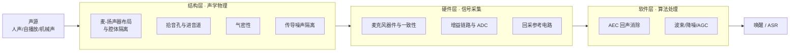

# 结构硬件软件对机器人采音的影响

采音质量的决定权呈"**结构 > 硬件 > 软件**"的排序：结构声学设计（麦-扬声器布局、拾音孔、气密性、传导噪声隔离）决定干扰的物理规模，硬件层（麦克风器件、增益链路、回采电路）决定信号能否完好送达，AEC 等算法只能收割前两层留下的余量。三层责任上层不可代偿下层——信号一旦削波失真、自采音一旦超过算法容纳上限，后端没有补救空间。本文结合讯飞 AIUI 声学设计文档与实测排查经验，总结三层各自的机制、量化指标与设计红线。

---

## 一、采音链路与三层责任模型

机器人采音链路可以拆成三层，每层解决不同性质的问题：

| 层 | 决定什么 | 失效后果 | 可否被下层补救 |
|----|----------|----------|----------------|
| 结构层 | 麦克风拾到的干扰有多强、目标声是否一致到达 | 自采音/机械声超限、频响失真、声道不一致 | 否，只能改结构 |
| 硬件层 | 信号是否在线性区完好采集 | 削波失真（不可逆）、底噪大、通路不同步 | 否，后端只能处理失真信号 |
| 软件层 | 能消掉余量中的多少干扰 | 残余回声/串音影响唤醒识别 | — |

一句话概括：**结构决定"问题有多大"，硬件决定"信号是否完好"，软件决定"能解决其中多少"**。软件是余量收割者，不是问题终结者。

---

## 二、结构层：声学物理决定问题规模

### 2.1 麦-扬声器布局：最便宜的降噪手段

自采音（回声）强度由布局决定，这是采音质量的第一变量：

- **距离**：点声源声压随距离平方反比衰减，每加倍距离约降 6dB。扬声器外置拉开距离，仅此一项就能拉开十几 dB 的物理差距，超过任何算法能提供的抑制量，且不耗算力、无副作用。设计要求：**喇叭与麦克风距离尽可能大，喇叭最大音量播放时 mic 录音不截幅**。
- **腔体隔离**：喇叭声音只应从外部空气路径传播到麦克风，必须避免结构内部传播。措施：选用带独立腔体的喇叭并做好腔体减震；非音腔喇叭要在结构内部加隔音层（隔音棉等），让麦克风、喇叭各有独立密闭空间。
- **阻尼减震**：喇叭出音口与结构件贴合处加阻尼材料（发泡硅胶、聚氨酯、PSR 泡棉），**泡棉厚度取结构间隙的 1.5 倍**，不推荐 EVA。

### 2.2 结构传导噪声：走固体路径的干扰

舵机、马达等运动机构的噪声经结构件固体传导直达麦克风，**不走空气路径**，因此波束成形的旁向抑制、AEC 的回采相减对它基本无效。治理只有结构手段：

1. 满足性能指标前提下选低噪型号（静音马达等）；
2. 做好减震——模块与结构件固定的螺栓加泡棉防震垫；
3. 模块远离麦克风，或物理隔离在密闭空间；
4. 线束全部固定不悬空（晃动本身产生噪声），位于震动模块附近的线束原则上都要包 EVA；
5. 各结构件连接处包 EVA 减震，整机安放加橡皮脚垫。

### 2.3 拾音孔与进音道：决定频响是否平坦

进音道推荐**倒 V 型或 ┃ 型**，禁用 ╋ 型、V 型，非特殊情况不建议 L 型。核心原则：密封硅胶紧贴结构内表面，声音路径内不存在任何空腔和缝隙，声音以最短路径直达麦克风拾音孔。孔径链关系：**壳体孔径 ≥ 密封硅胶孔径 ≥ PCB/mic 孔径**。

孔径与孔深的量化红线（防止管道驻波失真）：

| 参数 | 要求 | 说明 |
|------|------|------|
| 壳体开孔孔径 D | ≥ 1.5 mm（推荐 1.3-1.5 mm） | 过小声阻大 |
| 孔深 L | ≤ 5 mm | 过长形成"长管道" |
| 径深比 D/L | ≥ 1/3（推荐 ≥ 1/2） | 孔深不超过孔径 3 倍 |

违反径深比后果的物理机制：孔洞形成长管道结构，声波在管道内多次反射、与入射声波叠加形成**驻波**，特定频率被放大或衰减，频响平坦性被破坏，表现为中高频模糊、低频浑浊——这类失真发生在声学入口，任何后端算法都无法恢复。

另外注意风噪：高风噪环境麦克风放背风口（如头盔内侧优于外侧），否则录音截幅。

### 2.4 气密性：麦克风腔体的生命线

气密性指麦克风腔体隔绝外界声音的能力，定义：**气密性 = 不堵孔 mic 声压 − 堵住 mic 口声压，> 10dB 为良好**。气密性不足意味着声音绕过进音道从缝隙漏进腔体，破坏阵列各通道的一致性（相干性变差、声源定位角度漂移）。

工程要点：

- **优先上进音**（顶部进音硅麦）；下进音（底部进音）气密性难控制，对锡膏和炉温稳定性要求极高，锡膏密封焊盘没闭环就漏音；
- 密封硅胶套紧贴结构内表面，麦克风板用螺丝固定锁紧且**螺孔位置靠近 mic**，板与外壳中间空隙用双面胶贴住；
- 密封不要用 502 类胶水，用定制密封胶套 + VHB 双面胶/防水胶泥/蓝丁胶；
- 麦克风板的防震和密封同样影响气密性，不只是外部结构之间的事。

### 2.5 阵列间距与朝向：算法对结构的要求

麦克风间距不是自由参数，**算法模型按特定间距训练**，间距偏差直接换算为效果损失：

| 阵列形态 | 标准间距 |
|----------|----------|
| 线形 2 麦（标准） | 35 / 70 / 110 mm（35mm 最优） |
| 线形 4 麦 | 35 mm，共线均匀分布 |
| 环形 4 麦 / 6 麦 | 阵列半径 35 mm（部分新方案 17.5mm），均匀分布 |
| 双麦窄波束 | 60 / 140 mm，±5mm 内差异不大 |

非标间距的影响分级：窄波束算法和需要声源角度信息的产品必须按标准间距；普通功能需求麦间距差 5-10mm 时唤醒、识别效果会降低一点、定位角度偏差增大（前提是无其他声学问题）。

布局朝向：线形麦克风水平安放朝向用户，不建议开口朝屋顶（积灰）或地面；环形麦克风板水平安放、孔朝上，与水平面倾斜角 ≤ 10°；**拾音孔外表面要平整**——无凹槽凸起，或为中心完全对称的弧面，否则各通道收音一致性被破坏。环形阵列波束范围在麦克风中心两侧，会旋转的整机要确保旋转后麦克风正对说话人。

防尘网选 200-380 目（声阻适中，适用麦克风防尘）。

---

## 三、硬件层：器件选型与信号完好性

### 3.1 麦克风器件选型

| 属性 | 驻极体麦 | 模拟硅麦 | 数字硅麦 |
|------|----------|----------|----------|
| 灵敏度 | 一般 | 低 | 高 |
| 一致性 | 差 | 好 | 好 |
| 抗 RF 干扰 | 差 | 一般 | 高 |
| 抗冲击 | 差 | 好 | 好 |
| 受温湿度影响 | 大 | 小 | 小 |
| 生产效率 / 不良率 | 低 / 高 | 高 / 低 | 高 / 低 |
| 电路复杂度 | 复杂 | 简单 | 简单 |
| 对结构要求 | 低 | 高 | 高 |
| 成本 | 低 | 高 | 高 |

选型权衡：结构与成本优先选驻极体，可靠性与电路设计优先选硅麦（与《机器人麦克风选型》一文结论一致）。**阵列内 mic 选型必须一致**（特殊麦阵除外）。

一致性的量化要求：驻极体麦需要求厂商按单体灵敏度 **±1dB 分档**来料，焊接后两 mic 灵敏度误差控制在 **±1.5dB** 内。单体一致性差会直接表现为各通道相干性曲线不一致。

### 3.2 ADC / Codec 指标

采集侧最低指标：数据格式 16kHz × 16bit（或 24bit），**SNR ≥ 90dB，THD+N ≤ -80dB**，接口 I2S（支持 TDM）或 PDM。ADC 底噪大或失真高，等于在硬件层预先污染了信号。

### 3.3 增益链路与削波：全局性失效点

削波（信号顶满 ADC 满量程、波形平顶）是采音链路最典型的全局失效：

- 削波产生谐波失真，**信息在模拟前端已经丢失，不可逆**；
- AEC 基于线性假设（麦克风回声 ≈ 回采经自适应滤波的拷贝），削波破坏线性关系，滤波器拟合不上，残余回声显著增大；
- 降噪、AGC 等所有后端模块拿到的都是失真信号，效果全部打折。

也就是说，削波不在任何一级算法的能力讨论范围内，而是让整条软件链路的工作前提（信号线性完好）不成立。整改路径按优先级：

1. **降喇叭最大音量**，直至最大音量下 mic 信号不截幅（体验换质量）；
2. **改 mic 电路降低硬件增益**（源头解法，让大音量下峰值仍留 headroom）；
3. 硬件无独立增益可调时，软件层对多通道 PCM 的麦克风通道做**选择性数字衰减**（回采通道不动）——但要明确：软件衰减只能把"接近满幅但未削波"的信号拉回线性区，**不能恢复已硬削波丢失的信息**，是补丁不是解法。

另一个易漏项：喇叭自身失真过大会同样拖垮 AEC（回采参考是干净的，但喇叭输出的实际声音失真，两者对不上）。整改：换失真更低的喇叭、改喇叭前腔结构减少声阻、避免超出额定功率的大音量。

### 3.4 回采参考电路：AEC 的另一半

回采（参考信号）电路的三个坑：

- **回采位置**：回采点应在功放**后**。若回采取自功放前而功放带 AGC/算法处理，参考信号与实际输出不一致，AEC 无法对齐；
- **时延关系**：mic 信号不能出现在 ref 信号之前（出现即电路设计问题，需给 mic 加延迟）；ref 比 mic 快 **20ms 以上**时需软件给 ref 加延迟补偿；**时延值不稳定**通常是结构振动所致（喇叭/mic 加减震泡棉、降最大音量），时延抖动会持续打破自适应滤波器收敛；
- **回采信号质量**：磁珠选型不当会给回采引入树状纹干扰；回采出现低频高能量干扰通常是功放算法影响，需改功放算法。

---

## 四、软件层：算法能力边界与容纳上限

前端降噪以 AEC 回声消除为主业（典型 ERLE 约 30dB 量级）、空间波束为辅，解决"边播报边聆听、旁人说话不串音"两大问题。它对输入有明确前提：

1. **线性区前提**：信号未削波、喇叭未失真（见 3.3）；
2. **一致性前提**：各 mic 通道相干性一致（单体分档、气密一致、数据线不串扰——麦克风信号线要远离其他高频信号、不能交叉）；
3. **同步性前提**：各通道时延一致（同一 ADC/同一处理路径；mic 接到不同 DSP 核会因运算力不同引入时延差）；
4. **参考信号前提**：回采干净、时延可控（见 3.4）。

对自采音强度，算法存在**容纳上限**，可把问题分档：

| 自采音相对上限 | 软件层状态 | 结构层动作 |
|----------------|------------|------------|
| 明显低于上限 | 算法可兜底，正常迭代 | 无需动 |
| 接近上限 | 算法压线运行，高音量/嘈杂场景体验不稳 | 应做预防性整改（拉距离/隔腔体） |
| 超过上限（如两倍以上） | 无补救空间，功能性障碍 | 必须改结构或换方案 |

这条规则的价值在于把"要不要改结构"从争论变成测量：**测自采音强度、对照算法上限，结论自动出来**。实测中曾出现自采音超算法容纳上限两倍以上的案例，唱歌、说话时唤醒和交互完全失效，软件层面无解——这是"算法救不了结构"的典型边界。

算法能力的另一条边界：波束与 AEC 的设计对象都是**空气传导声**，对结构固体传导的机械噪声（舵机、马达）基本无效，治理必须回到结构层（见 2.2）。

---

## 五、三层协同的工程原则

### 5.1 排查顺序：先看波形，再谈算法

现场排查采音问题，顺序比努力重要：

1. 导出麦克风原始轨，检查播报段是否顶满刻度、平顶（削波判定）；
2. 削波则先解决增益链路（降音量 > 硬件增益 > 软件衰减），削波不解决，调什么算法都白费；
3. 查基础硬件指标：气密性（>10dB）、各通道相干性一致性、通路同步性、mic 信噪比（≥30dB）、灵敏度（不低于 -35dBFS，且与 amplify 值强相关）；
4. 未削波但残余回声大，测自采音强度对照算法容纳上限，超限回到结构层整改。

### 5.2 设计基线：把声学检查前置到结构评审

新机型结构评审时的声学强制检查项：

- 麦-扬声器距离最大化 + 腔体隔离 + 最大音量 mic 不截幅；
- 拾音孔径深比 ≥ 1/3、进音道倒 V/┃ 型、声音路径无空腔缝隙；
- 气密性 > 10dB、阵列间距符合算法模型标准、拾音孔表面平整；
- 喇叭/马达减震泡棉、线束包 EVA 并固定、回采取自功放后。

### 5.3 标准化：让新机型只测增量变量

功放与扬声器规格统一、麦克风选型与阵列方案固化后，整条声学链路的变量收敛：后续不同结构的新机型无需重复评估整条链路，只需测试**结构对采音的适配性**（气密、隔离、间距、拾音孔）——把"每代机型从头试错"变成"只测增量变量"。

---

## 六、结论

1. 采音质量的决定权排序为**结构 > 硬件 > 软件**：三层责任模型中上层不可代偿下层，软件算法只能收割结构与硬件留下的余量。
2. 结构层四件事——麦-扬声器布局与距离、拾音孔与进音道（径深比 ≥ 1/3）、气密性（>10dB）、传导噪声隔离——决定问题规模，且成本最低、收益最大，距离每加倍降 6dB 的物理手段超过任何算法抑制量。
3. 阵列间距是算法约束不是自由参数：算法按标准间距训练（线 4 麦 35mm、环形半径 35mm），非标间距以唤醒识别下降和定位角度偏差为代价。
4. 削波是全局性失效点，让所有后端算法的工作前提不成立；根治靠硬件增益与音量约束，软件数字衰减只是补丁。回采电路（功放后取点、时延可控）是 AEC 生效的另一半。
5. 算法容纳上限把"要不要改结构"变成可测量问题：自采音超限时（如两倍以上），唯一解在结构层，"算法救不了结构"。
6. 工程化路径：声学检查项前置到结构评审 + 功放扬声器麦克风方案标准化，让采音评估收敛为"结构适配性测试"单项工作。

## 相关阅读

- [机器人前端降噪算法作用与能力边界](2026-09-01_机器人前端降噪算法作用与能力边界.md) — AEC/波束的能力边界与调试不误判
- [麦阵回采AEC削波排查与麦克风数字增益](2026-06-07_麦阵回采AEC削波排查与麦克风数字增益.md) — 削波排查方法与数字增益补丁
- [多通道麦阵音频软件数字增益衰减](2026-06-05_多通道麦阵音频软件数字增益衰减.md) — 软件衰减的 C++ 实现与调参
- [机器人麦克风选型-驻极体vs硅麦区别与选型](2026-07-27_机器人麦克风选型-驻极体vs硅麦区别与选型.md) — 麦克风器件选型

## 参考文档

- 讯飞 AIUI 声学结构设计参考（yuque.com/aiui/zzoolv/nfbssn）— 麦阵布局、拾音孔、气密性、喇叭/马达隔离
- 讯飞 AIUI 电路设计参考（yuque.com/aiui/zzoolv/cmm87e）— 麦克风与 ADC 选型指标
- 讯飞 AIUI 硬件整改参考（yuque.com/aiui/zzoolv/opg14g）— 失效现象-根因-整改对照
- 讯飞 AIUI 麦间距标准（yuque.com/aiui/zzoolv/ymnf83g4zb187k8e）— 算法与麦间距对应关系
