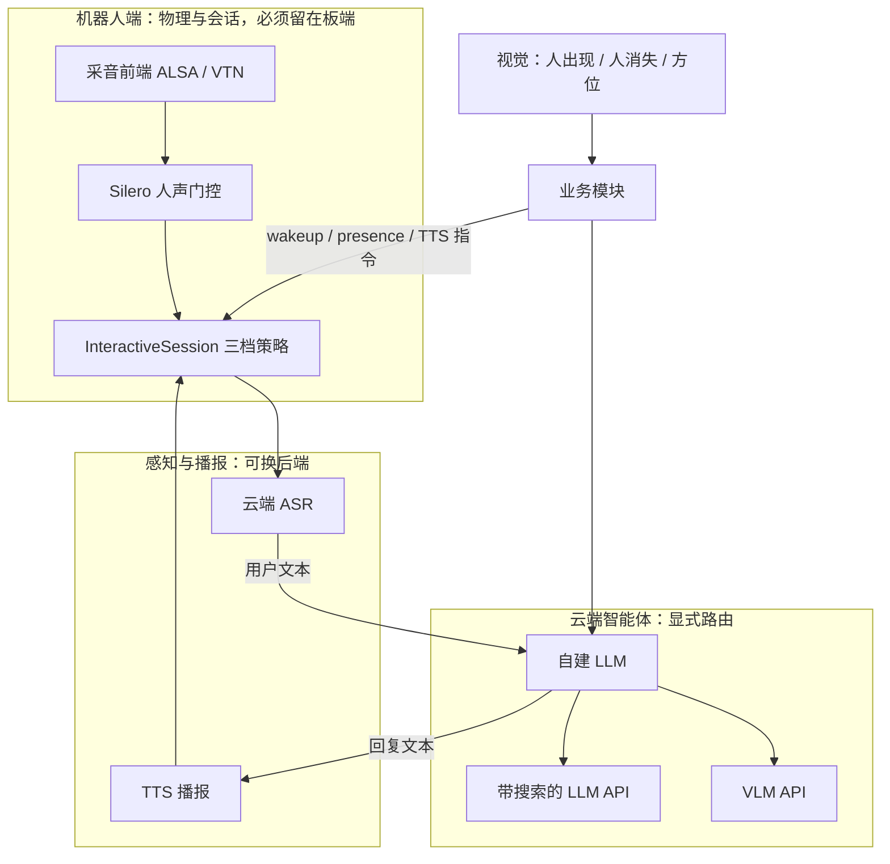
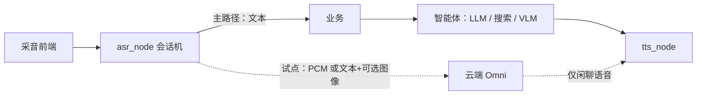

# 端到端语音模型在机器人端的适用性

本文回答一件事：开源/商用的端到端语音（Omni）模型，适不适合替换机器人现网的级联语音链路、能不能直接跑在机器人端（RK3588）。结论先行：两者都不成立；端到端只能当云端闲聊后端的可选项，会话编排仍留给显式状态机。

## 核心摘要

端到端模型在「更像人说话」上领先（副语言、首音时延、抢话自然度），但机器人语音系统的核心资产是**可测试的交互不变量**——开麦/关麦判决、唤醒契约、三档模式、视觉门闩、工具路由——这些端到端模型都不负责，写进权重后既不可审计也无法对单测。正确姿势是维持「级联 + 智能体显式路由」主链路，端到端仅作为云端闲聊试点后端。

## 结论速览

| 问题 | 结论 |
| --- | --- |
| 端侧板子（RK3588）上跑 Omni（9B～30B） | 否。算力、功耗、实时性都不成立 |
| 用 Omni 整包替换 ASR + 智能体 + TTS | 否。会话机、视觉门闩、工具路由、可观测性都会丢 |
| 用 Omni 替换第三方 ASR / TTS API | 可评估，但这是级联自建，不是端到端 |
| 云端增加一条语音直出闲聊后端 | 可试点，不得进入主路径 |

## 1. 「端到端」和现网不是同一件事

业界说的端到端，通常指**语音进、语音出**（有的还能看图）：一个模型吞 PCM / 视频流，直接吐波形，中间可以没有稳定的 ASR 终稿文本。

机器人现网是**级联 + 显式编排**：

```
采音前端（降噪 / 唤醒词 / 「停止」命令词）
  → asr_node（会话机 + 人声门控 + 云端 ASR）
  → 业务模块（ROS ↔ WebSocket）
  → 云端智能体（自建 LLM；按意图显式调搜索 LLM 或 VLM）
  → tts_node（播报 / 打断）
```

两套系统重叠的只有「把用户的话变成回复并播出来」。机器人难的部分——何时开麦、人在不在、欢迎语后再听、播报中能不能插话、该搜还是该看——端到端模型都不负责。

## 2. 现网真正在护的三层



| 层 | 现网职责 | 端到端模型 |
| --- | --- | --- |
| 物理与会话 | 麦阵 / AEC、唤醒词、「停止」、门控、三档模式、在场检测、欢迎语契约、全双工 barge-in | 不管 |
| 感知与播报 | ASR 终稿、TTS 流式播放 | 可以合并成「语音直出」 |
| 智能体 | 意图路由：普通回复 / 搜索 / VLM；视觉唤醒决策 | 不能整包替代 |

关键点：**开麦、退出只由会话机判决，不散落在 TTS 或视觉里**——这是现网能调稳的前提。端到端把「该听还是该说」写进模型权重，判决不可审计，也无法和 presence 状态、COMMAND_STOP、三档模式对齐。

## 3. 端到端确实有的优势

这些优势是真的，但都落在**对话体验**，不落在**机器人编排**。

### 3.1 副语言还在

级联在 ASR 把语音压成字：情绪、停顿、口音、笑声、反问语气基本切掉，后面的 LLM 和 TTS 只能按字面再演一遍。端到端走语音 token，用户怎么说，模型可以直接学怎么答。机器人若要「像人而不是播报员」，这是最硬的一条。

### 3.2 延迟结构不同

现网一轮是串行：说完 → 等 ASR 终稿 → 智能体生成 → 等 TTS 首包 → 开播。聊天模式还叠了云端句末静音（千问默认 1200ms / 豆包 400ms）和会话内回复后再开麦 300ms。

端到端可以边听边出声，首音往往更早（研究系统约 200ms 量级理论延迟）。这是**首包结构**优势。但要清醒：加上公网、GPU 排队、端侧门控之后，现场体感不一定赢过调好的流式 ASR + 流式 TTS。现网「反应慢」的锚点（停话 → 喇叭出声）主要死等在句末静音窗，不是 LLM 不够端到端。

### 3.3 少一截 ASR 误差放大

「西湖」听成「西胡」后，级联整轮都错。端到端没有独立终稿，声学和语义在同一模型里，有时能靠上下文把音救回来。

代价是排障：现网能看 ASR 结果话题定位「听错还是想错」；语音直出后中间文本弱或没有，排障变难。RAG 直答、口令切模式、屏上展示用户说了什么，都依赖终稿文本。

### 3.4 抢话可以更像人

现网全双工是规则：播报档门控、起播 hold-off 180ms、有效 partial 去空白标点后约 ≥2 字才停播、单麦拒绝。能用、可复现。端到端把话轮写进模型：嗯、插一句、被打断后接着说——更像真人，也更不可控。机器人上误打断的代价是正在播的导航/警告被掐掉。

### 3.5 听和看可以同一段上下文

「你看我手上这个」这类口语指代，Omni 把麦克风和画面放进同一时间轴，级联很难自然做到。

但注意：这与现网视觉模块**不是同一件事**。现网视觉做的是控制逻辑（约 2 米检测距离、脸大部分露出、多帧边沿、人消失后再出现才二次欢迎、交互中禁止视觉唤醒、方位转头）；Omni 的「边看边说」是理解逻辑。混成一个模型，门闩会先坏。

## 4. 为什么不适合用在机器人端

「机器人端」这里指两件事：模型跑在 RK3588 上，以及用端到端接管主链路。两条都不成立。

### 4.1 板端算力不够，也不该够

量产板 RK3588 上，语音进程只有采音前端 + asr_node + tts_node；对话模型放云端是有意为之：板端要稳、要实时、要留下算力给 AEC / VTN / 门控。可工作的开源 Omni 多在 9B～30B，需要独立 GPU（MiniCPM-o 4.5 官方按约 12GB 显存讲）。NPU 量化后的「能跑」和「能在 200～400ms 内流式出声、同时采 16k PCM、跑 VTN、跑门控」不是同一指标。壳振、回采削波、麦阵增益已经是端侧硬件主战场，再塞大模型只会把实时线程挤掉。

所以端到端若要用，也只能**云端推理、板端仍只出 PCM 和播 PCM**——这立刻变回「端侧会话机 + 云端模型」，并不是把架构端到端化。

### 4.2 会话机替不掉

现网已用状态机收口的行为，端到端都没有对应物：

| 现网行为 | 为何必须是规则 |
| --- | --- |
| 视觉唤醒契约 A / B（先欢迎语再开麦 / 只唤醒立刻开麦） | 欢迎语终态不得被问答模式当成「本轮答完」 |
| 被动唤醒先播「在的」再立刻开麦 | 体验约定，不能留给模型即兴 |
| present=true 续听；false 后至少约 7s 静音才待机 | 人一直站着，视觉不会再报「检测到人」 |
| 问答 / 聊天 / 全双工三档互斥 | 产品语义；单麦必须拒绝全双工 |
| COMMAND_STOP 退出且不再开麦 | 结束对话，不是插话 |
| 交互中禁止智能体再下发视觉唤醒 | 防止把正在聊的人掐断 |

这些是业务不变量。写进 prompt 会漂；写成权重更无法和 ROS 话题对单测。

### 4.3 工具路由会被「模型自己看着办」打散

现网智能体是显式分叉：普通回复 / 需要搜索 / 需要视觉。Omni 常见两条路：模型内同时听和看，或语音里 function call。但搜索仍要外挂；内置视觉通常弱于专用 VLM；「要不要看、要不要搜」没有可审计开关。机器人上该搜没搜、不该看却看，比聊天幻觉更伤。

### 4.4 可观测性与现网话题对不上

业务和屏/表情依赖现有状态，而不是模型内部的「正在生成音频」：

| 用户应看到 | 现网触发 |
| --- | --- |
| 注意到你 | 视觉人出现（欢迎语开始前） |
| 正在说 | TTS 状态 state=1 |
| 正在听 | 交互中、人在场、TTS 空闲、本地采音 |
| 正在想 | ASR 终稿已出、TTS 尚未开始 |
| 待机 | interactive_mode=2 |

语音直出后，「正在想」和「正在说」会糊在一起。RAG 高置信直答、口令切模式、把用户原话交给智能体，都需要文本中间态。丢掉终稿等于丢掉现网一半协议。

### 4.5 全双工模型 ≠ 已落地的全双工

现网全双工刻意**不做 TTS 全程裸送云端**：无人声时只本地门控；开门后短窗送流，靠播报档 + 文本回声过滤防自激——这是被麦阵回采和壳振逼出来的。端到端全双工默认持续听、持续说，等于把喇叭回灌重新交给模型猜。硬件回声问题还没从结构上消失，先换模型解决不了。

### 4.6 视觉辅助 VAD 已经排除了这条路

视觉辅助 VAD 方案把「画面里有没有人」「这张嘴在不在出声」「这句话说完没」拆开分层；大模型判 EOU 被明确列为非目标：视觉链路 15～30fps，不能挡 32ms 音频帧；看不见嘴必须 fail-open。端到端 Omni 把这四层重新合成一个「多模态 VAD」，和分层设计是反方向。

## 5. 若仍要试，边界钉死

只允许作为**云端闲聊后端**，不允许成为板端进程，不允许替换会话机：



必须遵守：

1. **板端进程集合不变**：前端 + asr_node + tts_node。Omni 不准进 RK3588。
2. **开麦/退出仍只由 InteractiveSession 判决**。模型不得自行决定进待机或二次欢迎。
3. **智能体仍是唯一编排者**。搜不搜、看不看，继续显式判断；Omni 若带视觉，只当另一路 VLM，不替代人出现/人消失边沿。
4. **涉及检索、控机、屏显用户原话，必须有文本中间态**。语音直出仅限闲聊。
5. **失败回落主路径**。Omni 超时/无音频，按现网 TTS/ASR 失败终态收口。
6. **不要用 Omni 做句末 VAD**。句末仍走云端静音窗；视觉只调制 hangover。

明确不做的事：

- 用 Moshi / MiniCPM-o 替换 VTN 唤醒词与命令词
- 用 Omni 主动提醒替代视觉唤醒门闩
- 为端到端再复制一套采音前端
- 在 asr_node / tts_node 里堆 Omni 时序 if

## 6. 和「替换第三方 API」的区别

更值得做、且与现网同构的，是级联自建，不是端到端：

| 档 | 做法 | 建议 |
| --- | --- | --- |
| A. 换 API | ASR 自建（FunASR / SenseVoice 等）；TTS 已可自部署 | 值得做：降本、可控，时序不变 |
| B. 云端 Omni 后端 | 闲聊语音直出；工具仍走智能体 | 可试点，单独开关，默认关 |
| C. 整机端到端 | 板端或云端一个模型听看说，丢掉会话机 | 不建议 |

档 A 吃到的是运维优势，档 B 才吃到第 3 节的语气/首音优势。不要把 A 宣传成「我们已经端到端了」。

## 7. 决策摘要

机器人语音系统的核心资产是**可测试的交互不变量**（在场、唤醒契约、三档、停止、视觉门闩），不是 ASR/TTS 用哪家模型。端到端模型在「更像人说话」上领先，在「把一台带屏、带视觉、要搜要看的机器人跑稳」上落后。

- **机器人端（RK3588）**：不上端到端大模型。
- **主链路**：维持级联 + 智能体显式路由。
- **体验增强**：若要语气和更早的首音，在云端加可选 Omni 闲聊后端，会话机不动。

相关文章：《半身带屏幕仿人机器人语音交互设计方案》的端云三层架构、《仿生机器人全双工语音交互方案》的打断决策引擎、《机器人前端降噪算法作用与能力边界》的 AEC 物理极限——分别对应本文第 2 节的分层护城河、第 3.4 节的规则式全双工、第 4.5 节的回声约束。
