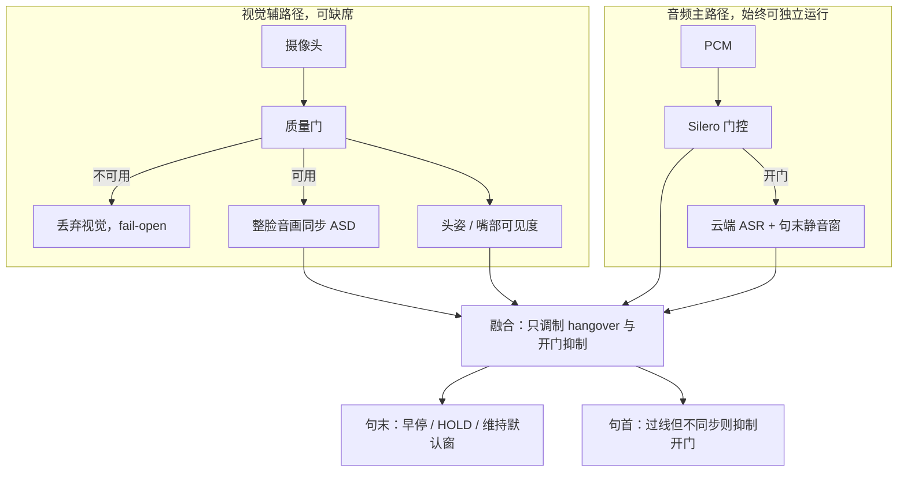
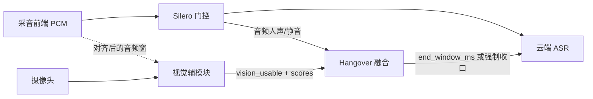

# 视觉辅助VAD与句末收口方案

视觉在语音交互中的正确用法是**辅助**而非替代：音频 VAD 始终独立完成开门与收口，视觉只在画质过关时调制句末静音窗（hangover）。核心收益是正脸闭嘴时句末窗从 400～1200ms 收到 150～250ms，侧脸、口罩、看不见嘴时行为与现网完全一致（fail-open）。本文拆解四层问题边界、融合规则、质量门设计与落地分期。

---

## 一、要解的问题

用户听感上的「反应慢」，锚点是**停话 → 喇叭出声**。句末纯音频静音窗（现场约 400～600ms，千问默认 1200ms）是「说完之后」的死等：音频分不清词间换气、思考停顿和真正交话轮。

视觉能补的不是「画面里有没有人」（那是在场/唤醒），而是：

| 痛点 | 纯音频 | 视觉能补什么 |
|------|--------|--------------|
| 句末多等几百 ms | 必须听满静音窗才敢收口 | 正脸闭嘴时可早停 |
| 句中短暂停被切断 | 「那个……然后」被当成说完 | 唇/下颌还在动则 HOLD |
| TTS 余响、电视、旁人误开门 | 能量 + Silero 仍可能过线 | 音画不同步则抑制开门 |
| 多人/声源不是画面里那张脸 | 麦阵 DOA 有限 | 脸与音频是否对齐 |

目标体验：用户正对说话、闭嘴干脆时，句末窗收到约 150～250ms；侧脸、低头、口罩时**不得更差**。

---

## 二、四层问题，不要合成一个「多模态 VAD」

业界成熟产线把「视觉 + VAD」拆成四件不同的事，模型和投票权也不同：

| 层 | 问题 | 成熟叫法 | 视觉输入 | 是否用于收口 |
|----|------|----------|----------|--------------|
| 1 | 这段音频像不像人声 | Audio VAD | 不参与主判 | 否，仍走 Silero |
| 2 | 是不是画面里这张脸在出声 | Active Speaker Detection（ASD） | 整脸裁块 + 音频 | 用于开门抑制、声源确认 |
| 3 | 这句话是不是说完了 | End-of-Utterance（EOU） | 闭嘴、头姿、可选回看 | 只在质量过关时调制静音窗 |
| 4 | 是不是在对机器人说 | Addressee | 注视/头朝向 | 后期可选；不当 VAD |



对应公开基准与可落地模型：AVA-ActiveSpeaker；TalkNet / Light-ASD / LR-ASD（实时、端侧可跑）。Voice Activity Projection（VAP）更接近「预测还说不说」，工程成熟度低于 ASD + 规则，一期不上。

---

## 三、总体架构：输出证据，不输出命令

视觉辅模块输出的是**证据**，不是「开麦/关麦」命令。开麦、退出交互仍只由交互会话层判决。



视觉辅模块的输出字段建议：

| 字段 | 含义 |
|------|------|
| `vision_usable` | 本窗质量门是否通过；false 则融合层当视觉不存在 |
| `face_yaw_deg` / `face_pitch_deg` | 头姿，用于分档 |
| `mouth_visible` | 嘴部 landmark 可见度是否够 |
| `asd_score` | 整脸与当前音频的同步说话分数 0～1 |
| `lips_closed_conf` | 仅 `vision_usable` 时有效；闭嘴置信 |
| `looking_at_robot` | 可选；仅音频已静音后用于话轮确认 |

音频与视频必须**共时钟**。未标定的音画偏差超过约 100ms，ASD 会系统性误判。以音频时间轴为准，视觉分数打上采集时间戳再对齐。

---

## 四、融合策略：视觉只改 hangover

不对称规则的出发点是错误代价：**误早停会切句，比多等 300ms 严重得多**，因此默认保守。

```
音频人声 ∧ asd 对齐           → 高置信正在说（可维持开门，抗回声）
音频人声 ∧ asd 明显不对齐     → 抑制开门（电视 / 旁人 / TTS 余响）
音频静音 ∧ 唇/下颌仍在动      → HOLD，拉长句末窗（防切断「那个」）
音频静音 ∧ 正脸高置信闭嘴     → 早收口，窗收到 150～250ms
音频静音 ∧ 闭嘴 ∧ 回看机器人  → 更敢立刻交话轮（二期）
音频静音 ∧ 目光移开           → 晚收口（用户还在想，二期）
vision_usable = false         → 完全忽略视觉，沿用现网静音窗
```

用静音窗时长表达融合结论，避免视觉帧去替换 Silero 逐帧判决：

| 融合结论 | 句末窗 | 说明 |
|----------|--------|------|
| 视觉不可用 | 现网默认（豆包 400 / 千问 1200，或现场已调的约 600ms） | fail-open |
| HOLD | max(默认, 800～1200ms) 或推迟强制 end | 只在质量过关且运动置信足够时 |
| 早收口 | 150～250ms | 仅正脸 + 高置信闭嘴 |
| 半侧脸 | 禁止早停；最多 HOLD | 见头姿分档 |

本地门控开门仍以 Silero `min_speech_duration_ms`（约 300ms）为准。**视觉不缩短开门**；最多在「音频过线但 ASD 明确不是这张嘴」时抑制送云端，降低误唤醒式送流。

---

## 五、质量门：看不见嘴就当没有视觉

唇 ROI 会经常失败：角度变、口罩、低头看手机、远、糊、逆光。质量门是准确率的第一道，比把唇读做强更重要。任一不满足则 `vision_usable=false`（阈值现场标定）：

| 门控 | 建议起点 | 挡住的失效模式 |
|------|----------|----------------|
| 脸宽/眼距 | 脸宽 ≥ 80～100px | 远、嘴唇只有几像素 |
| 偏航 \|yaw\| | 早收口要求 < 25°～35° | 纯侧脸、后脑 |
| 俯仰 | 低头过大则禁用 | 嘴被下巴或屏幕挡 |
| 嘴部 landmark 可见度 | 过低则禁用 | 手挡、口罩、暗光 |
| 模糊/过曝/过暗 | 梯度与亮度门 | 运动模糊、逆光 |
| 时域稳定 | 连续 3～5 帧过关 | 转头瞬间误判「闭嘴」 |

头姿分档（同一套 ASD，不同权限）：

| 档 | 条件 | 允许的动作 |
|----|------|------------|
| 正脸 | \|yaw\| 小、嘴可见 | 早收口 + HOLD |
| 半侧 | 约 25°～45° | 只 HOLD，禁止早停 |
| 大侧/无嘴 | 其余 | 视觉权重 = 0 |

一个关键取舍：几何「嘴高宽比」不要当主特征，yaw 三十度就会漂。一期用**整脸裁块 + 音频同步（Light-ASD 一类）**；侧脸还能看到下颌、颊部运动，分数变低时由质量门丢掉，而不是给出错误的「闭嘴」。

---

## 六、唇动局限与覆盖率门槛

| 风险 | 为什么会发生 | 规避 |
|------|----------------|------|
| 摄像头看不到嘴 | 侧后、出画、手挡、口罩 | fail-open；口罩场景直接不可用 |
| 角度变化 | 几何唇动对 yaw 敏感 | 整脸 ASD + yaw 分档，不用嘴张度阈值 |
| 假闭嘴 | 思考时嘴闭合但还要说 | 早停必须高置信；可叠加语义「句子未完则禁止早停」 |
| 假 HOLD | 侧脸被当成还在说，拖死 | 看不清时禁止 HOLD |
| 音画不同步 | 相机与麦延迟未标定 | 共时钟；偏差大则整路视觉关闭 |

覆盖率门槛（要在**真实对话**里统计，不是实验室正脸）：

| `vision_usable` 占比 | 建议 |
|----------------------|------|
| ≥ 40%～50% | 值得做早收口，正对时体感明显 |
| 10%～30% | 只当正对加速彩蛋，不写进时延 KPI |
| 更低 | 预算给语义 EOU 与缩短音频 VAD，视觉性价比差 |

机位比模型更能规避失败：摄像头略高于嘴、微俯视、对话距离下脸不要太小。这比把 ASD 做重有效。

---

## 七、落地分期

**一期（必须先有，否则不上视觉收口）**

1. 质量门 + `vision_usable`；失败则与现网逐字相同
2. 整脸 ASD 分数；音画时钟标定
3. 只做两件事：正脸高置信闭嘴 → 早收口；质量过关且仍在动 → HOLD。禁止低置信早停
4. 现场录正脸/半侧/低头/口罩，只标定门限，不承诺全角度加速

**二期**

- 音频已静音后，用粗注视/头朝向区分「还在想」与「交话轮」
- 麦阵 DOA 与人脸方位对齐，加强「声源是不是这张脸」
- 机位域数据微调 ASD，而不是直接用电影域权重

**三期（可选，勿与一期捆绑）**

- 语义 EOU 作为句末主加速（稳定 partial、句末标点、句法完整；不依赖正脸，覆盖率通常高于视觉）
- 多模态 VAP 预测未来几百 ms 还说不说；论文向、非默认

**明确不做**

- 纯视觉 VVAD 替代麦克风
- 用「画面有人」当 VAD
- 身体晃动判句末（口罩下最多辅助「有人在说话」，不能收口）

---

## 八、验收标准

1. **fail-open**：挡镜头、侧后、口罩，句末时延与切句率不差于现网
2. **正对短指令**：闭嘴干脆时，停话到 ASR 终稿比现网少约 300～400ms，且切句不明显增加
3. **句中停顿**：「那个……然后」HOLD 生效，切句少于现网
4. **误开门**：TTS 余响/侧向电视，ASD 不对齐时少送云端
5. **转头**：正脸→侧脸过程中不出现「突然早停」
6. **覆盖率**：报告真实对话 `vision_usable` 比例；低于门槛则降级为彩蛋或停用早收口

延迟只看句末等待这一段（停话/最长前缀 → ASR 定稿），不包装 LLM/TTS 环节。

---

## 延伸思考

这套方案的核心工程判断有三条，值得迁移到其他多模态融合场景：

1. **不对称错误代价决定保守默认**。早停切句的伤害远大于多等 300ms，所以所有融合规则偏向「不作为」——视觉只允许把窗收窄到 150ms 或拉长到 HOLD，不允许在低置信下行动。
2. **fail-open 是辅助模态的生命线**。视觉整路挂掉时系统必须退化为纯音频且行为逐字相同，否则一个摄像头的故障会变成语音交互的故障。
3. **先统计覆盖率再决定投入**。如果真实场景里用户 70% 时间侧对机器人，再强的 ASD 也只是彩蛋；预算应流向语义 EOU（不依赖正脸）这种覆盖率更高的路径。

与《仿生机器人全双工语音交互方案》中的 AV-VAD（唇动/视线/DOA 四级打断决策）互补：全双工方案里 AV-VAD 解决「是否在跟我说话」，本文解决「这句话说完没有」，两者共用 ASD 底座可复用同一套视觉证据。
