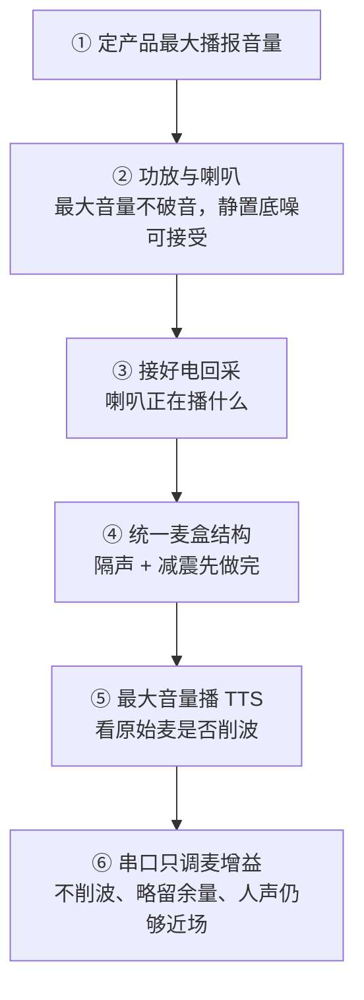

# 机器人采音硬件与结构设计流程

采音给云端 ASR 用，不是给人听。合格标准三条：人声进得去、自身播报消得掉、麦不削波。核心结论：**先把结构和功放做对，再调麦克风增益**——增益补不了壳振，也补不了漏音。本文给出从零设计一套采音方案的六步施工顺序、麦盒结构工艺要点、以及只看原始 6 路的四项验收测试，与《结构硬件软件对机器人采音的影响》《机器人采音链路与回采保证》构成原理—增益—施工三篇互补。

---

## 一、设计顺序：六步不可颠倒



顺序颠倒的典型翻车：结构还在抖就先拧增益。增益一高，底噪和削波一起变差，现象看起来像「麦太灵」，其实是结构在灌振膜。增益放大的是"人声 + 结构灌进来的振动"的总和——振膜被结构振动占掉一部分行程后，拧增益只是把削波点提前，人声并没有变干净。

> 三层责任排序（结构 > 硬件 > 软件）的原理见《[结构硬件软件对机器人采音的影响](2026-09-02_结构硬件软件对机器人采音的影响.md)》，本文不再展开，只讲怎么按这个排序把事情做出来。

---

## 二、验收的眼睛：原始 6 路

判结构、调增益都看**进引擎之前的原始 6 路**（`input_origin.pcm`），不要用降噪后的 `/voice/audio_raw`——降噪后的信号已经过算法加工，看不出结构问题的原貌。

```text
ch1~ch4 = 四路麦（空气传播 + 腔体共鸣 + 壳体振动都在这里）
ch5~ch6 = 两路喇叭电回采（电信号，几乎不含腔体与壳振分量）
```

这个通道划分本身就是诊断原理：**壳振只存在于 ch1~ch4，不存在于 ch5~ch6**。回采抽的是功放输出的电信号，而壳振是"电→喇叭→固体传导→振膜"的产物，电信号里没有这个传递函数——所以 AEC 拿回采做参考，永远消不掉壳振。这是后面结构减震全部要求的第一性依据。

---

## 三、硬件三件事

### 3.1 先定最大播报音量

按产品实际使用定一个**最大播报音量**（量产上限），后面功放、破音、削波、增益全部按这个点验收。现场临时把音量拧得更大再测，结论作废。

这一步是整套流程的锚点：最大音量是"最坏情况"，最坏情况下不削波，日常使用才有余量。削波曲线标定与 UI 音量档映射的完整方法见《[机器人采音链路与回采保证](2026-09-05_机器人采音链路与回采保证.md)》2.4 节。

### 3.2 功放与喇叭：查破音与底噪

在最大音量下检查两件事：

| 查什么 | 合格 | 不合格 |
| --- | --- | --- |
| 破音 | 喇叭听感干净，电回采波形不削顶 | 功放/喇叭已失真，后面 AEC 对不齐 |
| 底噪 | 不播报时回采接近静音；整机静置麦底噪稳定 | 功放底噪大、接地差，静置回采或麦一直粗 |

功放失真属于电声问题，不要当成「麦增益太大」去降——功放出的参考信号本身失真，AEC 的线性拟合就对不上，表现为"怎么调都消不干净"。

### 3.3 回采必须接对

回采是回声消除的参考：**喇叭电信号进声卡，不要衰减回采通道。**

- 未播报：ch5~ch6 应接近一条线
- 播 TTS：ch5~ch6 有包络，且和实际播放同步
- 回采没接、接反、电平被软件衰减：消除对不准，后面再改结构也像消不掉

麦增益（如 `alsa.mic_gain`）**只打在麦上**，不要动回采。回采电平另有目标（最大音量峰值 −3～−5 dBFS），与麦增益是两条独立的轴。

---

## 四、麦增益：最后一步才动它

前置条件：结构、音量、回采都已固定。然后：

1. 用产品**最大音量**播一段固定 TTS
2. 看原始四麦：峰值不要顶到满幅（32767），留余量——建议峰值低于满幅约 3～6 dB（即 −3～−6 dBFS，与采音链路篇的目标电平表一致）
3. 这个「最大音量刚不削波、再略保守一点」的增益，就是**当前这台机器实际结构**上的最佳点

用串口/配置按当前机型的实际结构调，不要抄别的机型的数字。两端都要防：

- **增益过大**：最大音量一播就削波，壳稍微一抖更满幅；削波后 AEC 救不回来（平顶是非线性失真，数字域缩小只把平顶变矮，消不掉）
- **增益过小**：近场说话太轻，唤醒/开门不稳，只剩很近的交互可用

近场人声够用、最大音量又不削波，才算平衡。**结构改过（垫、间隙、螺丝预紧）必须重调一次增益**——结构变了，灌进振膜的振动量就变了，旧增益不再是最佳点。

---

## 五、结构：先隔声减震，再谈多产品复用

目标就两句：

1. **隔声**：喇叭声尽量不要从机内空腔灌进麦；扬声器仓不要往结构里漏音造成内部回响
2. **减震**：喇叭磁路打进骨架的力，不要传到麦振膜。电回采里没有「壳在抖」，这条算法消不掉（见第二节）

### 5.1 统一小盒子（多产品公用）

不要每个机型再挖一套麦仓。做成一个独立小盒子：

- **盒内**：麦克风阵 + 声卡板（及必要的连接件）
- **盒外**：标准安装面，用螺丝装到任一产品上
- 拾音孔朝外、短而畅，防尘网要薄；人声通路别用厚海绵堵死

盒子本身就是第一层隔声：麦和整机大空腔分开，减少桶音和机内来回反射。这也是多产品线（半身机/全身机）下唯一划算的做法——声学结构一次设计、多机型复用，验收标准也统一。

### 5.2 隔声

- 小盒子把麦从整机空腔里隔离出来
- 扬声器在结构内**不要漏音**：喇叭仓与机内空腔封好，避免声音在壳里打转、再从脖子/缝/孔进麦
- 该封的缝封上；**不要把麦仓塞满吸音棉求静**——底噪下去了，人声也闷了

镂空脖子、外壳开孔造成的**空气回声**，隔振垫管不了——那是开口和腔体的事。空气回声只要和回采长得像，交给 AEC；壳振则必须改结构。两类问题的分界：

| 干扰类型 | 传播路径 | 电回采里有没有 | 治理手段 |
| --- | --- | --- | --- |
| 空气回声 | 喇叭→空气→拾音孔→麦 | 有（与回采相似） | AEC 可消；改开口/腔体减少 |
| 壳振 | 喇叭→结构固体传导→振膜 | 无 | 只能改结构减震 |

### 5.3 减震工艺（按能做到的优先级）

**最好：**

- 扬声器和麦克风小盒子**不在同一个腔体**
- 两者之间**没有硬连接**（不要共一块硬壳、硬梁、硬螺丝贯通）

**做不到分仓时（常见半身机）：**

- 小盒子不要大面积贴在机器人外壳上，**只允许螺丝口接触**外壳
- 螺丝口必须做软垫：垫在弹性区，螺丝只限位、不把垫压成硬短路
- 过孔略大于螺杆，螺杆尽量不碰孔壁；螺丝头下也可加软垫圈，让力走橡胶而不是铁对铁
- 麦克线同样会传振：留一点松弛，不要拉成弦

螺丝不可能传递为零，但可以不变成「把盒子和外壳锁成一块铁」。

### 5.4 软垫短路的三种典型

减震设计做完，装配环节把它废掉的三种常见方式：

1. **拧死**：螺丝把软垫压成硬短路，力走铁对铁
2. **垫压实**：垫被压出弹性区，失去隔离能力
3. **线缆绷直斜拉到大壳**：麦克线变成传振的"琴弦"，绕过了所有软垫

三种情况的共同特征：图纸上有减震，实物上是硬连接。验收时用手按大壳复测（见下节），不用拆机就能暴露。

---

## 六、结构验收：四项测试

同一软件、同一最大音量、同一增益（或结构定稿后再定增益），只看原始四麦：

| 测试项 | 合格标准 |
| --- | --- |
| 静置 | 四麦底噪稳定，约 −60 dBFS 量级，无碰撞咔嗒 |
| 最大音量 TTS | 四麦**不得削波**；麦比电回采明显低（经验上低 12 dB 以上更稳），波形仍可像回采 |
| 手按大壳再播 | 大壳可以在抖，四麦相对松手几乎不变（几 dB 内），绝不削波 |
| 敲远离麦盒的外壳 | 四麦弱；敲盒子本身才明显 |

**结果判读：**

- 按大壳变响、敲屏四麦齐跳 → 力路还在（贴壳、螺丝压死、或线在传），回 5.3/5.4 改结构
- 麦和回采很像、延迟约 1 ms、能量已经掉下来 → 壳振过关，剩下的是空气漏，另改开口和腔体，不要再怪垫

「手按大壳」是四项里性价比最高的一项：不拆机、一分钟出结论，直接检验减震链路是否真实生效。

---

## 七、与知识库相关文章的分工

| 文章 | 视角 |
| --- | --- |
| [结构硬件软件对机器人采音的影响](2026-09-02_结构硬件软件对机器人采音的影响.md) | 原理：结构>硬件>软件的三层责任模型，各层机制与红线 |
| [机器人采音链路与回采保证](2026-09-05_机器人采音链路与回采保证.md) | 增益：目标电平表、模拟域四麦同步、削波曲线标定与 UI 映射 |
| [麦阵回采AEC削波排查与麦克风数字增益](2026-06-07_麦阵回采AEC削波排查与麦克风数字增益.md) | 实战：削波问题的具体排查过程 |
| 本文 | 施工：从零设计的六步顺序、麦盒结构工艺、四项验收测试 |

---

## 八、现场一句话

功放按最大音量不破音；回采接对且不衰减；麦和声卡进统一小盒子；先隔声减震（分仓最好，否则只让螺丝口接触并加软垫）；最后用最大音量播报把麦增益收到「不削波还留一点余量」，同时保证近场人声够大。

结构没做好就拧增益，只会在底噪、削波和听不清人声之间来回打转。
