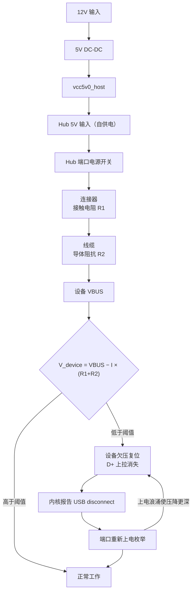

# 机器人 USB 设备掉线根因定位与整改方案

量产机器人（RK356x + 外置 USB Hub + 摄像头/声卡/WiFi）出现"出厂正常、用久了软件层频繁 USB 插拔、偶发开机检测不到"的故障。通过在故障机上 adb 远程采集 sysfs / dmesg / 设备号分配数据，定位到根因是**总线供电（Bus-Powered）设备的 VBUS 供电余量不足**——回路阻抗（连接器接触退化 + 线缆压降）乘上负载电流产生的压降越过阈值，导致设备掉电复位。据此给出"设备分类 → 供电隔离实验 → 分层整改"的定位方法论：不要先怀疑平台，先用供电方式把设备分组，一次实验就能把范围砍掉一半。

---

## 一、现象与背景

| 项 | 内容 |
| --- | --- |
| 现象 | 出厂正常 → 长期使用后软件层频繁检测到 USB 插拔 → 偶发开机直接检测不到 |
| 现场缓解 | 打胶、换线、重新插拔、软重启，均有改善但不持久 |
| 采集方式 | `adb connect` 远程连接，读 `/sys/bus/usb/devices`、`/sys/kernel/debug/usb/devices`、`dmesg` |
| 平台 | RK3568-EMB-2580-R11（**注意：实测为 RK3568，非 RK3588**，见 7.1） |
| 拓扑 | xHCI → 4 口 Hub → 摄像头 / 声卡 / WiFi 三设备 |

三个看似无关的现场观察，其实是同一件事的三个侧面：

- **打胶就好**：固定连接器 → 触点不再微动 → 接触电阻停止漂移
- **换线就好**：换掉磨损的公头 + 换成线径更粗的线 → 接触电阻与线缆压降同时下降
- **开机检测不到**：上电瞬间浪涌电流最大 → 压降最深 → 直接死在枚举阶段

---

## 二、关键方法：用"供电方式"给设备做天然分组

这是本次定位里最有价值的一步。不要一上来就看报错，先把总线上所有设备按**供电方式**和**声明电流**列出来，掉线次数立刻自己说话。

同一台机器、同一段时间（约 2.3 小时）的实测结果：

| 设备 | 端口 | 供电方式 | 声明电流 | 掉线次数 |
| --- | --- | --- | --- | --- |
| Hub 自身 | 7-1 | **自供电** | 100mA | **0** |
| WiFi（RTL8723DU） | 7-1.4 | **自供电** | 500mA | **0** |
| USB3 Hub | 8-1 | **自供电** | 0mA | **0** |
| **摄像头（WN Camera）** | 7-1.1 | **总线供电** | 500mA | **137** |
| **声卡（USB Dongle）** | 7-1.2 | **总线供电** | 50mA | **2** |

**规律完美分离：自供电设备零掉线，总线供电设备全在掉，且电流越大掉得越狠。**

这条规律一次性排除了三个大方向：

- 不是 RK3568 控制器 / PHY 缺陷——否则 Hub 自己和 WiFi 不可能一次都不掉
- 不是带宽 / 负载 / 应用层——否则同一总线上的 Hub 无法独善其身
- 不是单纯的信号完整性——否则 WiFi（500mA 声明、持续收发）该比声卡更容易崩

---

## 三、掉线的形态：静默断开，不是枚举失败

这是把根因从"信号质量"扭转到"供电"的决定性细节。

137 次掉线里，绝大多数是这个形态——**前面没有任何报错**：

```text
[ 8248.026627] usb 7-1.1: USB disconnect, device number 37
[ 8248.287800] usb 7-1.1: new high-speed USB device number 38 using xhci-hcd
[ 8248.478210] usb 7-1.1: New USB device found, idVendor=0edc, idProduct=3080
```

263 毫秒后干净恢复。全开机周期内失败类报错累计只有：CRC（`-71`）19 次、`Cannot enable` 12 次、`attempt power cycle` 4 次。

**为什么这个差别重要**：D+ 线上的 1.5k 上拉电阻消失，Hub 才会报告 `USB disconnect`。上拉消失只有两种可能——**设备掉电了，或者设备自己复位了**。

如果是信号眼图劣化，症状应该是"高速握手失败 → 降速 → 重试失败"，而不是"设备干净地消失又干净地回来"。实测确实出现过 2 次 full-speed 降级（480M → 12M），说明链路信号也在临界，但**主导机理是掉电，不是信号**。

---

## 四、根因链



压降公式很朴素：

```
V_device = V_hub_port − I_device × (R_connector + R_cable)
```

三个变量，对应三条独立恶化路径：

| 变量 | 随什么变化 | 现场表现 |
| --- | --- | --- |
| **R_connector（接触电阻）** | 振动微动磨损、镀层氧化、弹片应力松弛 | 打胶/换线/插拔有效——你说的"老化"就是这一条 |
| **R_cable（线缆阻抗）** | 线径、长度、固定弯折点断丝 | 换粗线/短有效 |
| **I_device（负载电流）** | 设备工作状态、上电浪涌 | 上电瞬间最容易失败 |

**你的判断（振动 → 连接器老化 → 电阻变化）对应的是第一条。方向正确，但它只是三个变量之一。**

一个必须正视的比例问题：拔掉声明 50mA 的声卡（约占总负载 9%），摄像头掉线率改善 **2.6 倍**。**9% 的负载换 2.6 倍的改善，不符合线性压降模型。** 这指向两件事：

1. **工作点贴着悬崖边**——电压回升一点点，"塌陷"概率成倍下降。这恰恰解释了为什么打胶、换线这类小改动能"完全好了"：不是修好了，是把工作点推离了临界。
2. **声卡的 50mA 声明值不可信**——它是用 Linux USB Gadget 实现的板子（VID 用的是 Linux Foundation 的 `1d6b`），板内跑着一个小 Linux 系统 + 4MIC 阵列，实际电流远超声明值。这个数必须用 USB 电流表实测。

---

## 五、已经排除的原因

排查的价值有一半在于排除。以下都拿到了反证：

| 假设 | 排除依据 |
| --- | --- |
| Hub 过流保护触发 | 所有端口 `over_current_count = 0` |
| autosuspend 挂起 | `power/control = on`（只有摄像头是 `auto`，属干扰项） |
| 电源管理唤醒失败 | 无 `error -110`（超时）、无 `error -32`（配置失败） |
| 带宽 / 应用负载 | 摄像头全程空闲——`Alt=0` 未推流，且 `/proc/*/fd` 中**无任何进程打开 `/dev/video*`**，仍在以 60~150 秒周期掉线 |
| 平台 USB 控制器缺陷 | 同总线上自供电设备零掉线 |
| 温度 / 活动相关 | 空闲状态同样掉线，静置 86 分钟不掉说明与"是否在用"绑定，而非单纯热效应 |

摄像头"**空闲仍在掉**"这一条特别关键：它彻底排除了带宽、负载、应用层三个方向，把问题锁定在**模块自身 / 供电 / 连接**三选一。

---

## 六、验证实验（按优先级）

### 6.1 外接独立 5V（决定性，半天可完成）

给摄像头接一根 Y 型线或带 DC 头的 USB 线，**只保留 D+/D-/GND，VBUS 由外部电源供**。

- 掉线消失 → 供电压降假设坐实，直接进整改
- 仍然掉 → 转向摄像头模块自身固件 / 复位逻辑

### 6.2 端口对调（零成本，立刻可做）

声卡拔掉后 port2/port3 空出，把摄像头换到 port3：

- 换过去不掉了 → 问题在 port1（Hub 端口侧）
- 换过去还掉 → 问题在摄像头/线缆/供电（设备侧）

### 6.3 负载隔离实验（已做，用于交叉验证）

拔掉声卡后观察 615 秒：

| 指标 | 拔出声卡前 | 拔出声卡后 |
| --- | --- | --- |
| 摄像头掉线 | 142 次 | **4 次** |
| 平均间隔 | 59.5 秒 | **153.8 秒** |
| 最长平静期 | 173 秒 | **399.6 秒** |

按泊松检验，掉线率下降 2.6 倍，**p ≈ 2%，统计上显著**。

**耦合证据**：拔出声卡的一瞬间，两条日志相隔 **0.8 毫秒**：

```text
[ 8446.995051] usb 7-1-port1: unable to enumerate USB device   ← 摄像头端口枚举失败
[ 8446.995854] usb 7-1.2: USB disconnect, device number 46     ← 声卡拔出
```

同 Hub 下两个端口之间存在强耦合，故障同源。

### 6.4 实测声卡工作电流

用几十元的 USB 电流表测声卡板实际电流。这个数字决定它是"50mA 的配角"还是"压垮 VBUS 的主角"。

---

## 七、解决方案：分层整改

### 7.1 立即可做（零成本）

- 关掉摄像头端口的 autosuspend（它是唯一 `power/control=auto` 的设备，其余全 `on`，这个不对称是干扰项）
- 已出货机器补一条标准化"**完全断电 30 秒**"流程——多数 Hub 芯片的过流/故障标志是锁存的，必须彻底断电才清除

### 7.2 现场缓解（本周）

- 换**短而粗**的摄像头线（电源芯 ≥ 24AWG）
- 摄像头端加 **470~1000µF 低 ESR 电解 + 陶瓷电容**做本地储能，吸收上电浪涌
- 连接器清洁后规范打胶：
  - **严禁**把胶灌进插接面或触点区域（不可逆损坏）
  - **禁用** 502 类瞬干胶（脆、易渗）和环氧（太硬，热膨胀系数不匹配）
  - **推荐** 704 硅橡胶或 3M / Loctite 柔性固定胶
  - 位置只点在连接器根部与 PCB / 结构件的过渡处，做应力消除

### 7.3 量产根治（下一批改板，按性价比排序）

| 优先级 | 措施 | 说明 |
| --- | --- | --- |
| 1 | **摄像头独立供电，不走 USB VBUS** | 收益最直接、成本最低。一根线 + 一个 DC-DC，直接消掉 I×R 里最不可控的一项 |
| 2 | **摄像头改 MIPI CSI 接入** | 最优解。RK3568 的 CSI2 DPHY 是好的（启动日志 `rockchip-csi2-dphy-hw fe870000: probe successfully`），模组若支持 MIPI 输出，一次性消除枚举、连接器、供电、带宽四类风险 |
| 3 | **摄像头改接独立 USB 控制器** | usb5/usb6 现在完全空载，挪过去即与其他设备物理隔离，不再共享端口电流预算 |
| 4 | **端口加低 Rds(on) 电源开关 + 独立去耦** | 降低端口内阻，提高瞬态响应 |
| 5 | **连接器换带锁 + 镀金加厚，或直接焊接/板对板** | 见下节 |

### 7.4 关于"减震 + 焊死"的定位

这个方案**有效，但只覆盖三个变量中的一个**，必须放对位置：

- **它解决的**：`R_connector`。焊接消除了触点微动磨损与氧化，接触电阻从"随振动漂移"变成"设计值固定"。对于**连接器退化主导**的那批机器，这是根治。
- **它不解决的**：
  - `R_cable`——线缆断丝、线径不足，焊死了也没用
  - `I_device`——摄像头上电浪涌与工作电流依旧压在同一个 VBUS 上，余量该不够还是不够
  - 若工作点本来就贴临界（本次实测高度指向这一点），则焊死后余量依然薄，只是把复发周期拉长
- **它的代价**：可维护性归零。声卡或摄像头是易损件，焊死后现场无法更换，返修只能回厂

**结论：焊死是"根治接触电阻"的正解，但要作为 7.3 的组合拳之一，而不是唯一解。** 顺序上仍建议**先做 6.1 的外接供电实验**——它决定压降的主角是连接器还是负载电流，从而决定焊死值不值得做。

### 7.5 软件兜底（提升可用性，非修根因）

应用层加自恢复链，把"必须派人到现场"变成"机器人自己恢复"，对已出货机器价值最大：

```text
检测到声卡/摄像头消失
  → 尝试 usb reset（sysfs authorized 或 unbind/bind）
  → 无效则重载 USB 控制器驱动
  → 仍无效则主动重启系统
```

---

## 八、附带发现（与掉线无关，但需处理）

| 项 | 日志线索 | 影响 |
| --- | --- | --- |
| PCIe PHY 初始化失败 | `rockchip_p3phy_init: lock failed` → `rk-pcie 3c0800000.pcie: fail to init phy, err -110` | 该 PCIe 通道不可用，需查 refclk / 供电配置 |
| OTG 口未配 VBUS 检测 | `extcon extcon1: failed to create extcon usb2-phy link` + `No vbus specified for otg port` | 当前不影响 Host，但 OTG 角色切换做不了 |
| 蓝牙协议栈未启用 | `rtk_btusb` 已绑定接口，但 `/sys/class/bluetooth` 为空 | 若产品需要蓝牙，是待办 |
| 声卡 USB 通道只有采集 | `card2 [Dongle]` 仅 `capture 1`，无 playback | 放音走板载 I2S codec，AEC 跨时钟域问题被坐实（见 8.1） |
| 声卡 VID 不合规 | `VID:PID = 1d6b:a4a6`，`1d6b` 是 Linux Foundation 分配给 USB Gadget 的 VID | 用 Linux 的 VID 出货本身不合规，需找供应商要固件实现说明 |

### 8.1 顺带坐实的一个架构问题

`/proc/asound/cards` 显示三个声卡：

| card | 名称 | 硬件 | 流 |
| --- | --- | --- | --- |
| 0 | rockchip,rk809-codec | 板载 I2S codec | playback 1 + capture 1 |
| 1 | rockchip,hdmi | HDMI 音频 | playback |
| 2 | Dongle | USB 声卡板 | **capture 1（只有录音）** |

即：**麦克风采集在 USB 声卡（独立晶振），扬声器参考在板载 codec（另一颗晶振）**。回声消除的两个输入天生不在同一时钟域，只能靠软件重采样硬补——CPU 开销大且效果不稳。这也说明 USB 那条链路只承担"上行采音"，长期应收敛到 I2S/PDM 直连。

---

## 九、采集命令备忘

以下命令可直接在故障机上执行，用于复现本报告的判据。

```bash
# 1. 全量设备清单 + 供电属性（关键：找到 bus-powered 设备）
for d in /sys/bus/usb/devices/*/; do
  [ -f "$d/idVendor" ] || continue
  echo "$(basename $d) $(cat $d/idVendor):$(cat $d/idProduct) \
        $(cat $d/product 2>/dev/null) \
        bmAttr=$(cat $d/bmAttributes 2>/dev/null) \
        bMaxPower=$(cat $d/bMaxPower 2>/dev/null) \
        speed=$(cat $d/speed 2>/dev/null)"
done

# 2. Hub 端口级状态（含 over_current_count，注意用 *port* 不带尾斜杠）
for d in /sys/bus/usb/devices/*/; do
  for p in "$d"*port*; do
    [ -f "$p/over_current_count" ] && echo "$p oc=$(cat $p/over_current_count)"
  done
done

# 3. 掉线次数统计（按设备分别计数）
dmesg | grep -c "usb 7-1.1: USB disconnect"
dmesg | grep -c "usb 7-1.2: USB disconnect"

# 4. 错误码分布
dmesg | grep -oE "error -[0-9]+" | sort | uniq -c | sort -rn

# 5. 设备号分配次数（判断枚举风暴规模；devnum 单调递增不复用）
cat /sys/bus/usb/devices/7-1.1/devnum

# 6. 是否降速到 full-speed（12M 即高速握手已失败）
cat /sys/bus/usb/devices/7-1.1/speed

# 7. 是否有进程在占用视频设备
for f in /proc/*/fd/*; do readlink $f 2>/dev/null; done | grep video

# 8. 声卡构成（确认录音/放音是否同域）
cat /proc/asound/cards
```

---

## 十、现场一句话

**先按供电方式给设备分组——自供电零掉线、总线供电全在掉，就已经排除了平台缺陷；再去做"给摄像头外接独立 5V"这一个实验，就能判定压降的主角是连接器还是负载电流。** 连接器微动退化（震动老化）是三条恶化路径之一，减震与焊接能根治它，但压降的另外两项——线缆阻抗与负载电流——必须靠独立供电或改 MIPI CSI 才能闭合。排查这个问题的顺序永远是：**供电余量 > 信号质量 > 软件容错**。

---

## 十一、关联文章

| 文章 | 视角 |
| --- | --- |
| [结构硬件软件对机器人采音的影响](2026-09-02_结构硬件软件对机器人采音的影响.md) | 原理：结构 > 硬件 > 软件的三层责任模型 |
| [机器人采音链路与回采保证](2026-09-05_机器人采音链路与回采保证.md) | 增益：目标电平表、削波曲线标定与 UI 映射 |
| [机器人采音硬件与结构设计流程](2026-09-10_机器人采音硬件与结构设计流程.md) | 施工：六步顺序、麦盒结构工艺、四项验收 |
| 本文 | 链路：USB 外设掉线（供电余量）与连接器可靠性 |

---

*环境示例：RK3568-EMB-2580 + USB2.1 Hub（05e3:0610）+ 摄像头（0edc:3080）+ USB 声卡（1d6b:a4a6）+ WiFi（0bda:d723）*
