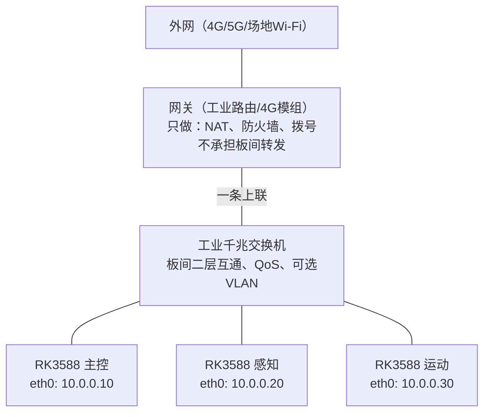

# 机器人内部通信架构剖析

多板机器人（RK3588 × N）的机内网络不是"小型局域网"，而是一条**产品级总线**：物理层按工业环境做、板间流量走二层交换、出网收敛到单一网关、控制与感知分道、时钟对齐、故障可降级。本文按物理层→拓扑→流量分级→协议→内核调优→时间同步→可靠性的顺序逐层剖析，并给出可直接写成接口规格的需求清单。

本文与《传输层演进的第一性原理-TCP-UDP到QUIC》《机器人研发常用通信方式与选型指南》构成一条线：前者钉传输层合同，后者讲单协议选型，这篇钉**机内网络怎么铺**。

---

## 1. 重新定义问题：机内网是总线，不是局域网

典型机型：机器人内部多块 RK3588，有线接到同一台路由/交换设备；板间传控制指令、状态、图像、点云；整机还要 4G/5G/场地 Wi-Fi 出网，做云端、OTA、远程运维。

家用思维是"买台路由，LAN 口插满，开 DHCP"；产品思维是把机内网当**总线**设计、把出网当**受控的单一出口**。两者混在同一台消费级路由的 CPU 上，是最常见的隐患。

真正会出事的从来不是"IP 配没配上"，而是这五个问题：

1. 控制指令和相机码流挤同一条链路，互相堵死；
2. 电机 EMI、振动松线、消费级路由过热，让"很近的内网"突发丢包；
3. 多板各自采传感器，时钟不对齐，融合在拼错位数据；
4. 路由器/4G 挂了，本地作业还能不能安全停、能不能继续跑；
5. 外网一旦暴露，是一块网关被扫，还是每块 3588 都对公网开着门。

---

## 2. 物理层：比协议更先死人的地方

RK3588 板卡一般是千兆电口（部分 2.5G），但机内有线必须按**工业环境**选，不按办公网选：

- **线材与连接器**：屏蔽网线（SF/UTP 以上）、金属卡扣或航空插头（M12）；关节运动处用高柔拖链网线。普通水晶头裸奔，振动几次就成间歇性故障。
- **走线隔离**：网线远离电机动力线、电调、无线天线；交叉处 90°。电机 EMI 直接造成突发丢包——内网"看起来很近"也会抖。
- **供电与地**：各板共地要干净；地环会让网口间歇性挂死。PoE 不与动力共线乱接。
- **振动与温升**：连接器锁死；交换/路由固定、散热。机内 50–70℃ 常见，消费级路由（220V 适配器、塑料壳）往往先死。
- **带宽余量**：千兆有效约 940 Mbps，规划按**峰值占用 ≤ 60–70%** 留突发和重传余量。

一个必须记住的数字：未压缩 1080p30 RGB 约 1.5 Gbps，**一张千兆网卡塞不下**。机内传视频必须走 RK3588 的 VPU 硬件编码（H.264/H.265），或降分辨率/抽帧，或上 2.5G/PCIe。跨板没有共享内存零拷贝，每过一次网卡就是拷贝 + 中断 + 协议栈。

---

## 3. 拓扑层：板间二层交换 + 单一网关出网

### 3.1 为什么交换机是必选项

很多团队前期把所有板插在路由器 LAN 口上，后期踩坑。根因对比：

| 维度 | 普通路由器 LAN 口 | 工业级千兆交换机 |
|---|---|---|
| 转发机制 | CPU 软交换/低端芯片，受 NAT/DHCP/Wi-Fi 进程挤占 | 硬件 ASIC 线速无阻塞转发 |
| 延迟抖动 | 1~5 ms 且有突发抖动 | 微秒级（< 10µs），确定性强 |
| 高并发小包（PPS） | 高频 UDP 易打满 CPU 丢包 | 轻松承受百万级 PPS |
| 环境适应 | 消费级芯片，无防浪涌/ESD | 工业防护（EFT/ESD）、宽温 -40~85℃ |

**瓶颈本质是 PPS 不是带宽**：路由器每个包（无论大小）都要 CPU/转发芯片做一次报文头解析和路由表查找。机器人板间是 100Hz~1000Hz 的高频小包场景，PPS 瞬间爆表，接收缓冲溢出直接物理层丢包。极限情况：连接跟踪表（Conntrack）爆满、CPU 长期 100% 触发看门狗复位或热重启。而且没有隔离时，**外网拥塞会倒灌内网**——4G 一卡，底盘控制指令跟着停顿。

### 3.2 标准拓扑：内网总线 + 边缘网关



四条流量规则，写进规格：

1. **板间地址同一网段、静态 IP**，互相访问走二层直连交换，禁止绕网关；
2. **只有需要出网的板配置默认路由**（通常只给主控）；感知/运动板网关留空，或只加"去主控"的明细路由；
3. **网关防火墙默认拒绝 WAN 入站**，只放必要出站（MQTT、NTP、OTA 域名）；
4. 调试口不对公网开放，远程运维只暴露网关的 VPN 或认证隧道。

### 3.3 三种落地方案

| 方案 | 结构 | 适用 | 代价 |
|---|---|---|---|
| A：交换 + 独立网关 | 全部 3588 接交换机，网关只连上联口 | **推荐，量产**；要出网、有视频、要认证售后 | 多一颗设备 |
| B：主控当网关 | 外网模组——主控 eth1，主控 eth0——交换机——其他板 | 结构紧凑、省一颗路由 | 主控必须双网口（USB 网卡只做出网不做总线）；拨号/看门狗自己写；主控故障连带断网 |
| C：全插路由 LAN 口 | 3588 × N 插路由，WAN 接 4G | 仅样机/低配；前提是 LAN 口硬件交换、板少、无大流量 | 振动/温度/QoS/故障隔离全弱 |

**不要用的结构**：板间菊花链（中间一断后面全盲、带宽共享）；所有板各自当"能上公网的主机"（攻击面 × N）；板间跨网段靠路由互访（多一跳三层，控制周期和视频一挤路由先炸）。

RK3588 原生双 GMAC 是硬件优势：**eth0 走内网（静态 IP、不配网关），eth1 走外网（连路由器）**，物理级隔离——外网断线、路由重启、被攻击，内部实时控制零影响。

---

## 4. 流量分级：控制面与数据面分道

机内数据不是一种，要求完全不同。至少分五档：

| 优先级 | 流量 | 延迟目标 | 能否丢 | 建议 |
|---|---|---|---|---|
| P0 | 急停/安全停机/看门狗 | < 5–10 ms | 不能丢 | 最高 QoS 或独立通道；**急停应有 GPIO/继电器硬互锁，不只靠网** |
| P1 | 关节/底盘周期控制、里程计 | 1–10 ms 周期，抖动小 | 状态可丢（最新覆盖）；指令要序号 | UDP + 序号；或 EtherCAT/CAN 不走以太网 |
| P2 | 感知结果（检测框、障碍物、局部地图） | 20–50 ms | 可丢旧帧 | UDP 或可靠消息，带时间戳 |
| P3 | 原始传感器（图像、点云） | 30–100 ms | 宁可丢帧 | UDP/RTP；VPU 编码后传；禁止与控制共一条 TCP |
| P4 | 日志、OTA、地图、调试 | 秒级 | 不能坏 | TCP；避开作业高峰 |

三条硬规则：

- **最新值覆盖**：位姿、速度、检测结果只保留最新，不排队重传旧数据；
- **指令幂等 + 序号**：丢了重发同一序号，不"发了就算成功"；
- **安全不能只靠以太网**：网络只是备份通道，硬线急停才是主通道。

一张图把控制 TCP 窗口堵死是机内网最常见的事故——本质和传输层队头阻塞是同一类病：**不可靠粒度和会话模型一旦混用，实时面先死**。

---

## 5. 协议选型：按可靠粒度选，不按时髦选

- **控制、配置、文件、OTA**：TCP（或 QUIC，要多路复用且避免队头阻塞时）；
- **高频状态、视频、点云**：UDP；关键字段自己做校验、序号、可选 FEC；
- **多板协作、已有 ROS2**：DDS（Fast-DDS/CycloneDDS），但必须收窄域、固定对端、实时话题单独 QoS、大包拆分；
- **一对多状态**：UDP 单播清单或组播；组播要开 IGMP Snooping 并实测交换机支持；
- **不要用 HTTP/WebSocket 跑周期控制**——握手和队头阻塞都不合适。

ROS2 的 DDS 默认发现机制产生大量组播/广播报文，普通交换机上可能引发"广播风暴"。量产环境配置 FastDDS/CycloneDDS 的 **unicast 单播模式或 Discovery Server**，禁用全网自动发现，改为配置白名单。

大块数据三约束：控制面只传结果（框、障碍物、轨迹）不传原图；必须传图就走 VPU 硬件编码、码率按链路预算封顶；点云降采样、体素化、只发感兴趣区域。

架构层面还有一条：能在一块板上做完的感知，不要拆成跨板拉原流。每块 3588 都是独立 CPU/NPU，**协调成本在网上，不在片内**。主从要明确——谁出运动指令、谁有仲裁权，多主同时写执行器是事故。

---

## 6. 内核与硬件调优：RK3588 专属清单

RK3588 跑 Linux，默认网络栈参数为通用 Server/PC 设计，高频 UDP 场景必须针对性调优。

### 6.1 地址与 ARP 静态化

所有板**静态 IP，禁止依赖 DHCP**；核心控制节点手动绑定**静态 ARP**——动态 ARP 广播查询会带来突发性几十毫秒的通信停顿，对 1–10 ms 控制周期是灾难。

### 6.2 网卡中断绑核

RK3588 是 4×A76 + 4×A55。默认网卡中断会频繁打断大核的 Vision/NPU 任务。用 `irqbalance` 关闭或手动设置 `smp_affinity`，把 eth0/eth1 的 IRQ 强制绑到 **A55 小核**，让 A76 专心跑业务。大流量板上，千兆口和 CPU/NPU 抢中断，软中断会显著抬高尾延迟。

### 6.3 Socket 缓冲区

高频高吞吐 UDP 下默认内核缓冲区极易溢出（表现为 `UDP receive buffer errors` 丢包计数上涨），`/etc/sysctl.conf` 调大：

```bash
net.core.rmem_max = 16777216
net.core.wmem_max = 16777216
net.core.rmem_default = 262144
net.core.wmem_default = 262144
```

### 6.4 关闭网卡节能（EEE）

Energy Efficient Ethernet 让 PHY 空闲休眠、突发唤醒，引入 **100µs~1ms 的首包延迟**：

```bash
ethtool --set-eee eth0 eee off
```

### 6.5 小包合并与 MTU

几字节的 1000Hz UDP 散包让 PPS 和 CPU 中断开销急剧上升。应用层做 Buffer，**每 5–10ms 把多条指令打成一个 UDP 包**，PPS 直接降一个数量级。反向操作：超大图像帧可把网卡和交换机 MTU 设为 9000（Jumbo Frame），降低中断频率。

### 6.6 QoS 标记

交换机侧按 DSCP/CoS 排队，控制指令包打 DSCP EF/CS6 高优先标记，确保视频流占满带宽时控制指令仍被优先转发。

---

## 7. 时间同步：多板融合的硬需求

多板各自采相机、雷达、IMU，**不同步就无法融合**——后面算法再好也是在拼错位的数据。

- **最低配置**：各板 NTP 对内部时钟源（主控或交换机当 master）；
- **认真做融合**：PTP（IEEE 1588），亚毫秒~数十微秒精度。要确认 RK3588 网卡/驱动支持**硬件时间戳**——很多方案只有软件 PTP，负载一高就漂；
- **消息带采集时间戳**（不是发送时间），接收方按时间对齐，不按到达顺序对齐。

---

## 8. 可靠性、安全与降级

机内"一个路由/交换"是典型单点，故障行为要写进需求，不等现场才发现。

| 坏了什么 | 期望行为 |
|---|---|
| 交换挂了 | 内部失联 → 各板本地看门狗安全停；急停仍走 GPIO 硬线 |
| 网关挂了/4G 没了 | 内部作业继续，只是没有云端和远程运维 |
| 外网被打满 | 限速上联口，保护交换背板和板间 QoS |

工程要点：

- **心跳 + 看门狗**：板间 50–200 ms 心跳；超时先降级（减速、刹车）再安全停，不死等；
- **链路检测**：网线松、交换宕、地址冲突，运动机器人要 100 ms 级识别；
- **启动顺序**：交换先就绪再上业务板，或业务板重试直到总线可用；
- **带宽保护**：图像发送必须有码率上限和反压——一个相机打满千兆，控制包会被交换机尾部丢弃；
- **高安全机型备路**：双交换或关键板直连，急停不走同一条网。

安全边界：机内路由若带 Wi-Fi/4G，外网进来等于进了所有 3588。板间网段与出网网段隔离；只开放必要端口，调试口量产关掉或加认证；"内部协议"也要校验来源和序号，防止误接线把运动指令打进来。

---

## 9. 可直接写成接口规格的清单

1. **物理**：千兆屏蔽线、锁紧连接器、与动力线隔离、工作温度与振动等级；
2. **地址**：静态 IP 表、主机名、角色、默认网关是否允许出网；
3. **时延/抖动**：控制通道 P99 延迟、最大抖动、最大连续丢包；
4. **带宽预算**：每路相机/雷达码率上限，整网峰值利用率 ≤ 60–70%；
5. **QoS**：哪些 DSCP、哪些 VLAN，交换机必须遵守；
6. **时钟**：NTP 还是 PTP，最大偏差（融合要求 < 1 ms）；
7. **消息契约**：序号、时间戳、周期、超时、是否最新覆盖、是否可靠；
8. **故障**：心跳超时动作、降级策略、急停是否独立于以太网；
9. **发现**：量产禁用全网自动发现，改配置白名单；
10. **调试**：镜像口或独立调试 VLAN，抓包不影响实时面；
11. **内核**：静态 ARP、IRQ 绑小核、Socket 缓冲、EEE 关闭、小包合并周期；
12. **出网边界**：仅一台网关连交换机负责外网；板间流量禁止经网关；仅主控允许访问外网。

---

## 10. 收成一句可背的话

**内部开发板全部接入工业交换机同一二层网络；仅一台网关连接该交换机并负责外网；板间流量禁止经过网关；仅主控允许访问外网。**

同一路由器只保证"能 ping 通"。产品要求是把机内网当总线设计：物理按工业环境做，控制与感知分道，时钟对齐，故障可降级，急停不唯网，内核按高频小包场景调优。这些写成板间接口规格，比先选 ROS2 还是自研协议更重要。

---

## 参考资料

- Gemini 对话实录（2026-08-30/31）：多板有线组网、内外网架构、单路由器风险评估
- 《机器人多板有线组网与内外网架构》（技术学习笔记）
- 本库《传输层演进的第一性原理-TCP-UDP到QUIC》
- 本库《机器人研发常用通信方式与选型指南》
