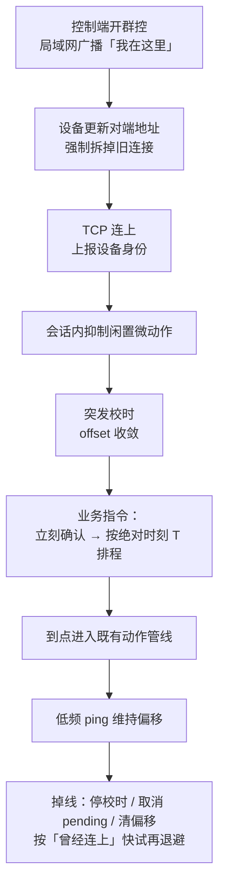

# 本地机器人群控架构调整

多台机器人同台齐舞、齐停，要的不是"指令能送到"，而是"同一物理时刻做同一件事"。本文记录本地局域网群控的一次完整架构调整：从"一条连接包办收发执行"，拆成发现 / 传输 / 协议 / 校时 / 调度 / 动作六层，每层只回答一个问题。时间戳从"看起来是全部"，退回到它本来的位置——六层里负责给出共用节拍器的那一层。

本文与《机器人内部通信架构剖析》分工不同：那篇钉**机内**多板总线与板间时间同步，这篇钉**机间**群控的会话与调度。

---

## 1. 两类群控，约束完全不同

机器人有两条群控通道，混在一起谈是大部分设计混乱的起点：

| | 云端群控 | 本地群控 |
| --- | --- | --- |
| 路径 | 云平台 → 公网 → 设备 | 控制端（手机 / 平板）← 局域网 TCP ← 设备 |
| 时延 | 百毫秒到秒级，不可控 | 通常几毫秒到几十毫秒，会排队、会抖 |
| 对齐 | 不做齐舞级对齐，收到就走动作管线 | 必须对齐：到点执行、过期丢弃 |
| 适用 | 远程下发、非同步编排 | 上台齐舞、齐动作、齐停 |

云端通道可以继续"投递即执行"——它的业务本来就不要求多机在同一物理时刻做同一个动作。

本地通道面对的是同一舞台、同一拍：谁先收到谁先动，观众立刻看出一片"海浪"。**所以本地群控必须单独做一套会话协议，而不是复用云端那条"收到就做"的路径。** 这是后面所有调整的前提。

本文只谈本地群控。

---

## 2. 调整前：一个连接类包办全部

早期实现把发现、握手、心跳、解析、执行、重连全写在同一条收发循环里：

```text
开机就连控制端
  → 读到一行 JSON
  → 立刻丢进动作总线
  → 读超时 / 心跳没回就拆连接再连
```

在实验室直连时确实能用。问题在于每一件事都被"顺手"塞进了同一个循环，于是各层的失败模式开始互相伪装。上台后同时踩中这几类：

| 旧做法 | 现场后果 |
| --- | --- |
| 收到就执行 | 各机网络时延不同，齐舞变成海浪 |
| 单向推一个"现在几点" | 半程时延写进偏移，抖一下就偏几十到上百毫秒 |
| 读超时、心跳计数当"死了" | 无线抖一下主动拆连接，NAT 映射作废，个别设备变成僵尸会话 |
| 未开群控也高频重连 | 空转打出 SYN 风暴，干扰日常网络 |
| 上台掉线仍用同一套慢退避 | 演示空窗太长；若改成死磕快连，空口差时又打爆无线 |
| 闲置微动作仍在跑 | 时间戳再准，某台自己晃一下头也不齐 |
| 协议、滤波、Socket 缠在一起 | 改校时会碰到重连，改重连会碰到执行，无法单测、无法收敛 |

**根因归纳成一句：把"能连上"和"能对齐"混在了同一条收发循环里。**

这两件事的失败模式截然不同——连不上是网络/发现问题，不齐是时间/调度问题。混在一起后，一个无线抖动既可能被当成"断线"（触发重连），也可能被当成"时钟变化"（污染偏移），还可能是"指令丢失"（触发补发）。日志上看都是"设备异常"，实际是三件不同的事。

所以这次调整的目标不是加功能，而是**拆职责**，让每一层只回答一个问题。

---

## 3. 调整后：六层各管一件事

```text
发现层     控制端在局域网现身 → 设备更新对端地址并重连
传输层     可靠字节流、心跳、按「最后收包」判活、两条重连曲线
协议层     校时包 / 业务包 / 确认包；先确认再调度
校时层     估计  serverNow ≈ localNow + offset（会话内偏移，不改系统钟）
调度层     到点执行、过期丢弃、新指令覆盖未执行的旧指令
动作层     复用已有动作 / 语音 / 导航 / 急停管线，群控不另造执行器
```

分层带来的最直接收益是**可测试性**：校时层可以喂固定时间戳序列做单测，重连曲线可以脱离真实网络验证，调度层可以注入假时刻。旧架构下这三件事都无法独立验证，因为它们共享同一条循环。

另外两个结构性决策：

**控制端是时间基准和编排源，设备是 TCP 客户端。** 设备主动连出去，而不是控制端连设备。原因是现场常见"设备在 NAT 后面、控制端在工业网"，穿透只能由内向外发起——控制端无法点名让某台设备重连。

**动作层不在群控里重建。** 群控只负责"何时把哪条载荷送进既有管线"，单动作、语音绑定、场景组合、导航、急停这些执行路径全部复用。否则等于把执行器实现两遍，行为差异会长期存在。

端到端：



---

## 4. 各层调整明细

### 4.1 发现层：地址是动态的，连接是会话态

控制端 IP 不能写死——手机开热点、换 AP、换网段都是常态。因此发现和传输必须分开：

1. 设备侧常驻一条轻量发现通道（广播 / 通知即可）
2. 控制端现身时带上自己的地址
3. 设备更新对端、**强制拆掉旧连接再连**——旧 socket 上的偏移、序号、pending 一律作废

一个容易犯的错是把发现做成连接前置（先探测再握手）。**探测通 ≠ 端口在听**：ICMP 和 TCP 在 NAT 上是两套表项，探测成功不代表群控端口可达。所以发现失败时，传输层仍按"从未连上"慢探，不额外增加一轮空等。

### 4.2 传输层：判活、重连、空口，三件事不能混

**判活看最后收包，不看自己发没发。** 心跳只证明还能写。单向能发不能收时（典型：AP 关联掉了但 TCP 未感知），自己狂 ping 毫无意义。超时必须以**下行静默**为准：超过存活窗口没有对端的包，才认为会话死了。

读阻塞超时只是"醒来看一眼还活不活"，**超时本身不等于断线**。旧架构把读超时、心跳漏计直接映射成 `reconnect()`，无线一抖就主动拆连接——这是上台掉线的主要自伤来源。

**两条重连曲线。** "从未连上过"和"曾经连上、上台刚掉"不是同一种失败：

| 状态 | 策略 | 为什么 |
| --- | --- | --- |
| 从未连上 | 慢探，秒级间隔 | 避免未开群控时打出 SYN 风暴 |
| 刚断、第一次再试 | 尽快（约几百毫秒） | 演示空窗要短，FIN / 偶发花屏通常一次就能回来 |
| 连续 `connect` 失败 | 指数退避 + 抖动，有上限 | 空口真不行时死磕会加重拥堵 |
| 连上 | 失败计数清零 | 下一次掉线仍享受"首次快试" |

禁止重叠连接。要防的是"一台高频 SYN × N 台"，不是单次握手本身。

**身份与会话。** 连上后立刻上报设备身份，让控制端把这条 TCP 和具体机器人对上。断线必须重置：校时偏移、未执行指令、校时节奏全部作废——对端可能已经换了。

**小包尽快出门。** 关闭发送端合并（如 `TCP_NODELAY`），否则校时和确认都会被内核再攒几十毫秒。一个实用判据：如果 RTT 统计呈现稳定的 ~40ms 台阶，九成是发送端合并与 delayed ACK 交互所致，不是网络问题。

### 4.3 协议层：先确认，再谈执行

业务包至少带两类信息：

- 单调序号 `seq`：用于确认和去重
- 服务器绝对时刻 `T`：用于对齐

处理顺序固定：

1. 入口立刻记下收包时刻（校时需要，**解析前就要打**）
2. 校时包处理完即返回，不走业务
3. 业务包**先确认，再调度**。控制端要的是"收到了"，不是"已经做完了"
4. 同一 `seq` 的补发只补确认，不重新执行
5. 新指令覆盖尚未执行的上一条。群控语义是"最新编排"，不是队列堆积
6. `T` 缺失或为 0，视为立即执行（急停这类控制指令）

两条容易被忽略的配套规则：

**补发必须沿用同一 `seq`。** 没看到动作就换新序号重推同一拍，会变成两次执行。

**不接受比已处理序号更老的包。** 避免旧补发盖掉新指令。这是覆盖语义的配套，不是可选项。

控制端按确认决定是否补发；过期由设备丢弃。控制端不要因为没看到动作就把同一拍延迟后再发一遍——那会插进下一拍。

### 4.4 校时层：会话内偏移，不改系统钟

这是本篇唯一涉及时间的地方，而它的定位很明确：**群控要齐的是"同一条指令同时起势"，不是两台设备的系统时钟。**

NTP / 手动对时解决不了几十毫秒级的齐舞问题，而且改系统钟会干扰设备上别的业务。所以做法是：控制端墙钟当基准，设备只估一个**会话内偏移**，不落盘、不碰系统时间。

```text
serverNow = localNow + offset
delay     = max(0, T - serverNow)
```

编排时刻 `T` 必须是控制端的**绝对时间**，不能是"现在 + 相对 delay"——相对 delay 会把各机网络时延重新引进来。`T` 至少比发送时刻晚出"最差可达时延 + 校时余量"。

**双向校时为主**，一次往返打四个时刻（与 NTP 同源）：

```text
设备                                  控制端
  │  t0  发出 ping                     │
  │ ─────────────────────────────────► │ t1  收到
  │                                    │
  │  t3  收到 pong                     │ t2  发出
  │ ◄───────────────────────────────── │

RTT    = (t3 - t0) - (t2 - t1)
offset = ((t1 - t0) + (t2 - t3)) / 2
```

路径对称时，单向排队延迟会互相抵消；不对称时误差上限约 `RTT/2`。所以滤波只有一句话：**只要空载、短 RTT 的样本。**

两条打点铁律，错了整个校时就废：

- `t0` 必须在**真正写出瞬间**取——入队、等锁、等线程池的时间不能算进 RTT
- `t3` 必须在**刚收到时**取——解析、日志、业务分发之后再取，会把本机耗时写进偏移

**单向推时只做冷启动垫值。** `offset ≈ 对端现在 - 本机收到时刻` 会把半程时延整段写进偏移。仅在还没有往返样本时用一次；一旦有了双向结果，单向绝不能覆盖。

**滤波节奏：突发摸底，稳态守衡。** 假设是"短时真实偏移几乎不变，变的是排队"。

- **连上突发**：连续数次短间隔 ping，只认最小 RTT（排队非负，最小值最接近空载路径；平均值会被长尾野点污染）
- **稳态**：约一分钟一轮即可（晶振慢漂）
- **RTT 过大**：丢，不当校时样本
- **偏移跳变**：单次当测偏；连续多次"小 RTT 仍大偏离"，才承认对端改时
- **平滑**：小系数 EMA
- **断线**：偏移清零（对端或路径变了，旧值是带符号的系统误差）

**感知阈值。** 人眼大约 30~50ms 开始觉得不齐，100ms 以上会散。跳变门限卡在这条感知线附近是有意的——它同时是"用户可察觉"的门槛。

**算法消不掉的**：路径固定不对称（有人走中继、有人直连）。所以部署应同一接入、同跳数；**不要跨公网做齐舞**——公网 RTT 一旦到几十毫秒以上，`RTT/2` 的误差就已经吃满感知阈值。

### 4.5 调度层：收到和执行必须拆开

```text
delay = max(0, T - serverNow)
```

三档处置：

- **未到点**：排进独立执行线程，到期再进动作总线
- **已过点但仍在宽限内**：立即执行（校时未收敛、调度粒度都可能让"刚好到点"偏晚）
- **超过宽限**：只确认不执行

宽限大约 1~2 秒：太短误杀本该执行的动作，队形缺人；太长会把真正迟到的动作硬插进下一拍，节奏错乱。

**"缺一台"比"一台晚半拍"好看。过期丢弃是产品决策，不是技术妥协。**

两个实现约束：

- 到期回调里**不要二次对表**——时刻在排程时已经锁定，重算只会把执行时刻往下推
- **执行线程与读 Socket 线程分开**，避免 IO 抖动直接砸进动作起点

### 4.6 动作层：只调度，不复制执行器

群控不重新实现动作。它只把"何时 + 哪条载荷"交给既有管线：单动作、语音绑定、场景组合、导航、急停。群控对外暴露的接口面越窄，越不容易和单机行为产生分歧。

---

## 5. 闲置抑制：群控是会话，不是配置

群控进行时必须关掉头部随机、闲置微动作。**否则对齐的是指令，打散的是自发运动**——时间戳再准也齐不了。

抑制必须是**会话态、只活在内存**：

- 连上时打开抑制，断线自动失效
- 不要写成持久开关，以免重启或退出群控后用户配置被改掉
- 外部"开启微动作"一类指令，在抑制期间应被挡住

群控不管闲置动作怎么生成，只要求执行入口认同一面抑制旗。这样耦合面最小。

---

## 6. 一次上场怎么走

```text
控制端开群控，发出「我在这里」
  → 设备更新地址，拆旧连接
  → TCP 连上，上报身份
  → 抑制闲置动作
  → 突发校时，offset 收敛
  → 指令：立刻确认 → 未过期则 delay = T - serverNow
  → 到点进入既有动作管线
  → 之后低频 ping 维持偏移
  → 掉线：停校时、取消 pending、清偏移；按「曾经连上」快试再退避
```

这条链路里，校时只是第 5 步。任何一步缺失，最终都会表现成"不齐"，但根因完全不同——这正是分层要解决的诊断问题。

---

## 7. 调整前后逐项对照

| 维度 | 调整前 | 调整后 |
| --- | --- | --- |
| 结构 | 连接循环里解析并执行 | 发现 / 传输 / 协议 / 校时 / 调度 / 动作 分层 |
| 执行时机 | 收到就做 | 绝对时刻到点才做，过期丢弃 |
| 时间 | 单向推时，或直接比系统钟 | 会话内双向偏移，不改系统钟 |
| 可靠 | 依赖 TCP 本身 | 序号 + 立刻确认 + 按确认补发 |
| 判活 | 读超时 / 心跳计数 → 拆连接 | 最后收包窗口；超时只唤醒检查 |
| 重连 | 一种间隔打天下 | 空转慢探，上台先快后退避 |
| 发现 | 地址写死或隐含在同一条连接里 | 独立发现通道，地址动态更新并强制重建会话 |
| 闲置 | 仍可能自发晃动 | 会话内抑制，不落盘 |
| 动作 | 群控旁路或混写 | 只调度，执行复用原管线 |

---

## 8. 验收口径

分层的价值在于"每层都能单独证伪"，所以验收也应该分层做，不要只看"齐不齐"这一个终态：

| 层 | 验收项 | 建议目标 |
| --- | --- | --- |
| 校时 | 冷启动收敛时间 | < 1 s |
| 校时 | 稳态 offset 波动 | ±5 ms |
| 调度 | 对齐偏差 P95 | ≤ 20 ms |
| 调度 | 过期丢弃率 | < 1% |
| 传输 | 上台掉线恢复时间 | < 500 ms |
| 传输 | 空转重连频率 | 秒级，且无重叠连接 |
| 协议 | 补发未导致重复执行 | 0 次 |

对齐偏差的外部测量可以用高速摄像（240 fps 即 4.2 ms/帧）或同时音频打点（注意按机间几何距离做声速修正，343 m/s → 1 米差 2.9 ms）。内部埋点测的是"调度是否准"，不含执行机构延迟，只适合快速回归。

---

## 9. 几条不会变的原则

1. **本地群控不是云端群控的短路径。** 公网投递和局域网齐舞的约束不同，不要合成一套"收到就做"。
2. **设备当客户端。** NAT 后面只能由内向外连；控制端不能点名重连。
3. **确认在当下，执行在未来。** 先让控制端知道送到了，再谈齐不齐。
4. **对齐靠会话偏移，不靠系统钟。** 校时是一层，不是传输层的附属 `if`。
5. **晚了就丢。** 补做比缺席更破坏齐舞。
6. **空转和上台掉线用两条重连曲线。** 连不上就退避，不要用探测协议给 TCP 当保镖。
7. **群控是会话。** 偏移、序号、pending、闲置抑制都随连接生灭，不要写进持久配置。

---

## 10. 一句话

> 本地群控架构调整的本质，是把"一条 TCP 上收到什么做什么"拆成可独立演进的几层：发现解决找谁，传输解决还在不在，协议解决别丢别重，校时给出共用时间轴，调度决定到点还是丢掉——动作仍走原来的执行器。时间戳只是其中让多机共用节拍器的那一层。

---

## 参考资料

- 项目内部文档 `GROUP_CONTROL.md`（本地机器人群控架构）、`GROUP_CONTROL_TIMESTAMP.md`（群控时间戳机制）
- 《机器人内部通信架构剖析》——机内多板总线与板间时间同步
- RFC 5905 — NTPv4（四时间戳与最小 delay 滤波）
- RFC 896 — Nagle 算法与发送端合并
